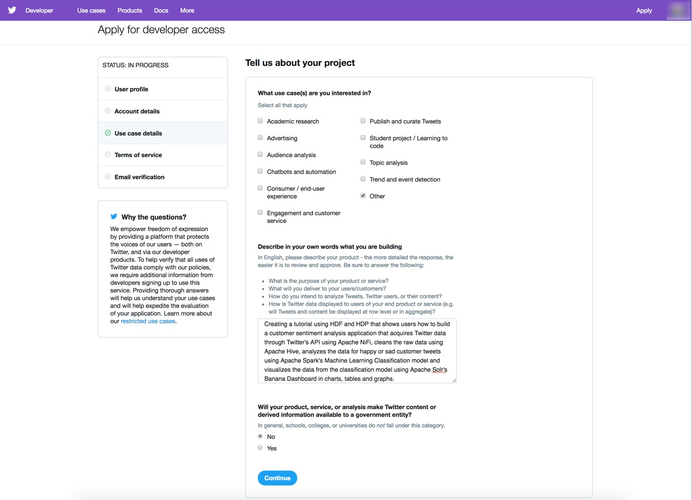

# Setting up the Development Environment

## Introduction

## Prerequisites

## Outline

- [Create a Twitter Application](#creating-a-twitter-application)
- [Approach 1: Automatically Setup Development Platforms](#approach-1-automatically-setup-development-platforms)
- [Approach 2: Manually Setup Development Platforms via CLI](#approach-2-manually-setup-development-platforms-via-cli)
- [Summary](#summary)
- [Further Reading](#further-readings)

## Create a Twitter Application

After creating and registering the Twitter Application, Twitter will provide you authorized access to pull live data through their API as long as you have the **Consumer API Keys** and **Access Tokens**. First you must apply for developer account, then once Twitter accepts your application, you will be able to create Twitter applications.

### Apply for a Twitter Developer Account

1\. To create new applications, Twitter requires you must go to their website -> [apply for a developer account](https://developer.twitter.com/en/apply-for-access.html)

2\. Click the **purple apply** button.

3\. Select the Twitter account you want to associate as admin of this developer account, then press **blue continue** button.

4\. Fill in the details for your developer account, then press **blue continue** button.

5\. Provide project details, then press the **blue continue** button.

6\. Read and agree to Terms of Service, then press the **blue submit application** button.

7\. Verify you received the verification email to complete the application.

8\. Open your email inbox, select **Verify your Twitter Developer Account**, then press the yellow orange **confirm your email** button.

9\. Welcome to your new Twitter developer account. Press on **Create an app** to go to the Apps page.

### Create a New Twitter Application

1\. Press the **blue Create an app** button.

2\. Enter your app details. Then press the **blue Create** button.

3\. Review Twitter's Developer Terms, then press the **blue Create** button.

4\. A green checkmark should appear in the top right corner notifying you that the application was created successfully. You will be taken to the page showing summary about your app.

Application at this point was created successfully! Switch to the Permissions tab.

### Change Application's Permissions

Since we are only going to be reading live data, let's check the permissions.

The access permission shows **Read and Write**. Press **Edit**.

The **Edit** button drops down to **Access permission** and **Additional permissions**. Change **Read and Write**
permission to **Read Only**. Then press the **blue Save** button.

A green checkmark should appear in the top corner notifying you that the application was updated successfully.

You will need to regenerate access tokens for the changes to take effect. Switch to the Keys and tokens tab.

### Get Keys & Tokens from Application

In order for you to have authorization access to pull data from your application's live feed, we need to get **Consumer API Keys** and **Access Tokens**.

1\. Initially the Access tokens are not created, so let's create the Access tokens. The changes we made earlier to the permissions will take effect too. Press the **blue Create** button.

2\. The access tokens will be created.

Save the following keys and tokens as they appear on your web page. The following keys and tokens are just examples from a previous application setup and are no longer usable, so you will need to get the keys and tokens from your developer account.

- Example: **Consumer API Key**

~~~bash
QN1C0nt9MYSgqxAOgLGULXfEu
~~~

- Example: **Consumer API Secret Key**

~~~bash
OEXtObh3er8wRzooiJDSOnSJ4ZM9qyiHx3ucodfWKctvZYi5Cu
~~~

- Example: **Access Token**

~~~bash
3939922273-j5VJwa0REmOeScxTLsem9JIAzeZ0oYn2dQQ7ep8
~~~

- Example: **Access Token Secret**

~~~bash
aFR7HmgMhjB0xSqhP27s4UN7QGCs97OrnIptyTfpSeflB
~~~

## Approach 1: Automatically Setup Development Platforms

Download the **[setup.sh](application/setup/shell/setup.sh)** script. It will perform the following operations to setup the services needed for customer sentiment analysis application development:

On the CentOS7 server **HDF** runs on:

- **Setup NiFi**: adjusts the system clock to be synchronized within a few milliseconds of Coordinated Universal Time (UTC) to prevent an authorization error from occurring when using NiFi's GetTwitter processor.

On the CentOS7 server **HDP** runs on:

- **Setup Hive**: downloads and installs Maven, then downloads and adds the JsonSerDe library to Hive's lib folder to allow Hive the ability to deserialize JSON data, then restarts Hive.
- **Setup HDFS for Hive Data Analysis**: creates /tmp/tweets_staging, /tmp/data/tables, /tmp/data/tables/time_zone_map and /tmp/data/tables/dictionary directories. Uploads the time_zone_map.tsv to the time_zone_map directory and dictionary.tsv to dictionary directory. Directories and files are setup for Hive data analysis.
- **Setup Spark**: imports the Sentiment Analysis Zeppelin notebook and clones the Spark Structured Streaming application.
- **Setup Solr**: verifies Ambari Infra is stopped, then adds the Solr service to the HDP cluster, adds the Solr Components, reads and applies 6 Solr Ambari Configurations to the HDP Cluster for proper Solr functionality, adds the Solr host component to the master domain name server and installs Solr to the HDP cluster. Copies over Solr configsets to tweets_config folder, then adjusts solrconfig.xml, so Solr can recognize tweet's timestamp format. Backups default.json to default.json.origin and replaces with default.json that is able to connect to Solr's Banana dashboard.

There are two options to run this script from **sandbox-host** or **Native Docker host**.

**Option 1:**

On VirtualBox and VMware sandbox-host, the login credentials are user/pass = `root/hadoop` to SSH into the server.

~~~bash
ssh root@sandbox-host -p 2122
wget [setup.sh](application/setup/shell/setup.sh)
bash setup.sh
~~~

**Option 2:**

On Native Docker running on mac or linux:

~~~bash
wget [setup.sh](application/setup/shell/setup.sh)
bash setup.sh
~~~

Once the script finishes, you are now ready to move onto the next phase of development (the next tutorial), acquiring the data using NiFi.

## Approach 2: Manually Setup Development Platforms via CLI

## Setup Data-In-Motion Platform

Apache NiFi is a service that runs on Hortonworks DataFlow (HDF) Platform. HDF handles data-in-motion using flow management, stream processing and stream analytics. We will do some configurations, so later we can focus on building the NiFi dataflow application.

### Setting up NiFi

Open HDF **sandbox web shell client** at `sandbox-hdf.hortonworks.com:4200`.

Since the tweets from the Twitter API are typically sent with a UTC timestamp, the Operating System, CentOS7, NiFi is running on may have the wrong system clock time. Since we don't want the CentOS7 server and Twitter's server out of sync, we will configure CentOS7' system clock using the Network Time Protocol (NTP) utility to be synchronized within a few milliseconds of Coordinated Universal Time (UTC). This adjustment should prevent an authorization error from occurring when using NiFi's GetTwitter processor.

Run the commands:

~~~bash
# Install Network Time Protocol
yum install -y ntp
service ntpd stop
ntpdate pool.ntp.org
service ntpd start
~~~

Refer to [Network Time Protocol (NTP)](https://en.wikipedia.org/wiki/Network_Time_Protocol) on Wikipedia if you are unfamiliar with it.

## Setup the Data-At-Rest Platform

Apache Solr, Hive2 and Spark2 are services that run on Hortonworks Data Platform (HDP). HDP handles data-at-rest using data management, data access engines, data governance, data security, data operations and data analytics. We will setup Hive2, Spark2 and Solr, so later we can focus on cleaning raw data, building a machine learning model and storytelling through a visualization dashboard.

### Setting up Hive

Open HDP **sandbox web shell client** at `sandbox-hdp.hortonworks.com:4200`.

The Twitter API data schema is in JSON format, but initially Hive2 does not support deserializing (reading) data in JSON because it doesn't have the JsonSerDe library. Let's give Hive2 and Hive the JsonSerDe library.

~~~bash
# Download apache maven
wget http://mirrors.koehn.com/apache/maven/maven-3/3.5.4/binaries/apache-maven-3.5.4-bin.tar.gz
# Extract maven
tar xvf apache-maven-3.5.4-bin.tar.gz
# Clone the JsonSerDe source
git clone https://github.com/rcongiu/Hive-JSON-Serde
cd Hive-JSON-Serde
# Compile JsonSerDe source to create JsonSerDe library jar file
./../apache-maven-3.5.4/bin/mvn -Phdp23 clean package
# Give JsonSerDe library jar file to Hive and Hive2 library
cp json-serde/target/json-serde-1.3.9-SNAPSHOT-jar-with-dependencies.jar /usr/hdp/2.6.0.3-8/hive/lib
cp json-serde/target/json-serde-1.3.9-SNAPSHOT-jar-with-dependencies.jar /usr/hdp/2.6.0.3-8/hive2/lib

USER='raj_ops'
PASS='raj_ops'
CLUSTER_NAME='Sandbox'
HOST=$(hostname -f)

function startWait()
{
  curl -u $USER:$PASS -i -H 'X-Requested-By: ambari' -X PUT -d \
  '{"RequestInfo": {"context":"Start '"$1"' via REST"}, "Body":
  {"ServiceInfo": {"state": "STARTED"}}}' \
  http://$HOST:8080/api/v1/clusters/$CLUSTER_NAME/services/$1
  wait $1 "STARTED"
}

function stopWait()
{
  curl -u $USER:$PASS -i -H 'X-Requested-By: ambari' -X PUT -d \
  '{"RequestInfo": {"context":"Stop '"$1"' via REST"}, "Body": {"ServiceInfo": {"state": "INSTALLED"}}}' http://$HOST:8080/api/v1/clusters/$CLUSTER_NAME/services/$1
  wait $1 "INSTALLED"
}

function wait()
{
  finished=0
  while [ $finished -ne 1 ]
  do
    str=$(curl -s -u $USER:$PASS http://$HOST:8080/api/v1/clusters/$CLUSTER_NAME/services/$1)
    if [[ $str == *"$2"* ]] || [[ $str == *"Service not found"* ]]
    then
      finished=1
    fi
      sleep 3
  done
}

# Send Ambari REST Call to STOP/START Hive Service
stopWait HIVE
startWait HIVE
~~~

### Setting up HDFS for Hive

Open HDP **sandbox web shell client** at `sandbox-hdp.hortonworks.com:4200`.

~~~bash
# Create /tmp/tweets_staging directory ahead of time
sudo -u hdfs hdfs dfs -mkdir -p /tmp/tweets_staging
# Change HDFS ownership of tweets_staging dir to maria_dev
sudo -u hdfs hdfs dfs -chown -R maria_dev /tmp/tweets_staging
# Change HDFS tweets_staging dir permissions to everyone
sudo -u hdfs hdfs dfs -chmod -R 777 /tmp/tweets_staging
# Create new /tmp/data/tables directory inside /tmp dir
sudo -u hdfs hdfs dfs -mkdir -p /tmp/data/tables
# Set permissions for tables dir
sudo -u hdfs hdfs dfs -chmod 777 /tmp/data/tables
# Inside tables parent dir, create time_zone_map dir
sudo -u hdfs hdfs dfs -mkdir /tmp/data/tables/time_zone_map
# Inside tables parent dir, create dictionary dir
sudo -u hdfs hdfs dfs -mkdir /tmp/data/tables/dictionary
# Download time_zone_map.tsv file on local file system(FS)
wget https://raw.githubusercontent.com/hortonworks/data-tutorials/master/tutorials/hdp/analyzing-social-media-and-customer-sentiment-with-apache-nifi-and-hdp-search/assets/time_zone_map.tsv
# Copy time_zone_map.tsv from local FS to HDFS
sudo -u hdfs hdfs dfs -put time_zone_map.tsv /tmp/data/tables/time_zone_map/
# Download dictionary.tsv file on local file system
wget https://raw.githubusercontent.com/hortonworks/data-tutorials/master/tutorials/hdp/analyzing-social-media-and-customer-sentiment-with-apache-nifi-and-hdp-search/assets/dictionary.tsv
# Copy dictionary.tsv from local FS to HDFS
sudo -u hdfs hdfs dfs -put dictionary.tsv /tmp/data/tables/dictionary/
~~~

### Setting up Spark

Open HDP **sandbox web shell client** at `sandbox-hdp.hortonworks.com:4200`.

We will use the Zeppelin REST Call API to import a notebook that has the Machine Learning Model we need for classifying the tweets as happy or sad.

~~~bash
curl -X POST http://sandbox-hdp.hortonworks.com:9995/api/notebook/import \
-d @'Sentiment%20Analysis.json'
~~~

We will clone the Scala Spark Streaming application, which will be used in a later tutorial to deploy the Spark Machine Learning Model. Since our Spark code depends on other libraries, like GSON, We will install SBT, a dependency manager, in order to package dependencies into an assembly that can be submitted to Spark.

~~~bash
# Clone the Scala Spark Streaming application
git clone https://github.com/Gregw135/sentimentAnalysis
# Install SBT
cd sentimentAnalysis
curl https://bintray.com/sbt/rpm/rpm | sudo tee /etc/yum.repos.d/bintray-sbt-rpm.repo
yum install sbt
~~~

### Setting up Solr

Download and install Apache Solr on HDP 2.6.5 via Ambari REST Calls.

Login to Ambari with credentials user/password is raj_ops/raj_ops.
Verify Ambari Infra is stopped because we don't want an already existing solr service running when installing standalone solr service.
Click on the **Actions** button on stack services, click **Add Service**.
Scroll down to the list of services, select **Solr**, press **Next**.
Accept all default values in the installation wizard, then you will see the progress of your installation.
After a minute, Solr should be installed successfully.
Restart **HDFS**, **YARN**, **MapReduce2** and **HBase**.

Open HDP Web Shell Client at `sandbox-hdp.hortonworks.com:4200`.

~~~bash
# Add Apache Solr Service to HDP Sandbox Cluster
USER='raj_ops'
PASS='raj_ops'
CLUSTER_NAME='Sandbox'
HOST=$(hostname -f)
MASTER_DNS=$HOST
SLAVE_DNS=$HOST

# https://markobigdata.com/2018/07/22/adding-service-to-hdp-using-rest-api/3/
# https://www.zylk.net/en/web-2-0/blog/-/blogs/starting-services-via-ambari-rest-api
# https://gist.github.com/randerzander/5b7b0e075e59f87d3c84
function startWait()
{
  curl -u $USER:$PASS -i -H 'X-Requested-By: ambari' -X PUT -d \
  '{"RequestInfo": {"context":"Start '"$1"' via REST"}, "Body": {"ServiceInfo": {"state": "STARTED"}}}' \
  http://$HOST:8080/api/v1/clusters/$CLUSTER_NAME/services/$1
  wait $1 "STARTED"
}

function stopWait()
{
  curl -u $USER:$PASS -i -H 'X-Requested-By: ambari' -X PUT -d \
  '{"RequestInfo": {"context":"Stop '"$1"' via REST"}, "Body": {"ServiceInfo": {"state": "INSTALLED"}}}' http://$HOST:8080/api/v1/clusters/$CLUSTER_NAME/services/$1
  wait $1 "INSTALLED"
}

function wait()
{
  finished=0
  while [ $finished -ne 1 ]
  do
    str=$(curl -s -u $USER:$PASS http://$HOST:8080/api/v1/clusters/$CLUSTER_NAME/services/$1)
    if [[ $str == *"$2"* ]] || [[ $str == *"Service not found"* ]]
    then
      finished=1
    fi
      sleep 3
  done
}
# Add a Service to the cluster
function addService()
{
  ENDPOINT="http://$HOST:8080/api/v1/clusters/$CLUSTER_NAME/services"
  curl -u $USER:$PASS -H "X-Requested-By:ambari" -i -X POST -d '{"ServiceInfo:":{"service_name":'"$1"'}}' $ENDPOINT
}
# Check if service added to the cluster
function checkIfServiceAdded()
{
  ENDPOINT="http://$HOST:8080/api/v1/clusters/$CLUSTER_NAME/services/$1"
  WAS_SERVICE_ADDED=$(curl -k -u $USER:$PASS -H "X-Requested-By:ambari" -i -X GET $ENDPOINT)
  echo $WAS_SERVICE_ADDED | grep -o *"service_name"*
}
# Check service state on the cluster, whether running or installed (stopped)
# $1: SOLR, AMBARI_INFRA, etc
function checkServiceState()
{
  ENDPOINT="http://$HOST:8080/api/v1/clusters/$CLUSTER_NAME/services/$1?fields=ServiceInfo"
  curl --silent -u raj_ops:raj_ops -X GET $ENDPOINT | grep "\"state\""
}
# Add components to the Service
function addComponentsToService()
{
  ENDPOINT="http://$HOST:8080/api/v1/clusters/$CLUSTER_NAME/services/$1/components/$1"
  curl -k -u $USER:$PASS -H "X-Requested-By:ambari" -i -X POST -d '{"RequestInfo":{"context":"Install '$1'"}, "Body":{"HostRoles":{"state":"INSTALLED"}}}' $ENDPOINT
}
# Read Config File of Service on Ambari Stack
function readConfigFile()
{
  # Read from example-collection.xml
  curl -u $USER:$PASS -H 'X-Requested-By:raj_ops' -i -X POST -d "@$1" "http://$HOST:8080/api/v1/clusters/$CLUSTER_NAME/configurations"
}
# Apply configuration
# $1: config_file.<json|xml|etc>
function applyConfiguration()
{
  curl -v -u $USER:$PASS -H 'X-Requested-By:raj_ops' -i -X PUT -d '{ "Clusters" : {"desired_configs": {"type": "'$1'", "tag" : "INITIAL" }}}' "http://$HOST:8080/api/v1/clusters/$CLUSTER_NAME"
}
# Install Component on Target HOST
# $1: SOLR
# $2: MASTER_DNS
function addComponentToHost()
{
  curl -u $USER:$PASS -H "X-Requested-By:ambari" -i -X POST -d '{"host_components" : [{"HostRoles":{"component_name":"'$1'"}}] }' "http://$HOST:8080/api/v1/clusters/$CLUSTER_NAME/hosts?Hosts/host_name=$2"
}
# Install Service on Ambari Stack for HDP
# $1: SOLR
function installService()
{
  curl -u $USER:$PASS -H "X-Requested-By:ambari" -i -X PUT -d '{"RequestInfo":{"context":"Install '$1' via REST API"}, "ServiceInfo": {"state":"INSTALLED"}}' "http://$HOST:8080/api/v1/clusters/$CLUSTER_NAME/services/$1"
}

# SOLR Config files from HDP Sandbox that had SOLR Installed
#/var/lib/ambari-server/resources/common-services/SOLR/5.5.2.2.5/configuration
# - example-collection.xml
# - solr-cloud.xml
# - solr-config-env.xml
# - solr-hdfs.xml
# - solr-log4j.xml
# - solr-ssl.xml

tee -a ~/example-collection.xml << EOF
<?xml version="1.0"?>
<?xml-stylesheet type="text/xsl" href="configuration.xsl"?>

<configuration>
    <property>
        <name>solr_collection_sample_create</name>
        <value>true</value>
        <description>True to create a sample collection when Solr is deployed</description>
        <display-name>Create sample collection</display-name>
        <value-attributes>
            <type>boolean</type>
            <overridable>false</overridable>
        </value-attributes>
    </property>

    <property>
        <name>solr_collection_sample_name</name>
        <value>collection1</value>
        <description>Solr sample collection name. Mandatory</description>
        <display-name>Sample collection name</display-name>
    </property>

    <property>
        <name>solr_collection_sample_config_directory</name>
        <value>data_driven_schema_configs</value>
        <description>Solr sample collection configurations directory. Mandatory
            This directory path is relative to /opt/lucidworks-hadoop/solr/server/solr/configset.
            It must contain at least solrconfig.xml and schema.xml
        </description>
        <display-name>Solr configuration directory</display-name>
    </property>

    <property>
        <name>solr_collection_sample_shards</name>
        <value>2</value>
        <description>Number of Solr shards, for details refer to
            (https://cwiki.apache.org/confluence/display/solr/Shards+and+Indexing+Data+in+SolrCloud)
        </description>
        <value-attributes>
            <type>int</type>
        </value-attributes>
        <display-name>Number of shards</display-name>
    </property>

    <property>
        <name>solr_collection_sample_replicas</name>
        <value>1</value>
        <description>Number of Solr replicas, for details refer to
            (https://cwiki.apache.org/confluence/display/solr/NRT%2C+Replication%2C+and+Disaster+Recovery+with+SolrCloud)
        </description>
        <value-attributes>
            <type>int</type>
        </value-attributes>
        <display-name>Number of replicas</display-name>
    </property>
</configuration>
EOF

tee -a ~/solr-cloud.xml << EOF
<?xml version="1.0"?>
<?xml-stylesheet type="text/xsl" href="configuration.xsl"?>

<configuration>
    <property>
        <name>solr_cloud_enable</name>
        <value>true</value>
        <description>Whether Solr should be started in Cloud mode</description>
        <display-name>Enable SolrCloud mode</display-name>
        <value-attributes>
            <type>boolean</type>
            <overridable>false</overridable>
        </value-attributes>
    </property>

    <property>
        <name>solr_cloud_zk_directory</name>
        <value>/solr</value>
        <description>ZooKeeper directory (chroot) for shared Solr files</description>
        <display-name>ZooKeeper root directory for Solr files</display-name>
    </property>
</configuration>
EOF

tee -a ~/solr-config-env.xml << EOF
<?xml version="1.0"?>
<?xml-stylesheet type="text/xsl" href="configuration.xsl"?>

<configuration>
    <property>
        <name>solr_config_port</name>
        <value>8983</value>
        <description>Solr TCP port</description>
        <value-attributes>
            <type>int</type>
        </value-attributes>
        <display-name>Solr port</display-name>
    </property>

    <property>
        <name>solr_config_memory</name>
        <value>512m</value>
        <description>
            Sets the min (-Xms) and max (-Xmx) heap size for the
            JVM, such as: -m 4g
            results in: -Xms4g -Xmx4g; by default, this
            script sets the heap
            size to 512m
        </description>
        <display-name>Solr heap size for the JVM</display-name>
    </property>

    <property>
        <name>solr_config_conf_dir</name>
        <value>/etc/solr/conf</value>
        <description>Solr conf directory</description>
        <value-attributes>
            <type>directory</type>
        </value-attributes>
        <display-name>Solr configuration directory</display-name>
    </property>

    <property>
        <name>solr_config_data_dir</name>
        <value>/etc/solr/data_dir</value>
        <description>Solr data directory</description>
        <value-attributes>
            <type>directory</type>
        </value-attributes>
        <display-name>Solr server directory</display-name>
    </property>

    <property>
        <name>solr_config_pid_dir</name>
        <value>/var/run/solr</value>
        <description>Solr PID directory</description>
        <value-attributes>
            <type>directory</type>
        </value-attributes>
        <display-name>Solr PID directory</display-name>
    </property>

    <property>
        <name>solr_config_log_dir</name>
        <value>/var/log/solr</value>
        <description>Solr log directory</description>
        <value-attributes>
            <type>directory</type>
        </value-attributes>
        <display-name>Solr log directory</display-name>
    </property>

    <property>
        <name>solr_config_service_log_dir</name>
        <value>/var/log/service_solr</value>
        <description>Solr service log directory</description>
        <value-attributes>
            <type>directory</type>
        </value-attributes>
        <display-name>Solr service log directory</display-name>
    </property>

    <property>
        <name>solr_config_user</name>
        <value>solr</value>
        <property-type>USER</property-type>
        <description>User for Solr service</description>
        <value-attributes>
            <type>user</type>
            <overridable>false</overridable>
        </value-attributes>
        <display-name>Solr user</display-name>
    </property>

    <property>
        <name>solr_config_group</name>
        <value>solr</value>
        <property-type>GROUP</property-type>
        <description>Group for Solr service</description>
        <value-attributes>
            <type>group</type>
            <overridable>false</overridable>
        </value-attributes>
        <display-name>Solr group</display-name>
    </property>

    <!-- solr.in.sh -->
    <property>
        <name>content</name>
        <description>This is the jinja template for solr.in.sh file</description>
        <value>
            # Licensed to the Apache Software Foundation (ASF) under one or more
            # contributor license agreements.  See the NOTICE file distributed with
            # this work for additional information regarding copyright ownership.
            # The ASF licenses this file to You under the Apache License, Version 2.0
            # (the "License"); you may not use this file except in compliance with
            # the License.  You may obtain a copy of the License at
            #
            #     http://www.apache.org/licenses/LICENSE-2.0
            #
            # Unless required by applicable law or agreed to in writing, software
            # distributed under the License is distributed on an "AS IS" BASIS,
            # WITHOUT WARRANTIES OR CONDITIONS OF ANY KIND, either express or implied.
            # See the License for the specific language governing permissions and
            # limitations under the License.

            # By default the script will use JAVA_HOME to determine which java
            # to use, but you can set a specific path for Solr to use without
            # affecting other Java applications on your server/workstation.
            #SOLR_JAVA_HOME=""

            # Increase Java Heap as needed to support your indexing / query needs
            SOLR_HEAP="512m"

            # Expert: If you want finer control over memory options, specify them directly
            # Comment out SOLR_HEAP if you are using this though, that takes precedence
            #SOLR_JAVA_MEM="-Xms512m -Xmx512m"

            # Enable verbose GC logging
            GC_LOG_OPTS="-verbose:gc -XX:+PrintHeapAtGC -XX:+PrintGCDetails \
            -XX:+PrintGCDateStamps -XX:+PrintGCTimeStamps -XX:+PrintTenuringDistribution -XX:+PrintGCApplicationStoppedTime"

            # These GC settings have shown to work well for a number of common Solr workloads
            GC_TUNE="-XX:NewRatio=3 \
            -XX:SurvivorRatio=4 \
            -XX:TargetSurvivorRatio=90 \
            -XX:MaxTenuringThreshold=8 \
            -XX:+UseConcMarkSweepGC \
            -XX:+UseParNewGC \
            -XX:ConcGCThreads=4 -XX:ParallelGCThreads=4 \
            -XX:+CMSScavengeBeforeRemark \
            -XX:PretenureSizeThreshold=64m \
            -XX:+UseCMSInitiatingOccupancyOnly \
            -XX:CMSInitiatingOccupancyFraction=50 \
            -XX:CMSMaxAbortablePrecleanTime=6000 \
            -XX:+CMSParallelRemarkEnabled \
            -XX:+ParallelRefProcEnabled"

            {{solr_hdfs_prefix}}GC_TUNE="$GC_TUNE -XX:MaxDirectMemorySize=20g -XX:+UseLargePages"

            # Set the ZooKeeper connection string if using an external ZooKeeper ensemble
            # e.g. host1:2181,host2:2181/chroot
            # Leave empty if not using SolrCloud
            #ZK_HOST=""

            # Set the ZooKeeper client timeout (for SolrCloud mode)
            #ZK_CLIENT_TIMEOUT="15000"

            # By default the start script uses "localhost"; override the hostname here
            # for production SolrCloud environments to control the hostname exposed to cluster state
            SOLR_HOST="{{solr_hostname}}"

            # By default the start script uses UTC; override the timezone if needed
            #SOLR_TIMEZONE="UTC"

            # Set to true to activate the JMX RMI connector to allow remote JMX client applications
            # to monitor the JVM hosting Solr; set to "false" to disable that behavior
            # (false is recommended in production environments)
            ENABLE_REMOTE_JMX_OPTS="false"

            # The script will use SOLR_PORT+10000 for the RMI_PORT or you can set it here
            # RMI_PORT=18983

            # Set the thread stack size
            SOLR_OPTS="$SOLR_OPTS -Xss256k"

            # Anything you add to the SOLR_OPTS variable will be included in the java
            # start command line as-is, in ADDITION to other options. If you specify the
            # -a option on start script, those options will be appended as well. Examples:
            #SOLR_OPTS="$SOLR_OPTS -Dsolr.autoSoftCommit.maxTime=3000"
            #SOLR_OPTS="$SOLR_OPTS -Dsolr.autoCommit.maxTime=60000"
            #SOLR_OPTS="$SOLR_OPTS -Dsolr.clustering.enabled=true"

            # Location where the bin/solr script will save PID files for running instances
            # If not set, the script will create PID files in $SOLR_TIP/bin
            SOLR_PID_DIR={{solr_config_pid_dir}}

            # Path to a directory for Solr to store cores and their data. By default, Solr will use server/solr
            # If solr.xml is not stored in ZooKeeper, this directory needs to contain solr.xml
            SOLR_HOME={{solr_config_data_dir}}

            # Solr provides a default Log4J configuration properties file in server/resources
            # however, you may want to customize the log settings and file appender location
            # so you can point the script to use a different log4j.properties file
            LOG4J_PROPS={{solr_config_conf_dir}}/log4j.properties

            # Location where Solr should write logs to; should agree with the file appender
            # settings in server/resources/log4j.properties
            SOLR_LOGS_DIR={{solr_config_log_dir}}

            # Sets the port Solr binds to, default is 8983
            #SOLR_PORT=8983

            # Uncomment to set SSL-related system properties
            # Be sure to update the paths to the correct keystore for your environment
            {{solr_ssl_prefix}}SOLR_SSL_KEY_STORE={{ solr_ssl_key_store }}
            {{solr_ssl_prefix}}SOLR_SSL_KEY_STORE_PASSWORD={{ solr_ssl_key_store_password }}
            {{solr_ssl_prefix}}SOLR_SSL_TRUST_STORE={{ solr_ssl_trust_store }}
            {{solr_ssl_prefix}}SOLR_SSL_TRUST_STORE_PASSWORD={{ solr_ssl_trust_store_password }}
            {{solr_ssl_prefix}}SOLR_SSL_NEED_CLIENT_AUTH={{ solr_ssl_need_client_auth }}
            {{solr_ssl_prefix}}SOLR_SSL_WANT_CLIENT_AUTH={{ solr_ssl_want_client_auth }}

            # Uncomment if you want to override previously defined SSL values for HTTP client
            # otherwise keep them commented and the above values will automatically be set for HTTP clients
            #SOLR_SSL_CLIENT_KEY_STORE=
            #SOLR_SSL_CLIENT_KEY_STORE_PASSWORD=
            #SOLR_SSL_CLIENT_TRUST_STORE=
            #SOLR_SSL_CLIENT_TRUST_STORE_PASSWORD=

            # Settings for authentication
            {{solr_kerberos_prefix}}SOLR_AUTHENTICATION_CLIENT_CONFIGURER=org.apache.solr.client.solrj.impl.Krb5HttpClientConfigurer
            {{solr_kerberos_prefix}}SOLR_AUTHENTICATION_OPTS="-Djava.security.auth.login.config={{solr_kerberos_jaas_config}} \
            {{solr_kerberos_prefix}}-Dsolr.kerberos.cookie.domain={{solr_kerberos_cookie_domain}} \
            {{solr_kerberos_prefix}}-Dsolr.kerberos.cookie.portaware=true \
            {{solr_kerberos_prefix}}-Dsolr.kerberos.principal={{solr_spnego_principal}} \
            {{solr_kerberos_prefix}}-Dsolr.kerberos.keytab={{solr_spnego_keytab}}"
        </value>
        <value-attributes>
            <type>content</type>
        </value-attributes>
    </property>
</configuration>
EOF

tee -a ~/solr-hdfs.xml << EOF
<?xml version="1.0"?>
<?xml-stylesheet type="text/xsl" href="configuration.xsl"?>

<configuration>
    <property>
        <name>solr_hdfs_enable</name>
        <value>true</value>
        <description>Enable support for Solr on HDFS</description>
        <display-name>Enable support for Solr on HDFS</display-name>
        <value-attributes>
            <type>boolean</type>
            <overridable>false</overridable>
        </value-attributes>
    </property>

    <property>
        <name>solr_hdfs_directory</name>
        <value>/solr</value>
        <description>HDFS directory for Solr indexes</description>
        <display-name>HDFS directory for Solr indexes</display-name>
    </property>

    <property>
        <name>solr_hdfs_delete_write_lock_files</name>
        <value>false</value>
        <description>Delete write.lock files on HDFS</description>
        <display-name>Delete write.lock files on HDFS</display-name>
        <value-attributes>
            <type>boolean</type>
            <overridable>false</overridable>
        </value-attributes>
    </property>
</configuration>
EOF

tee -a ~/solr-log4j.xml << EOF
<?xml version="1.0"?>
<?xml-stylesheet type="text/xsl" href="configuration.xsl"?>

<configuration supports_final="false" supports_adding_forbidden="true">

  <property>
    <name>content</name>
    <description>Custom log4j.properties</description>
    <value>
      # Licensed to the Apache Software Foundation (ASF) under one or more
      # contributor license agreements.  See the NOTICE file distributed with
      # this work for additional information regarding copyright ownership.
      # The ASF licenses this file to You under the Apache License, Version 2.0
      # (the "License"); you may not use this file except in compliance with
      # the License.  You may obtain a copy of the License at
      #
      #     http://www.apache.org/licenses/LICENSE-2.0
      #
      # Unless required by applicable law or agreed to in writing, software
      # distributed under the License is distributed on an "AS IS" BASIS,
      # WITHOUT WARRANTIES OR CONDITIONS OF ANY KIND, either express or implied.
      # See the License for the specific language governing permissions and
      # limitations under the License.

      #  Logging level
      solr.log={{solr_config_log_dir}}
      #log4j.rootLogger=INFO, file, CONSOLE
      log4j.rootLogger=INFO, file

      log4j.appender.CONSOLE=org.apache.log4j.ConsoleAppender

      log4j.appender.CONSOLE.layout=org.apache.log4j.PatternLayout
      log4j.appender.CONSOLE.layout.ConversionPattern=%-4r [%t] %-5p %c %x [%X{collection} %X{shard} %X{replica} %X{core}] \u2013 %m%n

      #- size rotation with log cleanup.
      log4j.appender.file=org.apache.log4j.RollingFileAppender
      log4j.appender.file.MaxFileSize=10MB
      log4j.appender.file.MaxBackupIndex=9

      #- File to log to and log format
      log4j.appender.file.File=${solr.log}/solr.log
      log4j.appender.file.layout=org.apache.log4j.PatternLayout
      log4j.appender.file.layout.ConversionPattern=%d{ISO8601} [%t] %-5p [%X{collection} %X{shard} %X{replica} %X{core}] %C (%F:%L) - %m%n

      log4j.logger.org.apache.zookeeper=WARN
      log4j.logger.org.apache.hadoop=WARN

      # set to INFO to enable infostream log messages
      log4j.logger.org.apache.solr.update.LoggingInfoStream=OFF
    </value>
    <value-attributes>
      <type>content</type>
      <show-property-name>false</show-property-name>
    </value-attributes>
  </property>
</configuration>
EOF

tee -a ~/solr-ssl.xml << EOF
<?xml version="1.0"?>
<?xml-stylesheet type="text/xsl" href="configuration.xsl"?>

<configuration>
    <property>
        <name>solr_ssl_enable</name>
        <value>false</value>
        <description>Enable SSL support</description>
        <display-name>Enable SSL support</display-name>
        <value-attributes>
            <type>boolean</type>
            <overridable>false</overridable>
        </value-attributes>
    </property>

    <property>
        <name>solr_ssl_key_store</name>
        <value>etc/solr-ssl.keystore.jks</value>
        <description>SSL keystore file</description>
        <display-name>SSL keystore file</display-name>
    </property>

    <property>
        <name>solr_ssl_key_store_password</name>
        <value>secret</value>
        <property-type>PASSWORD</property-type>
        <description>SSL keystore password</description>
        <value-attributes>
            <type>password</type>
            <overridable>false</overridable>
        </value-attributes>
        <display-name>SSL keystore password</display-name>
    </property>

    <property>
        <name>solr_ssl_trust_store</name>
        <value>etc/solr-ssl.keystore.jks</value>
        <description>SSL truststore file</description>
        <display-name>SSL truststore file</display-name>
    </property>

    <property>
        <name>solr_ssl_trust_store_password</name>
        <value>secret</value>
        <property-type>PASSWORD</property-type>
        <description>SSL truststore password</description>
        <value-attributes>
            <type>password</type>
            <overridable>false</overridable>
        </value-attributes>
        <display-name>SSL truststore password</display-name>
    </property>

    <property>
        <name>solr_ssl_need_client_auth</name>
        <value>false</value>
        <description>Need client authentication</description>
        <display-name>Need client authentication</display-name>
        <value-attributes>
            <type>boolean</type>
            <overridable>false</overridable>
        </value-attributes>
    </property>

    <property>
        <name>solr_ssl_want_client_auth</name>
        <value>false</value>
        <description>Want client authentication</description>
        <display-name>Want client authentication</display-name>
        <value-attributes>
            <type>boolean</type>
            <overridable>false</overridable>
        </value-attributes>
    </property>
</configuration>
EOF

INFRA_STATE=$(checkServiceState 'AMBARI_INFRA')
if [[ $INFRA_STATE == *"STARTED"* ]]
then
  # Ambari Infra is STARTED, we need to turn it off before installing Apache Solr
  stopWait 'AMBARI_INFRA'
fi

if [[ $INFRA_STATE == *"INSTALLED"* ]]
then
  # Ambari Infra is INSTALLED, but not running, so lets begin installing Apache Solr
  # Add SOLR Service on HDP Service
  addService 'SOLR'
  WAS_SOLR_ADDED=$(checkIfServiceAdded 'SOLR')
  if [[ $WAS_SOLR_ADDED == *"SOLR"* ]]
  then
    # Add components to the SOLR service
    # The component has been added according to the components element in JSON output
    addComponentsToService 'SOLR'
    # Create configuration for SOLR

    # I grabbed the config files from Ambari after Installing SOLR via
    # Ambari Install Wizard in the previous HDP Sandbox.
    # Copied them and now on a fresh hdp sandbox will send them to ambari-server
    # via rest call. 6 ambari configuration files are needed for SOLR.
    # - example-collection.xml
    # - solr-cloud.xml
    # - solr-config-env.xml
    # - solr-hdfs.xml
    # - solr-log4j.xml
    # - solr-ssl.xml

    # - example-collection.xml
    # "201 Created" status should be returned
    readConfigFile 'example-collection.xml'
    applyConfiguration 'example-collection'

    # - solr-cloud.xml
    # "201 Created" status should be returned
    readConfigFile 'solr-cloud.xml'
    applyConfiguration 'solr-cloud'

    # - solr-config-env.xml  
    # "201 Created" status should be returned
    readConfigFile 'solr-config-env.xml'
    applyConfiguration 'solr-config-env'

    # - solr-hdfs.xml
    # "201 Created" status should be returned
    readConfigFile 'solr-hdfs.xml'
    applyConfiguration 'solr-hdfs'

    # - solr-log4j.xml
    # "201 Created" status should be returned
    readConfigFile 'solr-log4j.xml'
    applyConfiguration 'solr-log4j'

    # - solr-ssl.xml
    # "201 Created" status should be returned
    readConfigFile 'solr-ssl.xml'
    applyConfiguration 'solr-ssl'

    # Create host components
    # Define which nodes in the cluster the service will run on
    # "Install hosts component on MASTER_DNS," located on HOST due to single node cluster
    # After command is run, state should be in INIT
    addComponentToHost "SOLR" "$MASTER_DNS"

    # Install SOLR Service
    # In Ambari, the install can be observed, once the command is run
    # Final status that should be observed is SOLR installed on 1 client and 6 mandatory config
    # files should be available
    installService "SOLR"

    # Now the SOLR Service is ready to use. Could run a service check?
  fi
else
  echo "AMBARI INFRA is not STOPPED, need to stop service to began installing SOLR"
  stopWait 'AMBARI_INFRA'
fi
~~~

To make sure **Solr** can recognize a tweet's timestamp format, we will copy over the configset to twitter's **tweet_configs** folder.

~~~bash
sudo -u solr cp -r /opt/lucidworks-hdpsearch/solr/server/solr/configsets/data_driven_schema_configs /opt/lucidworks-hdpsearch/solr/server/solr/configsets/tweet_config

echo "Insert new config for Solr to recognize tweet's timestamp format"
sudo -u solr sed -i.bak '/<arr name="format">/a   <str>EEE MMM d HH:mm:ss Z yyyy</str>' /opt/lucidworks-hdpsearch/solr/server/solr/configsets/tweet_config/conf/solrconfig.xml

sudo -u solr sed -i.bak 's/<str>EEE MMM d HH:mm:ss Z yyyy<\/str>/        <str>EEE MMM d HH:mm:ss Z yyyy<\/str>/' /opt/lucidworks-hdpsearch/solr/server/solr/configsets/tweet_config/conf/solrconfig.xml
~~~

Replace a JSON file. Move the original file and download the replacement file.

~~~bash
cd /opt/lucidworks-hdpsearch/solr/server/solr-webapp/webapp/banana/app/dashboards/

mv default.json default.json.orig

wget https://raw.githubusercontent.com/hortonworks/data-tutorials/master/tutorials/hdp/analyzing-social-media-and-customer-sentiment-with-apache-nifi-and-hdp-search/assets/default.json
~~~
