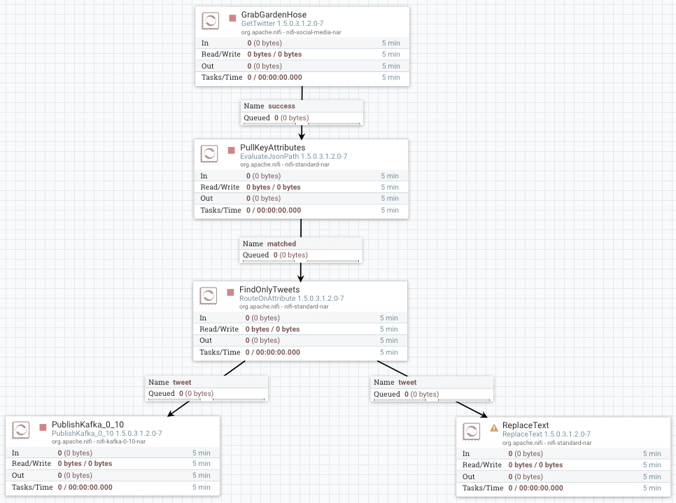
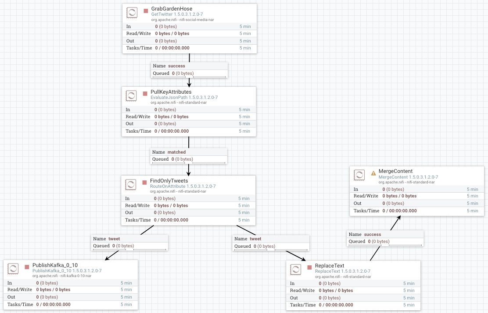
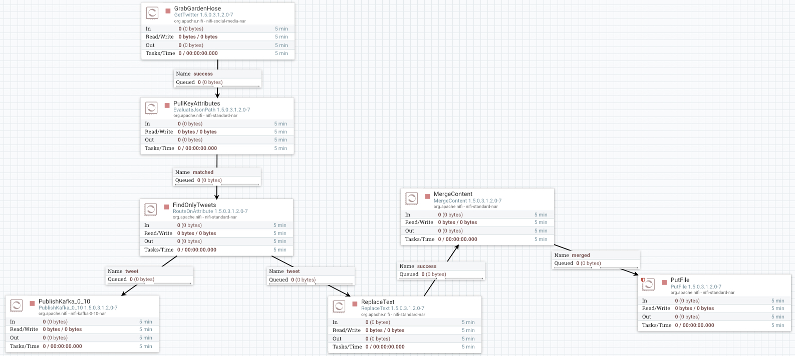
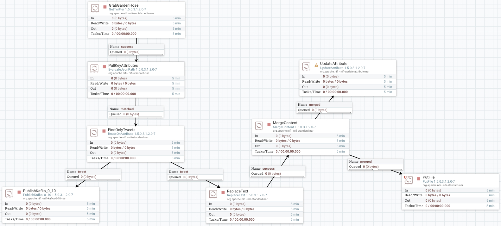
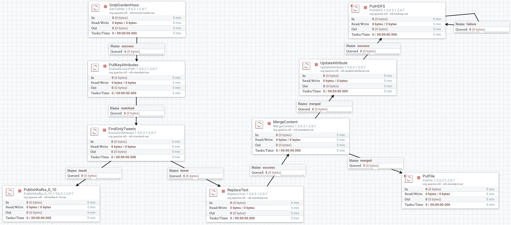

# Acquiring Twitter Data

## Introduction

Our next objective is to acquire sentiment data from Twitter's **[Decahose stream](https://developer.twitter.com/en/docs/tweets/sample-realtime/overview/streaming-likes)** API.

You will build one NiFi flow in a process group that ingests data from Twitter using
your KEYS and TOKENS you obtained from creating your Twitter Developer App.
Next you will massage the data extracting meaningful insight from JSON content
from the Twitter feed. Finally at different points in the flow you will store
the data into a Kafka topic, HDFS and the local file system.

You will build the second NiFi flow in another process group to consume data from
a different Kafka topic, which has a trained sentiment model built with an external service SparkML.

## Prerequisites

- Enabled Connected Data Architecture
- Setup the Development Environment

## Outline

- [Approach 1: Build a NiFi Flow to Acquire Twitter Data](#approach-1-build-a-nifi-flow-to-acquire-twitter-data)
- [Approach 2: Import NiFi Flow to Acquire Twitter Data](#approach-2-import-nifi-flow-to-acquire-twitter-data)
- [Summary](#summary)
- [Further Reading](#further-reading)

## Approach 1: Build a NiFi Flow to Acquire Twitter Data

After starting your sandbox, open HDF **NiFi UI** at `http://sandbox-hdf.hortonworks.com:9090/nifi`.

### 1\. Create AcquireTwitterData Process Group

This capture group ingests Twitter's **[Decahose stream](https://developer.twitter.com/en/docs/tweets/sample-realtime/overview/streaming-likes)** through Twitter's [Sentiment Detection API](https://developer.twitter.com/en/use-cases/analyze.html), preprocesses the data, stores it into Kafka, HDFS and local file system for later analysis.

Drop the process group icon  onto the NiFi canvas.

Insert the Process Group Name: `AcquireTwitterData` or one of your choice.

Double click on the process group to dive into it. At the bottom of the canvas, you will see **NiFi Flow >> AcquireTwitterData** breadcrumb. Let's began connecting the processors for data ingestion, preprocessing and storage.

### Ingest Twitter Data Source

Drop the processor icon onto the NiFi canvas. Add the **GetTwitter**.

Hold **control + mouse click** on **GetHTTP** to configure the processor:

**Table 1: Settings Tab**

| Setting | Value     |
| :------------- | :------------- |
| Name | GrabGardenHose |

**Table 2: Scheduling Tab**

| Scheduling     | Value     |
| :------------- | :------------- |
| Run Schedule       | `1 sec`       |

**Table 3: Properties Tab**

| Property     | Value     |
| :------------| :---------|
| **Twitter Endpoint**  | `Filter Endpoint` |
| **Consumer Key**  | `<Your-Consumer-API-Key>` |
| **Consumer Secret**  | `<Your-Consumer-API-Secret-Key>` |
| **Access Token**  | `<Your-Access-Token>` |
| **Access Token Secret**  | `<Your-Access-Token-Secret>` |
| Languages  | `en` |
| Terms to Filter On | `AAPL,ORCL,GOOG,MSFT,DELL` |

Click **APPLY**.

### Pull Key Attributes from JSON Content of FlowFile

Drop the processor icon onto the NiFi canvas. Add the **EvaluateJsonPath**.

Create connection between **GetTwitter** and **EvaluateJsonPath** processors. Hover
over **GetTwitter** to see arrow icon, press on processor and connect it to
**EvaluateJsonPath**.

Configure Create Connection:

| Connection | Value     |
| :------------- | :------------- |
| For Relationships     | success (**checked**) |

Click **ADD**.

Configure **EvaluateJsonPath** processor:

**Table 4: Settings Tab**

| Setting | Value     |
| :------------- | :------------- |
| Name | `PullKeyAttributes` |
| Bulletin Level | ERROR |
| Automatically Terminate Relationships | failure (**checked**) |
| Automatically Terminate Relationships | unmatched (**checked**) |

**Table 5: Scheduling Tab**

| Scheduling | Value     |
| :------------- | :------------- |
| Concurrent Tasks       | `4`       |
| Run Schedule       | `1 sec`       |

**Table 6: Properties Tab**

To add a new user defined property in case one the following properties in the
table isn't defined, press the plus button **+**.

| Property | Value     |
| :------------- | :------------- |
| **Destination**       | `flowfile-attribute` |
| twitter.handle       | `$.user.screen_name` |
| twitter.hashtags       | `$.entities.hashtags[0].text` |
| twitter.language       | `$.lang` |
| twitter.location       | `$.user.location` |
| twitter.msg       | `$.text` |
| twitter.time       | `$.created_at` |
| twitter.time_zone       | `$.user.time_zone` |
| twitter.tweet_id       | `$.id` |
| twitter.unixtime       | `$.timestamp_ms` |
| twitter.user       | `$.user.name` |

Click **APPLY**.

### Route FlowFiles Attributes Containing Non-Empty Tweets

Drop the processor icon onto the NiFi canvas. Add the **RouteOnAttribute**.

Create connection between **EvaluateJsonPath** and **RouteOnAttribute** processors. Hover
over **EvaluateJsonPath** to see arrow icon, press on processor and connect it to
**RouteOnAttribute**.

Configure Create Connection:

| Connection | Value     |
| :------------- | :------------- |
| For Relationships     | matched (**checked**) |

Click **ADD**.

Configure **RouteOnAttribute** processor:

**Table 7: Settings Tab**

| Setting | Value     |
| :------------- | :------------- |
| Name | `FindOnlyTweets` |
| Automatically Terminate Relationships | unmatched (**checked**) |

**Table 8: Scheduling Tab**

| Scheduling | Value     |
| :------------- | :------------- |
| Concurrent Tasks       | `2`       |
| Run Schedule       | `1 sec`       |

**Table 9: Properties Tab**

To add a new user defined property in case one the following properties in the
table isn't defined, press the plus button **+**.

| Property | Value     |
| :------------- | :------------- |
| **Routing Strategy**       | `Route to Property name` |
| tweet       | `${twitter.msg:isEmpty():not()}` |

Click **APPLY**.

### Put FlowFile Contents to Kafka Topic via KafkaProducer API

Drop the processor icon onto the NiFi canvas. Add the **PublishKafka_0_10** processor.

Create connection between **RouteOnAttribute** and both **PublishKafka_0_10** processors. Hover
over **RouteOnAttribute** to see arrow icon, press on processor and connect it to
**PublishKafka_0_10**.

Configure Create Connection:

| Connection | Value     |
| :------------- | :------------- |
| For Relationships     | tweet (**checked**) |

Click **ADD**.

Configure **PublishKafka_0_10** processor for relationship connection **tweet**:

**Table 10: Settings Tab**

| Setting | Value     |
| :------------- | :------------- |
| Automatically Terminate Relationships | failure (**checked**) |
| Automatically Terminate Relationships | success (**checked**) |

**Table 11: Scheduling Tab**

| Scheduling | Value     |
| :------------- | :------------- |
| Run Schedule       | `1 sec`       |

**Table 12: Properties Tab**

To add a new user defined property in case one the following properties in the
table isn't defined, press the plus button **+**.

| Property | Value     |
| :------------- | :------------- |
| **Kafka Brokers**       | `sandbox-hdp.hortonworks.com:6667` |
| **Topic Name**       | `tweets` |

Click **APPLY**.

### Search and Replace Content of FlowFile via Regex

Drop the processor icon onto the NiFi canvas. Add the **ReplaceText** processor.

Create connection between **RouteOnAttribute** and both **ReplaceText** processors. Hover
over **RouteOnAttribute** to see arrow icon, press on processor and connect it to
**ReplaceText**.

Configure Create Connection:

| Connection | Value     |
| :------------- | :------------- |
| For Relationships     | tweet (**checked**) |

Click **ADD**.

Configure **ReplaceText** processor for relationship connection **tweet**:

**Table 13: Settings Tab**

| Setting | Value     |
| :------------- | :------------- |
| Automatically Terminate Relationships | failure (**checked**) |

**Table 14: Scheduling Tab**

| Scheduling | Value     |
| :------------- | :------------- |
| Run Schedule       | `1 sec`       |

**Table 15: Properties Tab**

To add a new user defined property in case one the following properties in the
table isn't defined, press the plus button **+**.

Just like the properties table above, you will enter value into the value field for the appropriate property in NiFi.

~~~
Property = Value

Search Value = (?s:^(.*)$)

Replacement Value = {"tweet_id":${twitter.tweet_id},"created_unixtime":${twitter.unixtime},"created_time":"${twitter.time}","lang":"${twitter.language}","displayname":"${twitter.handle}","time_zone":"${twitter.time_zone}","msg":"${twitter.msg:replaceAll('[$&+,:;=?@#|\'<>.^*()%!-]',''):replace('"',''):replace('\n','')}"}
~~~

Click **APPLY**.

### Merge FlowFiles Once a Set Number Has Accumulated

Drop the processor icon onto the NiFi canvas. Add the **MergeContent** processor.

Create connection between **ReplaceText** and both **MergeContent** processors. Hover
over **ReplaceText** to see arrow icon, press on processor and connect it to
**MergeContent**.

Configure Create Connection:

| Connection | Value     |
| :------------- | :------------- |
| For Relationships     | success (**checked**) |

Click **ADD**.

Configure **MergeContent** processor:

**Table 16: Settings Tab**

| Setting | Value     |
| :------------- | :------------- |
| Automatically Terminate Relationships | failure (**checked**) |
| Automatically Terminate Relationships | original (**checked**) |

**Table 17: Scheduling Tab**

| Scheduling | Value     |
| :------------- | :------------- |
| Run Schedule       | `1 sec`       |

**Table 18: Properties Tab**

To add a new user defined property in case one the following properties in the
table isn't defined, press the plus button **+**.

| Property | Value     |
| :------------- | :------------- |
| **Minimum Number of Entries**       | `200` |
| **Maximum Number of Entries**       | `1000` |
| Max Bin Age       | `120 seconds` |
| **Maximum number of Bins**       | `100` |

Click **APPLY**.

### Write Contents of FlowFile to Local File System

Drop the processor icon onto the NiFi canvas. Add the **PutFile** processor.

Create connection between **MergeContent** and both **PutFile** processors. Hover
over **MergeContent** to see arrow icon, press on processor and connect it to
**PutFile**.

Configure Create Connection:

| Connection | Value     |
| :------------- | :------------- |
| For Relationships     | merged (**checked**) |

Click **ADD**.

Configure **PutFile** processor:

**Table 19: Settings Tab**

| Setting | Value     |
| :------------- | :------------- |
| Automatically Terminate Relationships | failure (**checked**) |
| Automatically Terminate Relationships | success (**checked**) |

**Table 20: Scheduling Tab**

| Scheduling | Value     |
| :------------- | :------------- |
| Run Schedule       | `1 sec`       |

**Table 21: Properties Tab**

To add a new user defined property in case one the following properties in the
table isn't defined, press the plus button **+**.

| Property | Value     |
| :------------- | :------------- |
| **Directory**       | `/sandbox/tutorial-files/770/nifi/output/tweets` |

Click **APPLY**.

### Update Merged FlowFile Attribute Name

Drop the processor icon onto the NiFi canvas. Add the **UpdateAttribute** processor.

Create connection between **MergeContent** and both **UpdateAttribute** processors. Hover
over **MergeContent** to see arrow icon, press on processor and connect it to
**UpdateAttribute**.

Configure Create Connection:

| Connection | Value     |
| :------------- | :------------- |
| For Relationships     | merged (**checked**) |

Click **ADD**.

Configure **UpdateAttribute** processor:

**Table 22: Scheduling Tab**

| Scheduling | Value     |
| :------------- | :------------- |
| Run Schedule       | `1 sec`       |

**Table 23: Properties Tab**

To add a new user defined property in case one the following properties in the
table isn't defined, press the plus button **+**.

| Property | Value     |
| :------------- | :------------- |
| filename      | `tweets-${now():format("HHmmssSSS")}.json` |

Click **APPLY**.

### Write Contents of FlowFile to Hadooop Distributed File System

Drop the processor icon onto the NiFi canvas. Add the **PutHDFS** processor.

Create connection between **UpdateAttribute** and both **PutHDFS** processors. Hover
over **UpdateAttribute** to see arrow icon, press on processor and connect it to
**PutHDFS**.

Configure Create Connection:

| Connection | Value     |
| :------------- | :------------- |
| For Relationships     | success (**checked**) |

Click **ADD**.

Configure **PutHDFS** processor:

**Table 24: Settings Tab**

| Setting | Value     |
| :------------- | :------------- |
| Automatically Terminate Relationships | success (**checked**) |

**Table 25: Scheduling Tab**

| Scheduling | Value     |
| :------------- | :------------- |
| Run Schedule       | `1 sec`       |

**Table 26: Properties Tab**

To add a new user defined property in case one the following properties in the
table isn't defined, press the plus button **+**.

| Property | Value     |
| :------------- | :------------- |
| Hadoop Configuration Resources       | `/etc/hadoop/conf/core-site.xml,/etc/hadoop/conf/hdfs-site.xml` |
| **Directory**       | `/sandbox/tutorial-files/770/hive/tweets_staging` |
| **Conflict Resolution Strategy**       | `replace` |
| Replication       | `1` |

Click **APPLY**.

Create connection between **PutHDFS** and itself. Hover
over **PutHDFS** to see arrow icon, press on processor and connect it to itself.

Configure Create Connection:

| Connection | Value     |
| :------------- | :------------- |
| For Relationships     | failure (**checked**) |

Click **ADD**.

### Start Process Group Flow to Acquire Data

At the breadcrumb, select **NiFi Flow** level. Hold **control + mouse click** on the **AcquireTwitterData** process group, then click the **start** option.

Once NiFi writes your sensor data to HDFS, which you can check by viewing data provenance, you can turn off the process group by holding **control + mouse click** on the **AcquireTwitterData** process group, then choose **stop** option.

### Verify NiFi Stored Data

Enter the **AcquireTwitterData** process group, press **control + mouse click** on PutHDFS processor of your choice, then press **View data provenance**.

Press on **i** icon on the left row to view details about a provenance event. Choose the event with the type **SEND**. In the Provenance Event window, choose **CONTENT** tab. On **Output Claim**, choose **VIEW**.

You will be able to see the data NiFi sent to the external process HDFS. The data below shows tweets dataset.

### 2\. Create StreamTweetsToSolr Process Group

Make sure to exit the **AcquireTwitterData** process group and head back to **NiFi Flow** level.

This capture group consumes data from Kafka that was brought in by Spark Structured Streaming and streams the contents of the flowfiles to Solr.

Drop the process group icon  onto the NiFi canvas next to **AcquireTwitterData** process group.

Insert the Process Group Name: `StreamTweetsToSolr` or one of your choice.

Double click on the process group to dive into it. At the bottom of the canvas, you will see **NiFi Flow >> StreamTweetsToSolr** breadcrumb. Let's began connecting the processors for data ingestion, preprocessing and storage.

### Poll Kafka Topic for Data using KafkaConsumer API

Drop the processor icon onto the NiFi canvas. Add the **ConsumeKafka_0_10** processor.

Configure **ConsumeKafka_0_10** processor:

**Table 27: Scheduling Tab**

| Scheduling | Value     |
| :------------- | :------------- |
| Run Schedule       | `1 sec`       |

**Table 28: Properties Tab**

To add a new user defined property in case one the following properties in the
table isn't defined, press the plus button **+**.

| Property | Value     |
| :------------- | :------------- |
| **Kafka Broker**       | `sandbox-hdf.hortonworks.com:6667` |
| **Topic Name(s)**       | `tweetsSentiment` |
| **Group ID**       | `1` |

Click **APPLY**.

### Stream Contents of FlowFile to Solr Update Handler

Drop the processor icon onto the NiFi canvas. Add the **PutSolrContentStream** processor.

Create connection between **ConsumeKafka_0_10** and both **PutSolrContentStream** processors. Hover
over **ConsumeKafka_0_10** to see arrow icon, press on processor and connect it to
**PutSolrContentStream**.

Configure Create Connection:

| Connection | Value     |
| :------------- | :------------- |
| For Relationships     | success (**checked**) |

Click **ADD**.

Configure **PutSolrContentStream** processor:

**Table 29: Settings Tab**

| Setting | Value     |
| :------------- | :------------- |
| Automatically Terminate Relationships | connection_failure (**checked**) |
| Automatically Terminate Relationships | failure (**checked**) |
| Automatically Terminate Relationships | success (**checked**) |

**Table 30: Scheduling Tab**

| Scheduling | Value     |
| :------------- | :------------- |
| Run Schedule       | `1 sec`       |

**Table 31: Properties Tab**

To add a new user defined property in case one the following properties in the
table isn't defined, press the plus button **+**.

| Property | Value     |
| :------------- | :------------- |
| **Solr Type**       | `Cloud` |
| **Solr Location**       | `sandbox-hdp.hortonworks.com:2181/solr` |
| Collection       | `tweets` |
| Commit Within       | `1000` |
| f.1       | `id:/id` |
| f.2       | `text_t:/text` |
| f.3       | `screenName_s:/user/screen_name` |
| f.4       | `language_s:/lang` |
| f.5       | `twitter_created_at_dt:/created_at` |
| f.6       | `tag_ss:/entities/hashtags` |
| f.7       | `originalposter_s:/retweeted_status/user/screen_name` |
| f.8       | `source_s:/source` |
| f.9       | `geo_s:/geo` |
| f.10       | `coordinates_s:/coordinates` |
| f.11       | `place_s:/place` |
| split       | `/` |

Click **APPLY**.

Exit **StreamTweetsToSolr** process group, we will need to use this process group later to pull in data from Kafka once we use Spark Structured Streaming to store data in Kafka.

We are done building the NiFi flows, you can head to the summary, then onward to the next area of development for this data pipeline.

## Approach 2: Import NiFi Flow to Acquire Twitter Data

Download the NiFi template [AcquireTwitterData.xml](application/development/nifi-template/AcquireTwitterData.xml) to your local computer.

After starting your sandbox, open HDF **NiFi UI** at `http://sandbox-hdf.hortonworks.com:9090/nifi`.

Open the Operate panel if not already open, then press the **Upload Template** icon .

Press on Select Template icon .

The file browser on your local computer will appear, find **AcquireTwitterData.xml** template you just downloaded, then press **Open**, then press **UPLOAD**.

You should receive a notification that the **Template successfully imported.** Press OK to acknowledge.

Drop the **Template** icon  onto the NiFi canvas.

Add Template called **acquire-twitter-data**.

Start the NiFi flow. Hold **control + mouse click** on the **AcquireTwitterData** process group, then click the **start** option.

Once NiFi writes tweet data to HDFS and Kafka, you can check the provenance events quickly by looking at the PutHDFS or PublishKafka_0_10 processor inside the **AcquireTwitterData** process group and once enough data has been stored, you can turn off the process group by holding **control + mouse click** on the **AcquireTwitterData** process group, then choose **stop** option.

## Summary

Congratulations! You built one dataflow **AcquireTwitterData** using NiFi to acquire Tweet sentiment data from Twitter's **[Decahose stream](https://developer.twitter.com/en/docs/tweets/sample-realtime/overview/streaming-likes)** API. The data pipeline filters for tweets before publishing messages into **Kafka topic 'tweets'**, which is picked up by the external service Spark. The data pipeline also updates the flowfile content in JSON with key value pairs to represent the sentiment data, merges multiple flowfiles together before storing into **HDFS**. The other dataflow **StreamTweetsToSolr** ingests Kafka messages and streams the content to Solr.

## Further Reading

- [NiFi User Guide](https://nifi.apache.org/docs/nifi-docs/html/user-guide.html)
