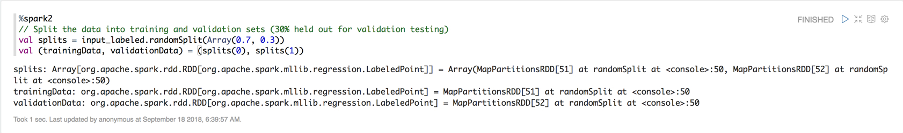
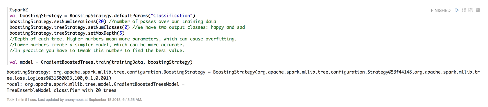
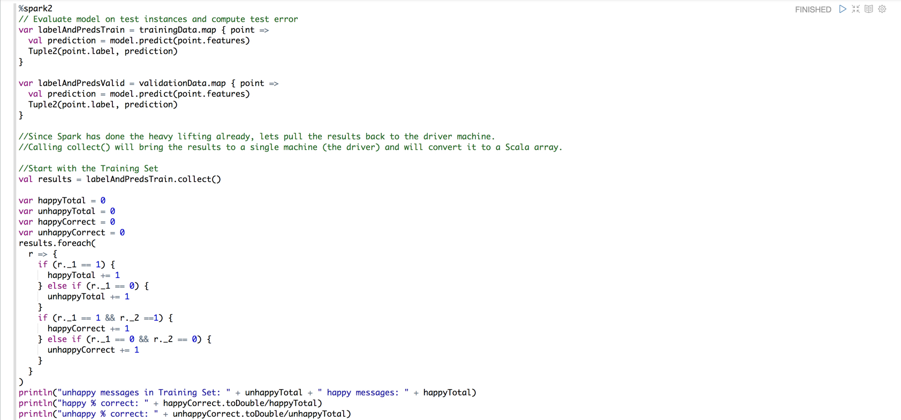
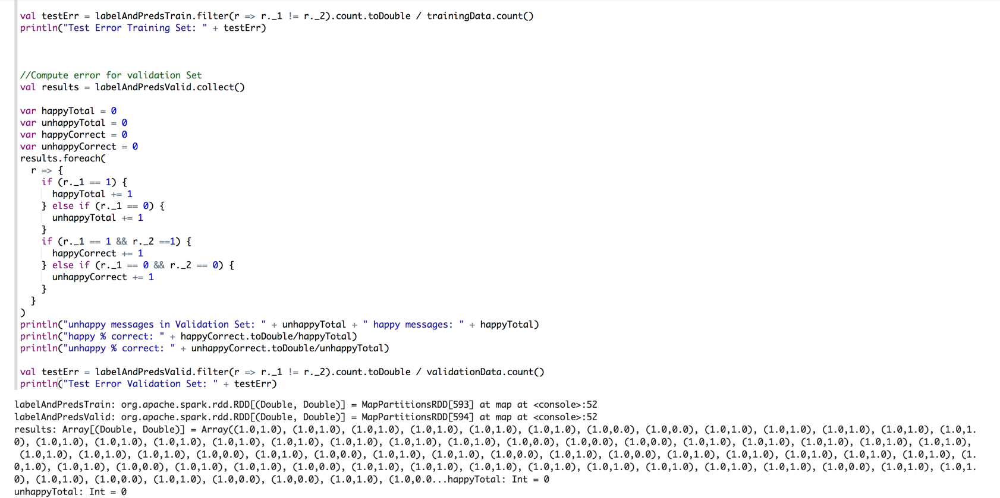
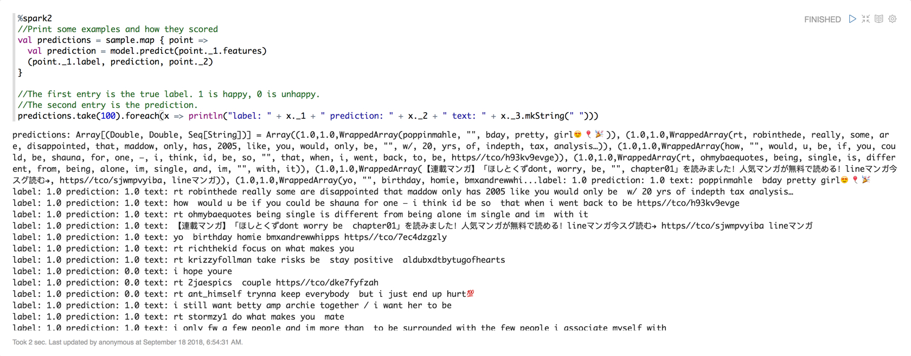
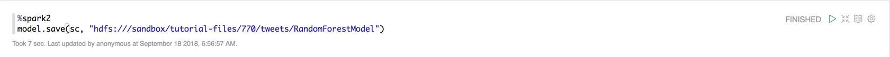

# Building a Sentiment Classification Model

## Introduction

Our next objective is to build the sentiment classification model using our cleaned twitter dataset. First we must train our machine learning model by separating our data into a training set and validation set. Next we can choose Gradient Boosting to build our model. We will then evaluate our model to see how well it did against training and test set. In the evaluation, we will attempt to adjust the parameters of the model to see if we can increase the model's accuracy at how well it differentiates between happy and sad tweets. Once the model has configured for maximum accuracy, we will export it into HDFS for production use.

## Prerequisites

- Enabled Connected Data Architecture
- Setup the Development Environment
- Acquired Twitter Data
- Cleaned Raw Twitter Data

## Outline

- [Approach 1: Implement a Sentiment Classification Model](#approach-1-implement-a-sentiment-classification-model)
- [Approach 2: Import Zeppelin Notebook via Zeppelin UI](#approach-2-import-zeppelin-notebook-via-ui)
- [Approach 3: Auto Deploy Zeppelin Notebook via REST Call](#approach-3-auto-deploy-zeppelin-notebook-via-rest-call)
- [Summary](#summary)
- [Further Reading](#further-reading)

## Approach 1: Implement a Sentiment Classification Model

### Create Zeppelin Notebook for Building the Model

Open Zeppelin UI at `http://sandbox-hdp.hortonworks.com:9995`.

1\. Create new note.

Insert note name as `Building-Sentiment-Classification-Model`, then press **Create Note**.

Now the notebook is created and we will start writing the code to build the model for the data.

### Split into Training and Validation Sets

When training any machine learning model you want to separate your data into a training set and a validation set. Click here to find out why we do it and how.

**Fixing overfitting:**

If you see that your validation accuracy is very low compared to your training accuracy, you can fix this overfitting by either increasing the size of your training data or by decreasing the number of parameters in your model. Copy and paste the Scala Spark code into Zeppelin notebook:

~~~scala
// Split the data into training and validation sets (30% held out for validation testing)
val splits = input_labeled.randomSplit(Array(0.7, 0.3))
val (trainingData, validationData) = (splits(0), splits(1))
~~~

### Build the Model

This machine learning application uses Gradient Boosting for classification.

~~~scala
val boostingStrategy = BoostingStrategy.defaultParams("Classification")
boostingStrategy.setNumIterations(20) //number of passes over our training data
boostingStrategy.treeStrategy.setNumClasses(2) //We have two output classes: happy and sad
boostingStrategy.treeStrategy.setMaxDepth(5)
//Depth of each tree. Higher numbers mean more parameters, which can cause overfitting.
//Lower numbers create a simpler model, which can be more accurate.
//In practice you have to tweak this number to find the best value.

val model = GradientBoostedTrees.train(trainingData, boostingStrategy)
~~~

### Evaluate Model

Let's evaluate the model to see how it performed against our training and test set.

~~~scala
// Evaluate model on test instances and compute test error
var labelAndPredsTrain = trainingData.map { point =>
  val prediction = model.predict(point.features)
  Tuple2(point.label, prediction)
}

var labelAndPredsValid = validationData.map { point =>
  val prediction = model.predict(point.features)
  Tuple2(point.label, prediction)
}

//Since Spark has done the heavy lifting already, lets pull the results back to the driver machine.
//Calling collect() will bring the results to a single machine (the driver) and will convert it to a Scala array.

//Start with the Training Set
val results = labelAndPredsTrain.collect()

var happyTotal = 0
var unhappyTotal = 0
var happyCorrect = 0
var unhappyCorrect = 0
results.foreach(
  r => {
    if (r._1 == 1) {
      happyTotal += 1
    } else if (r._1 == 0) {
      unhappyTotal += 1
    }
    if (r._1 == 1 && r._2 ==1) {
      happyCorrect += 1
    } else if (r._1 == 0 && r._2 == 0) {
      unhappyCorrect += 1
    }
  }
)
println("unhappy messages in Training Set: " + unhappyTotal + " happy messages: " + happyTotal)
println("happy % correct: " + happyCorrect.toDouble/happyTotal)
println("unhappy % correct: " + unhappyCorrect.toDouble/unhappyTotal)

val testErr = labelAndPredsTrain.filter(r => r._1 != r._2).count.toDouble / trainingData.count()
println("Test Error Training Set: " + testErr)

//Compute error for validation Set
val results = labelAndPredsValid.collect()

var happyTotal = 0
var unhappyTotal = 0
var happyCorrect = 0
var unhappyCorrect = 0
results.foreach(
  r => {
    if (r._1 == 1) {
      happyTotal += 1
    } else if (r._1 == 0) {
      unhappyTotal += 1
    }
    if (r._1 == 1 && r._2 ==1) {
      happyCorrect += 1
    } else if (r._1 == 0 && r._2 == 0) {
      unhappyCorrect += 1
    }
  }
)
println("unhappy messages in Validation Set: " + unhappyTotal + " happy messages: " + happyTotal)
println("happy % correct: " + happyCorrect.toDouble/happyTotal)
println("unhappy % correct: " + unhappyCorrect.toDouble/unhappyTotal)

val testErr = labelAndPredsValid.filter(r => r._1 != r._2).count.toDouble / validationData.count()
println("Test Error Validation Set: " + testErr)
~~~

Lets take some time to reflect on our result back at the **tutorial page (EXTERNAL LINK)**.

### Taking a closer look

Let's take some time to evaluate how our model did by dissecting the data at the individual tweet level.

~~~scala
//Print some examples and how they scored
val predictions = sample.map { point =>
  val prediction = model.predict(point._1.features)
  (point._1.label, prediction, point._2)
}

//The first entry is the true label. 1 is happy, 0 is unhappy.
//The second entry is the prediction.
predictions.take(100).foreach(x => println("label: " + x._1 + " prediction: " + x._2 + " text: " + x._3.mkString(" ")))
~~~

Once you've trained your first model, you should go back and tweak the model parameters to see if you can increase model accuracy. In this case, try tweaking the depth of each tree and the number of iterations over the training data. You could also let the model see a greater percentage of happy tweets than unhappy tweets to see if that improves prediction accuracy for happy tweets.

### Exporting the Model

Once your model is as accurate as you can make it, you can export it for production use. Models trained with Spark can be easily loaded back into a Spark Streaming workflow for use in production.

~~~scala
model.save(sc, "hdfs:///sandbox/tutorial-files/770/tweets/RandomForestModel")
~~~

You've now seen how to build a sentiment analysis model. The techniques you've seen here can be applied to other text classification models besides sentiment analysis. Try analyzing other keywords besides happy and sad and see what results you get.

~~~scala
println(model.predict(hashingTF.transform("To this cute little happy sunshine who never fails to bright up my day with his sweet lovely smiles ".split(" ").toSeq)))
~~~

## Approach 2: Import Zeppelin Notebook via Zeppelin UI

Open HDP **Zeppelin UI** at `sandbox-hdp.hortonworks.com:9995`.

1\. Click **Import note**. Select **Add from URL**.

Insert the following URL cause we are going to import **Building-Sentiment-Classification-Model** notebook:

~~~bash
https://<github-url>/Building-Sentiment-Classification-Model.json
~~~

Click **Import Note**.

Your notebook **Building-Sentiment-Classification-Model** should be a part of the list of notebooks now.

Click on notebook **Building-Sentiment-Classification-Model**. Then press the **play** button for all paragraphs to be executed. The **play** button is near the title of this notebook at the top of the webpage.

Now we are finished cleaning the Twitter data. We can head to the summary to review how we cleaned the data and prepared it to be ready for visualization.

## Approach 3: Auto Deploy Zeppelin Notebook via REST Call

Open HDP **sandbox web shell client** at `sandbox-hdp.hortonworks.com:4200`.

We will use the Zeppelin REST Call API to import a notebook that uses SparkSQL to analyze NASA's server logs for possible breaches.

~~~bash
NOTEBOOK_NAME="Building-Sentiment-Classification-Model"
wget https://github.com/james94/data-tutorials/raw/master/tutorials/cda/building-a-cybersecurity-breach-detection-application/application/development/shell/zeppelin-auto-deploy.sh
bash zeppelin-auto-deploy.sh $NOTEBOOK_NAME
~~~

## Summary

Congratulations! You learned how to build a sentiment classification model using SparkML's Gradient Boosting. Reviewing the process we took: separated the data into a training set and validation set, evaluated the model for accuracy, configured the model for maximum accuracy and exported it into HDFS for later use with Spark Streaming.

## Further Reading
