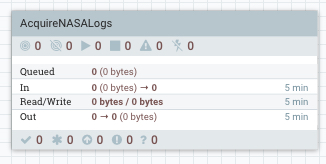

# Acquiring NASA Server Log Data

## Introduction

You have been brought onto the project as a Data Engineer with the following responsibilities: acquire the NASA Server Log data feed, preprocess the data to be readable and store it into a storage.

## Prerequisites

- Enabled CDA for your appropriate system.

## Outline

- [Approach 1: Auto Deploy NiFi Flow via REST Call](#approach-1-auto-deploy-nifi-flow-via-rest-call)
- [Approach 2: Import NiFi Flow via UI](#approach-2-import-nifi-flow-via-ui)
- [Approach 3: Build a NiFi AcquireNASALogs Process Group](#approach-3-build-a-nifi-acquirenasalogs-process-group)
    - [Ingest Server Log Data Source](#ingest-server-log-data-source)
    - [Enrich the Raw Server Logs](#enrich-the-raw-server-logs)
    - [Store the Data Into Storage](#store-the-data-into-storage)
    - [Start Process Group Flow to Acquire Data](#start-process-group-flow-to-acquire-data)
    - [Verify NiFi Stored Data](#verify-nifi-stored-data)
- [Summary](#summary)
- [Further Reading](#further-reading)
- [Appendix A: NiFi Reference](#appendix-a-nifi-reference)

## Approach 1: Auto Deploy NiFi Flow via REST Call

Open HDF Sandbox Web Shell Client at `http://sandbox-hdf.hortonworks.com:4200` with login `root/hadoop`.

~~~bash
wget https://github.com/james94/data-tutorials/raw/master/tutorials/cda/building-a-security-breach-analysis-application/application/development/shell/nifi-auto-deploy.sh
bash nifi-auto-deploy.sh
~~~

Open HDF **NiFi UI** at `http://sandbox-hdf.hortonworks.com:9090/nifi`. Your NiFi was just uploaded, imported and started.

## Approach 2: Import NiFi Flow via UI

## Approach 3: Build a NiFi AcquireNASALogs Process Group

Open HDF **NiFi UI** at `http://sandbox-hdf.hortonworks.com:9090/nifi`.

### Create AcquireNASALogs Process Group

Drop the **process group** icon onto the NiFi canvas.

Add the Process Group Name: `AcquireNASALogs` or one of your choice.

Double click on the process group to dive into it. At the bottom of the canvas, you will see **NiFi Flow >> AcquireNASALogs** breadcrumb. Let's began connecting the processors for data ingestion, preprocessing and storage.

### Ingest Server Log Data Source

### GetFTP

Drop the processor icon onto the NiFi canvas. Add the **GetFTP**.

Hold **control + mouse click** on **GetFTP** to configure the processor:

**Table 1: Scheduling Tab**

| Scheduling     | Value     |
| :------------- | :------------- |
| Run Schedule       | `1 sec`       |

**Table 2: Properties Tab**

| Property     | Value     |
| :------------| :---------|
| **URL**  | `ftp://ita.ee.lbl.gov/traces/NASA_access_log_Aug95.gz` |
| **Username**  | `anonymous` |

Click **APPLY**.

### UnpackContent

Drop the processor icon onto the NiFi canvas. Add the **UnpackContent**.

Create connection between **GetFTP** and **UnpackContent** processors. Hover
over **GetFTP** to see arrow icon, press on processor and connect it to
**UnpackContent**.

Configure Create Connection:

| Connection | Value     |
| :------------- | :------------- |
| For Relationships     | success (**checked**) |

Click **ADD**.

![getftp_to_unpackcontent]

### Enrich the Raw Server Logs

### Store the Data Into Storage

### Start Process Group Flow to Acquire Data

### Verify NiFi Stored Data

## Summary

## Further Reading

## Appendix A: NiFi Reference

**NiFi Flow** will use GetHTTP to pull data directly from NASA Server Logs HTTP Server instead of using local file.
