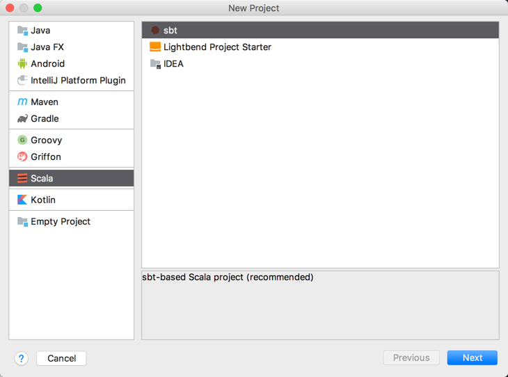
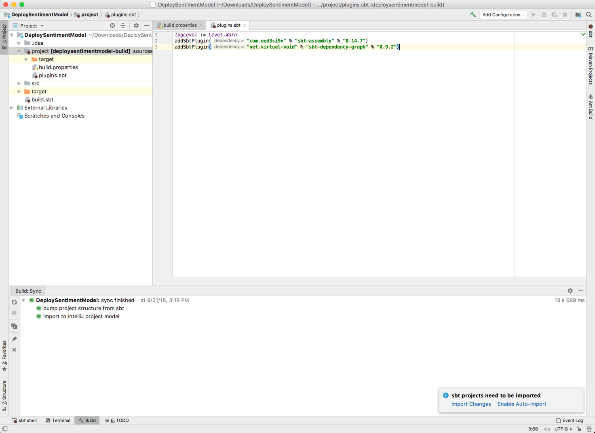
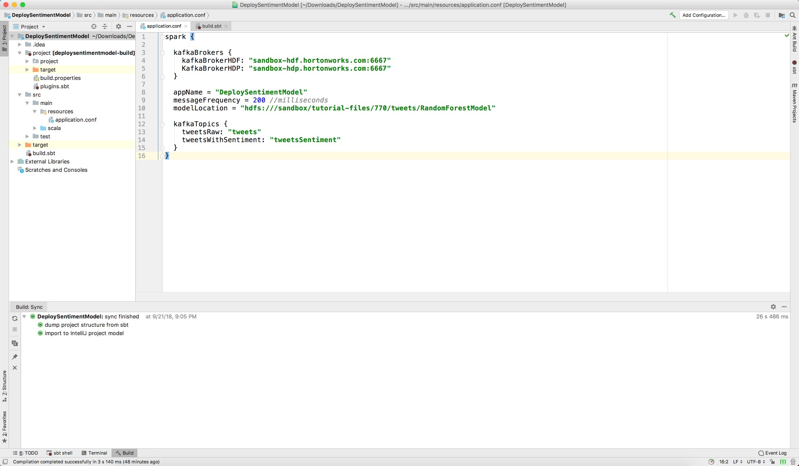
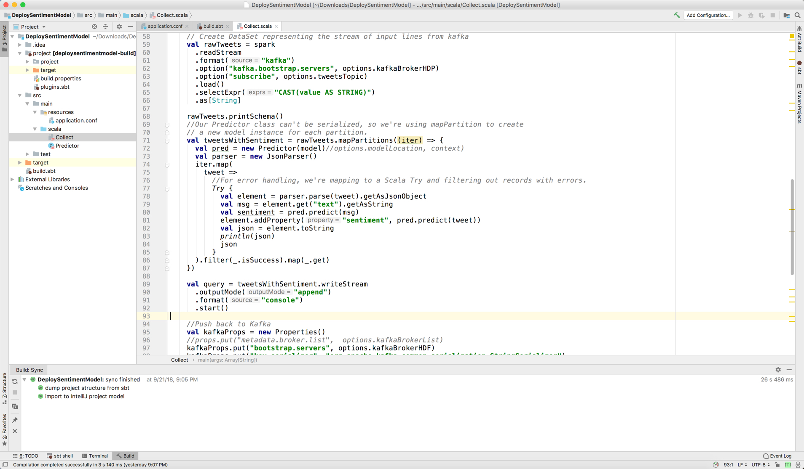
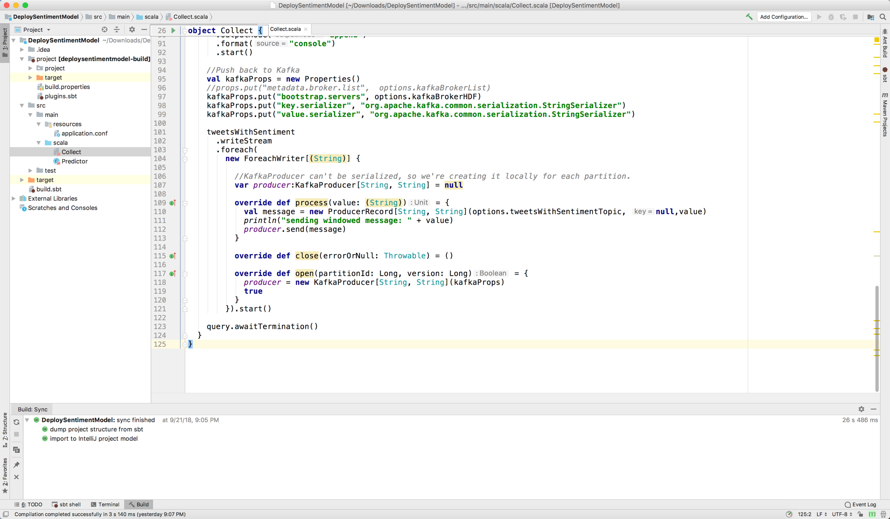
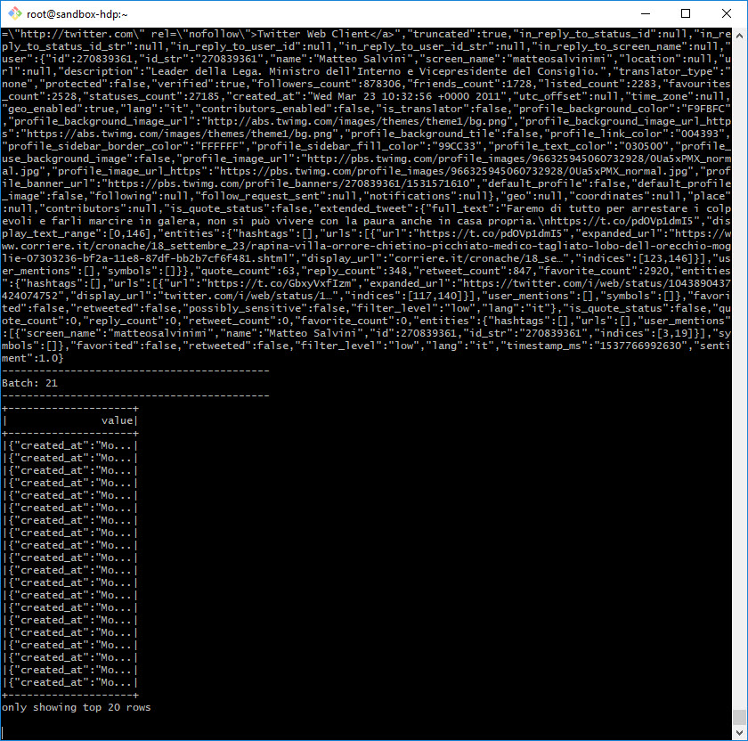

# Deploying a Sentiment Classification Model

## Introduction

Our next objective as a Data Engineer is to implement a Spark Structured Streaming application in Scala that pulls in the sentiment model from HDFS running on HDP, then pulls in fresh tweet data from Apache Kafka topic "tweet" running on HDP, does some processing by adding a sentiment score to each tweet based on the trained model output and streams each tweet with the new sentiment score field to Apache Kafka topic "tweetsSentiment" running on HDF.

## Prerequisites

- Enabled Connected Data Architecture
- Setup the Development Environment
- Acquired Twitter Data
- Cleaned Raw Twitter Data
- Built a Sentiment Classification Model
- Go through **[Setting up a Spark Development Environment with Scala](https://hortonworks.com/tutorial/setting-up-a-spark-development-environment-with-scala/)**, it will cover **installing SBT**, **IntelliJ** with Scala Plugin and some basic concepts that will be built upon in this tutorial

## Outline

- [Implement a Spark Streaming App to Deploy the Model](#implement-a-spark-streaming-app-to-deploy-the-model)
- [Summary](#summary)
- [Further Reading](#further-reading)

## Approach 1: Implement a Spark Streaming App to Deploy the Model

### Create New IntelliJ Project

**Create New Project**

Select **Scala** with **sbt**, then press next.

Name your project `DeploySentimentModel`

Feel free to use InteliJ's default location for storing the application. The one
in the following picture was a custom location to store the application.

Select appropriate **sbt version 1.2.3** and **Scala version 2.11.12**. Make sure sources are checked to download sources.

Click **finish** to proceed. Open the **Project** folder.

### Project folder

From **project**, we will verify **build.properties** contains the appropriate **sbt** version. Next we will create a plugins.sbt folder to have **sbt** download the plugins needed to import external libraries.

### build.properties

Verify **build.properties** file contains the appropriate **SBT version**.
It should match the version you chose when you created the IntelliJ project.

~~~scala
sbt.version = 1.2.3
~~~

By adding the **SBT version**, this allows people with different versions of the SBT launcher to build the same project with consistent results.

### plugins.sbt

**What is a Plugin?**

- A plugin adds new setting, which extension to the build definition. In our case,
we need to add **sbt-assembly** and **sbt-depedency-graph** plugins.

Right click on **project** folder, select **new**, then select **file**.
Name the file `plugins.sbt`, then click **ok**.

Add the following lines to the file:

~~~scala
logLevel := Level.Warn
addSbtPlugin("com.eed3si9n" % "sbt-assembly" % "0.14.7")
addSbtPlugin("net.virtual-void" % "sbt-dependency-graph" % "0.9.2")
~~~

If you haven't enabled auto import for sbt projects, you should **Enable-Auto-Import**. Anytime we add more plugins to this file, IntelliJ will allow sbt to auto import them.

What do the keywords in the configuration file for SBT mean?

- **logLevel**: controls the logging level for our project, currently we have enabled debug logging for all tasks in the current project
- **addSbtPlugin**: allows for you to declare plugin dependency, takes as input the following format ("`IvyModuleID`" % "`ArtifactID`" % "`Revision`")
- **sbt-assembly**: this plugin creates a fat JAR of your project with all its dependencies
- **sbt-dependency-graph**: this plugin visualizes your project's dependencies

**plugins.sbt Reference:**

- for more information on **logLevel**, refer to [Configure and use logging](https://www.scala-sbt.org/1.x/docs/Howto-Logging.html)
- for more information on **sbt-assembly** plugin dependency, such as revision used, refer to [sbt-assembly repo - Using Published Plugin](https://github.com/sbt/sbt-assembly)
- for more information on **sbt-dependency-graph** plugin dependency, such as revision used, refer to [sbt-dependency-graph repo](https://github.com/jrudolph/sbt-dependency-graph)

### SBT

We will use SBT to import the **Spark libraries**, **Kafka library**, **Google gson library**, **tyesafe config library** and the **appropriate documentation** into IntelliJ. Thus, IntelliJ can recognize Spark and GSON code. Copy and paste the following lines to the file **build.sbt** to overwrite it:

~~~scala
name := "DeploySentimentModel"

version := "2.0.0"

scalaVersion := "2.11.12"

libraryDependencies ++= {
  val sparkVer = "2.3.1"
  Seq(
    "org.apache.spark"     %% "spark-core"              % sparkVer % "provided" withSources(),
    "org.apache.spark"     %% "spark-mllib"             % sparkVer % "provided" withSources(),
    "org.apache.spark"     %% "spark-sql"               % sparkVer % "provided" withSources(),
    "org.apache.spark"     %% "spark-streaming"         % sparkVer % "provided" withSources(),
    "org.apache.spark"     %% "spark-streaming-kafka-0-10" % sparkVer withSources(),
    "org.apache.spark"     %% "spark-sql-kafka-0-10" % sparkVer withSources(),
    "org.apache.kafka"     %% "kafka" % "0.10.2.2" withSources(),
    "org.jpmml"            % "pmml-model" % "1.4.6",
    "com.typesafe" % "config" % "1.3.3",
    "com.google.code.gson" % "gson" % "2.8.5"
  )
}

assemblyMergeStrategy in assembly := {
  case PathList("org", "apache", xs @ _*)      => MergeStrategy.first
  case PathList("javax", "xml", xs @ _*)      => MergeStrategy.first
  case PathList("com", "esotericsoftware", xs @ _*)      => MergeStrategy.first
  case PathList("com", "google", xs @ _*)      => MergeStrategy.first
  case x =>
    val oldStrategy = (assemblyMergeStrategy in assembly).value
    oldStrategy(x)
}
~~~

What do the keywords in the configuration file for SBT mean?

- **name**: specifies project name
- **version**: specifies project version
- **scalaVersion**: specifies Scala version
- **libraryDependencies**: specifies that we want SBT to import the following `Spark libraries` **spark-core, spark-mllib, spark-sql, spark-streaming, spark-streaming-kafka-0-10, spark-sql-kafka-0-10** with associated `sparkVer` **2.3.1**, import the following `Kafka library` **kafka** with associated version **0.10.0**, import the following `typesafe library` **config** with associated version **1.3.1** and import `Google gson library` **gson** with associated version **2.8.0**
- **Group ID**: Ex: org.apache.spark
- **Artficate ID**: Ex: spark-core
- **Revision**: sparkVer = 2.3.1, but you could explicitly write the version number too
- **%%**: Ex: appends **scala version** to **ArtifactID**
- **Seq(...)**: used in combination with **++=** to load multiple library dependencies in SBT
- **assemblyMergeStrategy**: maps `path names` to `merge strategies`, each case pattern uses PathList(...) mapped to MergeStrategy.first, which says pick the first of matching files in the classpath order. Ex: the first case pattern uses `PathList(...)` to pick `org/apache/*` from the first jar.

**SBT Reference:**

- **libraryDependencies** is built-in sbt, for more info look into [libraryDependencies - sbt doc](https://www.scala-sbt.org/1.x/docs/Library-Dependencies.html)
- **assemblyMergeStrategy** is an sbt plugin, for more info look into [sbt-assembly repo](https://github.com/sbt/sbt-assembly)
- [Spark Streaming + Kafka 0.10.0 Integration Guide](https://spark.apache.org/docs/latest/streaming-kafka-0-10-integration.html)
- If you run into unresolved dependency for a module not found indicated by Build log, then you should refer to link **[mvnrepository](http://mvnrepository.com)** and check each libraryDependency to make sure the build definition line is correct

Now that we added the Spark Structured Streaming application dependencies, we are ready to start writing the code.

### Create Spark Structured Streaming Application

### resources folder

In your project, if the **resources** folder or directory does not exist yet, create a directory under **src/main** called `resources`, and create the `application.conf` file there.

### application.conf

**application.conf** holds the configurations about our environment in which we will run the application. We will use the following configuration file and load configurations into **Scala**.

~~~scala
spark {

  kafkaBrokers {
    kafkaBrokerHDF: "sandbox-hdf.hortonworks.com:6667"
    kafkaBrokerHDP: "sandbox-hdp.hortonworks.com:6667"
  }

  appName = "DeploySentimentModel"
  messageFrequency = 200 //milliseconds
  modelLocation = "hdfs:///sandbox/tutorial-files/770/tweets/RandomForestModel"

  kafkaTopics {
    tweetsRaw: "tweets"
    tweetsWithSentiment: "tweetsSentiment"
  }
}
~~~

What configurations are we passing to Scala with this file?

- **kafkaBrokers**: specifies the server location in which each Kafka Broker at HDF and HDP used in the application listens in on for packets coming into the application.
- **appName**: specifies application name
- **messageFrequency**: how often to send messages
- **modelLocation**: location our machine learning model resides
- **kafkaTopics**: Kafka topics that will be used in the **Spark Structured Streaming** application

**application.conf Reference:**

- For more information on Scala configuration files, refer to [Loading Configurations in Scala](https://danielasfregola.com/2015/06/01/loading-configurations-in-scala/)

### Collect.scala

Now that we have our **application.conf** file, we will reference it in the **Collect.scala** code file that we will implement. Create a **new file** called `Collect.scala` in **src/main/scala** directory. Copy and paste the following code into the file:

~~~scala
package main.scala

import java.util.Properties

import scala.util.control.ControlThrowable
import com.google.gson.{Gson, JsonParser}
import com.typesafe.config.ConfigFactory
import org.apache.kafka.clients.producer.{KafkaProducer, ProducerRecord}
import org.apache.spark.mllib.classification.LogisticRegressionModel
import org.apache.spark.mllib.tree.model.GradientBoostedTreesModel
import org.apache.spark.sql.{ForeachWriter, SparkSession}
import org.dmg.pmml.True

import scala.util.Try

case class CollectOptions(
                           kafkaBrokerHDF: String,
                           kafkaBrokerHDP: String,
                           tweetsTopic: String,
                           tweetsWithSentimentTopic: String,
                           appName:String,
                           modelLocation:String
                         )

/** Setup Spark Streaming */
object Collect {
  private implicit val config = ConfigFactory.load()
  def main(args: Array[String]) {

    val options = new CollectOptions(
      config.getString("spark.kafkaBrokers.kafkaBrokerHDF"),
      config.getString("spark.kafkaBrokers.kafkaBrokerHDP"),
      config.getString("spark.kafkaTopics.tweetsRaw"),
      config.getString("spark.kafkaTopics.tweetsWithSentiment"),
      config.getString("spark.appName"),
      config.getString("spark.modelLocation")
    )

    val spark = SparkSession
      .builder
      .appName("DeploySentimentModel")
      .getOrCreate()
    spark.sparkContext.setLogLevel("ERROR")

    var model: GradientBoostedTreesModel = null
    if(options.modelLocation != null) {
      try {
        model = GradientBoostedTreesModel.load(spark.sparkContext, options.modelLocation)
      }catch{
        case unknown : ControlThrowable => println("Couldn't load Gradient Boosted Model. Have you built it with Zeppelin yet?")
          throw unknown
      }
    }
    //Instantiate model. Model should already be trained and exported with associated Zeppelin notebook.

    import spark.implicits._

    // Create DataSet representing the stream of input lines from kafka
    val rawTweets = spark
      .readStream
      .format("kafka")
      .option("kafka.bootstrap.servers", options.kafkaBrokerHDP)
      .option("subscribe", options.tweetsTopic)
      .load()
      .selectExpr("CAST(value AS STRING)")
      .as[String]

    rawTweets.printSchema()
    //Our Predictor class can't be serialized, so we're using mapPartition to create
    // a new model instance for each partition.
    val tweetsWithSentiment = rawTweets.mapPartitions((iter) => {
      val pred = new Predictor(model)//options.modelLocation, context)
      val parser = new JsonParser()
      iter.map(
        tweet =>
          //For error handling, we're mapping to a Scala Try and filtering out records with errors.
          Try {
            val element = parser.parse(tweet).getAsJsonObject
            val msg = element.get("text").getAsString
            val sentiment = pred.predict(msg)
            element.addProperty("sentiment", pred.predict(tweet))
            val json = element.toString
            println(json)
            json
          }
      ).filter(_.isSuccess).map(_.get)
    })

    val query = tweetsWithSentiment.writeStream
      .outputMode("append")
      .format("console")
      .start()

    //Push back to Kafka
    val kafkaProps = new Properties()
    //props.put("metadata.broker.list",  options.kafkaBrokerList)
    kafkaProps.put("bootstrap.servers", options.kafkaBrokerHDF)
    kafkaProps.put("key.serializer", "org.apache.kafka.common.serialization.StringSerializer")
    kafkaProps.put("value.serializer", "org.apache.kafka.common.serialization.StringSerializer")

    tweetsWithSentiment
      .writeStream
      .foreach(
        new ForeachWriter[(String)] {

          //KafkaProducer can't be serialized, so we're creating it locally for each partition.
          var producer:KafkaProducer[String, String] = null

          override def process(value: (String)) = {
            val message = new ProducerRecord[String, String](options.tweetsWithSentimentTopic, null,value)
            println("sending windowed message: " + value)
            producer.send(message)
          }

          override def close(errorOrNull: Throwable) = ()

          override def open(partitionId: Long, version: Long) = {
            producer = new KafkaProducer[String, String](kafkaProps)
            true
          }
        }).start()

    query.awaitTermination()
  }
}
~~~

### Predictor.scala

Since we are referencing the Predictor class in **Collect.scala** source file to predict whether the tweet is happy or sad and it hasn't been implemented yet, we will develop **Predictor.scala** source file. Create a new Scala Class file called `Predictor` in **src/main/scala** directory and for **kind**, choose **Class**. Copy and paste the following code into the file

~~~scala
package main.scala

import org.apache.spark.SparkContext
import org.apache.spark.mllib.tree.GradientBoostedTrees
import org.apache.spark.mllib.tree.model.GradientBoostedTreesModel
import org.apache.spark.mllib.feature.HashingTF
import org.apache.spark.mllib.linalg.{Vector, Vectors}

/**
  * Predict violations
  */
class Predictor(model: GradientBoostedTreesModel){//modelLocation:String, sc:SparkContext) {

  //  var model: GradientBoostedTreesModel = null
  //  if(modelLocation != null)
  //    model = GradientBoostedTreesModel.load(sc, modelLocation)

  /**
    * Returns 1 for happy, 0 for unhappy
    * @param tweet
    * @return
    */
  def predict(tweet:String): Double ={
    if(tweet == null || tweet.length == 0)
      throw new RuntimeException("Tweet is null")
    val features = vectorize(tweet)
    return model.predict(features)
  }

  val hashingTF = new HashingTF(2000)
  def vectorize(tweet:String):Vector={
    hashingTF.transform(tweet.split(" ").toSeq)
  }

}
~~~

### Overview of Spark Code to Deploy Model

To submit the code to Spark we need to compile it and submit it to Spark. Since our code depends on other libraries (like GSON) to run, we ought to package our code with these dependencies into an assembly that can be submitted to Spark. To do this we're using a dependency manager called SBT, which you'll need to install on your machine, if you haven't done so, refer to the prerequisites. (You'll notice we also added this line of code to the plugins.sbt file, which is also required.) Once you've installed it, you can package your code and dependencies into a single jar. Open your mac/linux terminal or windows git bash on your host machine not virtual machine, then run the following shell code:

~~~bash
cd ~/IdeaProjects/DeploySentimentModel
sbt clean
sbt assembly
~~~

This will create a single jar file inside the target folder. You can copy this jar into the HDP sandbox like this:

~~~scala
scp -P 2222 ./target/scala-2.11/DeploySentimentModel-assembly-1.0.0.jar root@sandbox-hdp.hortonworks.com:/root
~~~

Once this has been copied to the HDP sandbox, you want to make sure **Kafka** is turned on for both HDP and HDF sandboxes, **Spark2 and HBase** is turned on for HDP sandbox and **NiFi** is turned on for HDF sandbox. Make sure the NiFi flow is turned on and tweets are flowing to Kafka via Spark Structured Streaming.

Open your HDP sandbox web shell at http://sandbox-hdp.hortonworks.com:4200. The login is `root` and the password you set. Then use spark-submit to deploy the jar to Spark:

~~~scala
/usr/hdp/current/spark2-client/bin/spark-submit --class "main.scala.Collect" --master local[4] ./DeploySentimentModel-assembly-1.0.0.jar
~~~

Here we're deploying the jar on a single machine only by using --master local[4]. In production you want to change these settings to run on Yarn. Once you submit the job you should see output on the terminal as Spark scores each tweet.

The shell output (running on windows 10 git bash similar for mac/linux terminal)
illustrates that Spark Structured Streaming Application is pulling in data from
HDP Kafka topic "tweets" and streaming the tweets with a sentiment score to HDF
Kafka topic "tweetsSentiment".

## Summary

Congratulations! You implemented a Spark Structured Streaming application that pulls in JSON messages from Kafka topic "tweets", adds a sentiment field to the JSON based on the sentiment model loaded in from HDFS and sends the enriched data back to Kafka topic "tweetsSentiment".

## Further Reading

- [Building a Scala Project With IntelliJ and SBT](https://docs.scala-lang.org/getting-started-intellij-track/building-a-scala-project-with-intellij-and-sbt.html)
- [Apache Spark Structured Streaming](https://spark.apache.org/docs/latest/structured-streaming-programming-guide.html)
- [Apache Spark 2.3.1 + Kafka Integration](https://spark.apache.org/docs/2.3.1/structured-streaming-kafka-integration.html)
- [Google GSON Library](https://github.com/google/gson)
- [Java JPMML API](https://github.com/jpmml)
- [SBT Assembly](https://github.com/sbt/sbt-assembly)
