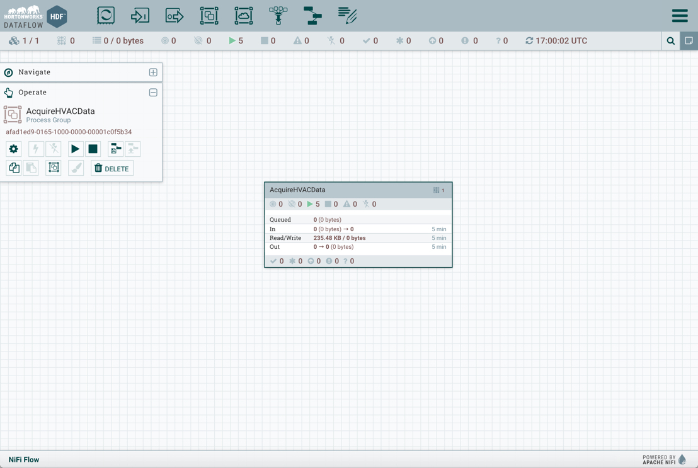
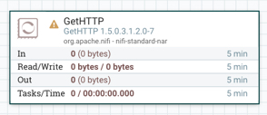
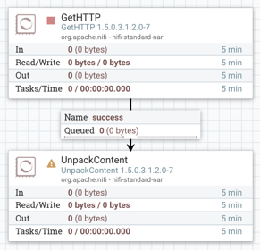
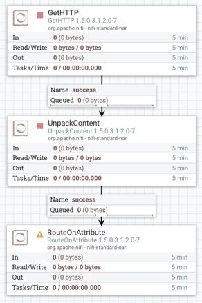
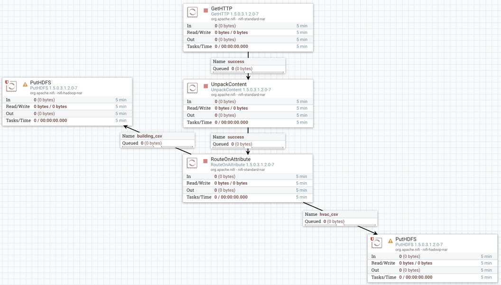
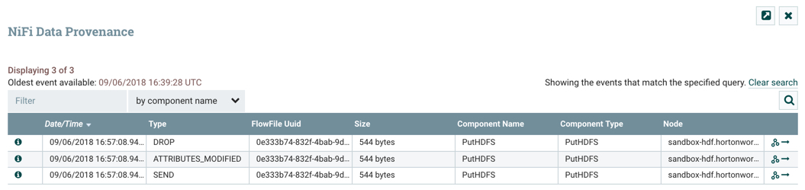
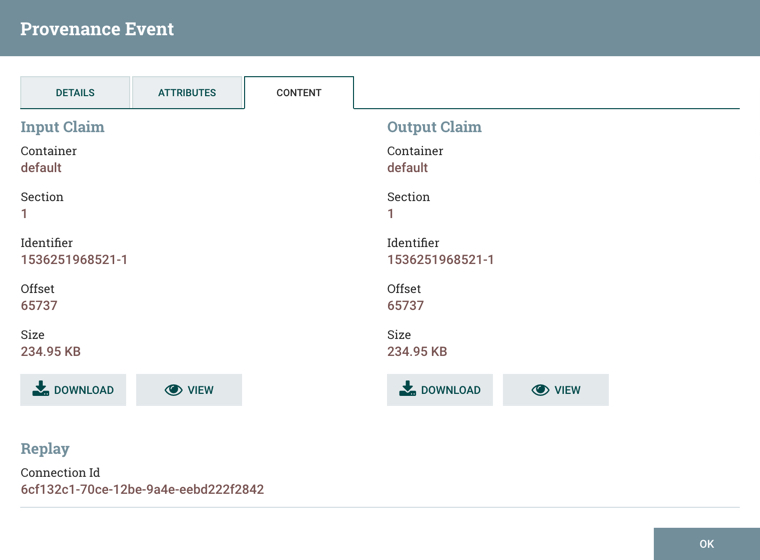
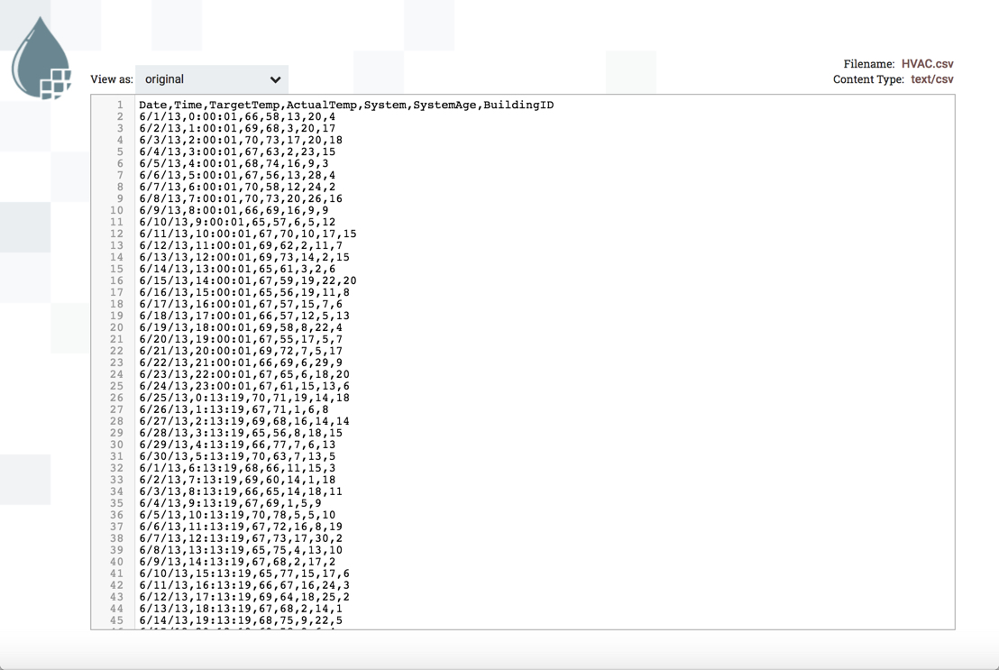

# Acquiring HVAC Sensor Data

## Introduction

You have been brought onto the project as a Data Engineer with the following responsibilities: acquire the HVAC sensor data feed, split the feed into two separate flows and store them into their respective locations in storage.

## Prerequisites

- Enabled CDA for your appropriate system.

## Outline

- [Approach 1: Auto Deploy NiFi Flow via REST Call](#approach-1-auto-deploy-nifi-flow-via-rest-call)
- [Approach 2: Import NiFi Flow via UI](#approach-2-import-nifi-flow-via-ui)
- [Approach 3: Build a NiFi AcquireHVACData Process Group](#approach-3-build-a-nifi-acquirehvacdata-process-group)
    - [Ingest Sensor Data Source](#ingest-sensor-data-source)
    - [Decompress Content of FlowFile](#decompress-content-of-flowfile)
    - [Split the Source Into Two Flows](#split-the-source-into-two-flows)
    - [Store the Data Into Storage](#store-the-data-into-storage)
    - [Start Process Group Flow to Acquire Data](#start-process-group-flow-to-acquire-data)
    - [Verify NiFi Stored Data](#verify-nifi-stored-data)
- [Summary](#summary)
- [Further Reading](#further-reading)
- [Appendix A: NiFi Reference](#appendix-a-nifi-reference)

## Approach 1: Auto Deploy NiFi Flow via REST Call

Open HDF **sandbox web shell client** at `http://sandbox-hdf.hortonworks.com:4200/` with login `root/hadoop`.

~~~bash
wget https://raw.githubusercontent.com/james94/data-tutorials/master/tutorials/cda/building-an-hvac-system-analysis-application/application/development/shell/nifi-auto-deploy.sh
bash nifi-auto-deploy.sh
~~~

Open HDF **NiFi UI** at `http://sandbox-hdf.hortonworks.com:9090/nifi`.

You will see the NiFi template was uploaded, imported and started.

Once NiFi writes your sensor data to HDFS, which you can check quickly by looking at the PutHDFS processors inside the process group, you can turn off the process group by holding **control + mouse click** on the **AcquireHVACData** process group, then choose **stop** option.

## Approach 2: Import NiFi Flow via UI

Download the NiFi template [acquire-hvac-data.xml](application/development/nifi-template/acquire-hvac-data.xml) to your local computer.

After starting your sandbox, open HDF **NiFi UI** at `http://sandbox-hdf.hortonworks.com:9090/nifi`.

Open the Operate panel if not already open, then press the **Upload Template** icon .

Press on Select Template icon .

The file browser on your local computer will appear, find **acquire-hvac-data.xml** template you just downloaded, then press **Open**, then press **UPLOAD**.

You should receive a notification that the **Template successfully imported.** Press OK to acknowledge.

Drop the **Template** icon  onto the NiFi canvas.

Add Template called **acquire-hvac-data**.

Start the NiFi flow. Hold **control + mouse click** on the **AcquireHVACData** process group, then click the **start** option.

Once NiFi writes your sensor data to HDFS, which you can check quickly by looking at the PutHDFS processors inside the process group, you can turn off the process group by holding **control + mouse click** on the **AcquireHVACData** process group, then choose **stop** option.

## Approach 3: Build a NiFi AcquireHVACData Process Group

After starting your sandbox, open HDF **NiFi UI** at `http://sandbox-hdf.hortonworks.com:9090/nifi`.

### Create AcquireHVACData Process Group

Drop the process group icon  onto the NiFi canvas.

Add the Process Group Name: `AcquireHVACData` or one of your choice.

Double click on the process group to dive into it. At the bottom of the canvas, you will see **NiFi Flow >> AcquireHVACData** breadcrumb. Let's began connecting the processors for data ingestion, preprocessing and storage.

### Ingest Sensor Data Source

Drop the processor icon onto the NiFi canvas. Add the **GetHTTP**.

Hold **control + mouse click** on **GetHTTP** to configure the processor:

**Table 1: Scheduling Tab**

| Scheduling     | Value     |
| :------------- | :------------- |
| Run Schedule       | `1 sec`       |

**Table 2: Properties Tab**

| Property     | Value     |
| :------------| :---------|
| **URL**  | `http://s3.amazonaws.com/hw-sandbox/tutorial14/SensorFiles.zip` |
| **Filename**  | `HVACSensorFiles.zip` |
| **Connection Timeout**  | `30 sec` |
| **Date Timeout**  | `30 sec` |

Click **APPLY**.

### Decompress Content of FlowFile

Drop the processor icon onto the NiFi canvas. Add the **UnpackContent**.

Create connection between **GetHTTP** and **UnpackContent** processors. Hover
over **GetHTTP** to see arrow icon, press on processor and connect it to
**UnpackContent**.

Configure Create Connection:

| Connection | Value     |
| :------------- | :------------- |
| For Relationships     | success (**checked**) |

Click **ADD**.

Configure **UnpackContent** processor:

**Table 3: Settings Tab**

| Setting | Value     |
| :------------- | :------------- |
| Automatically Terminate Relationships | failure (**checked**) |
| Automatically Terminate Relationships | original (**checked**) |

**Table 4: Scheduling Tab**

| Scheduling | Value     |
| :------------- | :------------- |
| Run Schedule       | `1 sec`       |

**Table 5: Properties Tab**

| Property | Value     |
| :------------- | :------------- |
| **Packaging Format**       | `zip` |

Click **APPLY**.

### Split the Source Into Two Flows

Drop the processor icon onto the NiFi canvas. Add the **RouteOnAttribute**.

Create connection between **UnpackContent** and **RouteOnAttribute** processors. Hover
over **UnpackContent** to see arrow icon, press on processor and connect it to
**RouteOnAttribute**.

Configure Create Connection:

| Connection | Value     |
| :------------- | :------------- |
| For Relationships     | success (**checked**) |

Click **ADD**.

Configure **RouteOnAttribute** processor:

**Table 6: Settings Tab**

| Setting | Value     |
| :------------- | :------------- |
| Automatically Terminate Relationships | unmatched (**checked**) |

**Table 7: Scheduling Tab**

| Scheduling | Value     |
| :------------- | :------------- |
| Run Schedule       | `1 sec`       |

**Table 8: Properties Tab**

Press the **+** button to add a user defined property for routing property name **building** and **hvac**.

| Property | Value     |
| :------------- | :------------- |
| **Routing Strategy**       | `Route to Property name` |
| **building_csv**       | `${filename:equals('building.csv')}` |
| **hvac_csv**       | `${filename:equals('HVAC.csv')}` |

Click **APPLY**.

### Store the Data Into Storage

Drop the processor icon onto the NiFi canvas. Add 2 **PutHDFS** processors.

Create connection between **RouteOnAttribute** and both **PutHDFS** processors. Hover
over **RouteOnAttribute** to see arrow icon, press on processor and connect it to
**PutHDFS**. Repeat the the previous step to connect to the other **PutHDFS** processor.

For one of the **PutHDFS** processors, Configure Create Connection:

| Connection | Value     |
| :------------- | :------------- |
| For Relationships     | building_csv (**checked**) |

Click **ADD**.

For the other **PutHDFS** processor, Configure Create Connection:

| Connection | Value     |
| :------------- | :------------- |
| For Relationships     | hvac_csv (**checked**) |

Click **ADD**.

Configure **PutHDFS** processor for relationship connection **building_csv**:

**Table 9: Settings Tab**

| Setting | Value     |
| :------------- | :------------- |
| Automatically Terminate Relationships | failure (**checked**) |
| Automatically Terminate Relationships | success (**checked**) |

**Table 10: Scheduling Tab**

| Scheduling | Value     |
| :------------- | :------------- |
| Run Schedule       | `1 sec`       |

**Table 11: Properties Tab**

Press the **+** button to add a user defined property for routing property name **building** and **hvac**.

| Property | Value     |
| :------------- | :------------- |
| Hadoop Configuration Resources       | `/etc/hadoop/conf/core-site.xml,/etc/hadoop/conf/hdfs-site.xml` |
| **Directory**       | `/sandbox/sensor/hvac_building` |
| **Conflict Resolution Strategy**       | `fail` |
| **Compression codec**       | `NONE` |

Click **APPLY**.

Configure **PutHDFS** processor for relationship connection **hvac_csv**:

**Table 12: Settings Tab**

| Setting | Value     |
| :------------- | :------------- |
| Automatically Terminate Relationships | failure (**checked**) |
| Automatically Terminate Relationships | success (**checked**) |

**Table 13: Scheduling Tab**

| Scheduling | Value     |
| :------------- | :------------- |
| Run Schedule       | `1 sec`       |

**Table 14: Properties Tab**

Press the **+** button to add a user defined property for routing property name **building** and **hvac**.

| Property | Value     |
| :------------- | :------------- |
| Hadoop Configuration Resources       | `/etc/hadoop/conf/core-site.xml,/etc/hadoop/conf/hdfs-site.xml` |
| **Directory**       | `/sandbox/sensor/hvac_temperature` |
| **Conflict Resolution Strategy**       | `fail` |
| **Compression codec**       | `NONE` |

Click **APPLY**.

### Start Process Group Flow to Acquire Data

At the breadcrumb, select **NiFi Flow** level. Hold **control + mouse click** on the **AcquireHVACData** process group, then click the **start** option.

Once NiFi writes your sensor data to HDFS, which you can check by viewing data provenance, you can turn off the process group by holding **control + mouse click** on the **AcquireHVACData** process group, then choose **stop** option.

### Verify NiFi Stored Data

Enter the **AcquireHVACData** process group, press **control + mouse click** on PutHDFS processor of your choice, then press **View data provenance**.

Press on **i** icon on the left row to view details about a provenance event. Choose the event with the type **SEND**. In the Provenance Event window, choose **CONTENT** tab. On **Output Claim**, choose **VIEW**.

You will be able to see the data NiFi sent to the external process HDFS. The data below shows hvac_temperature dataset.

## Summary

## Further Reading

## Appendix A: NiFi Reference

### Remove a NiFi Dataflow via UI

Remove a NiFi flow currently on the NiFi canvas by pressing **command + A** or **control + A** and then **delete** or **backspace**.
