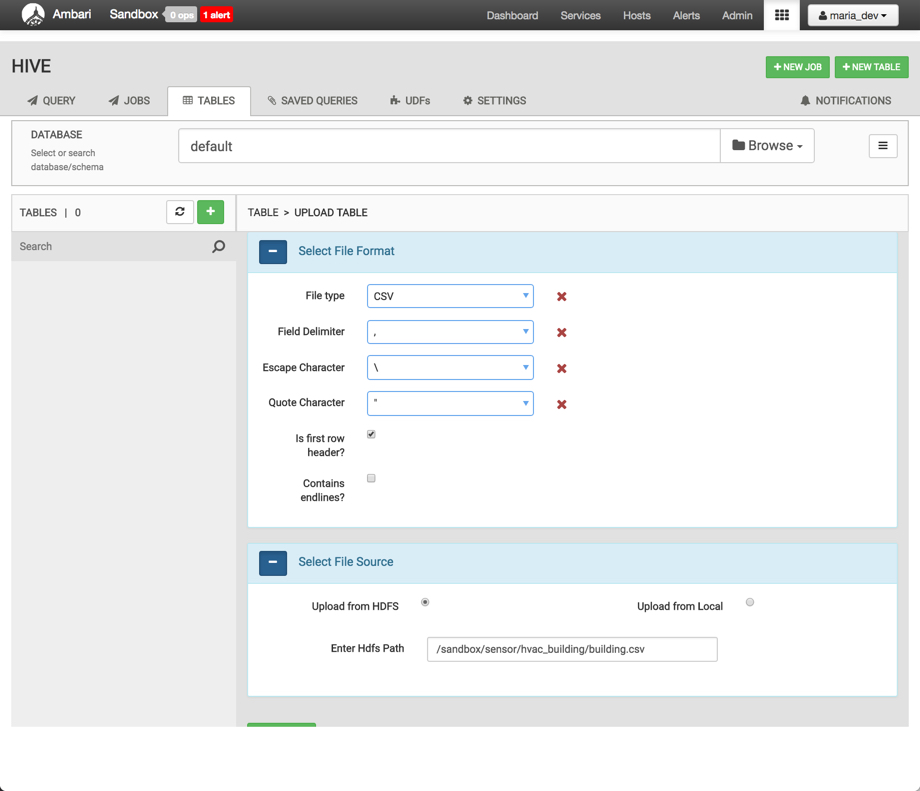
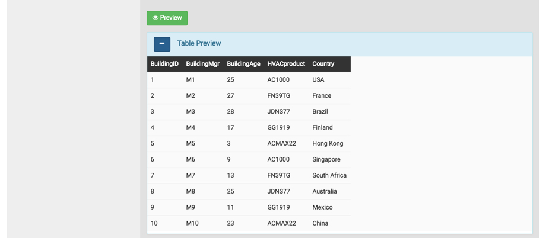
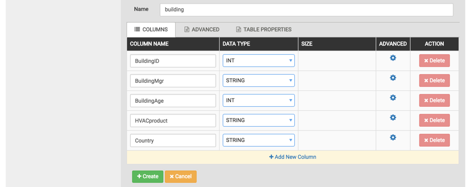
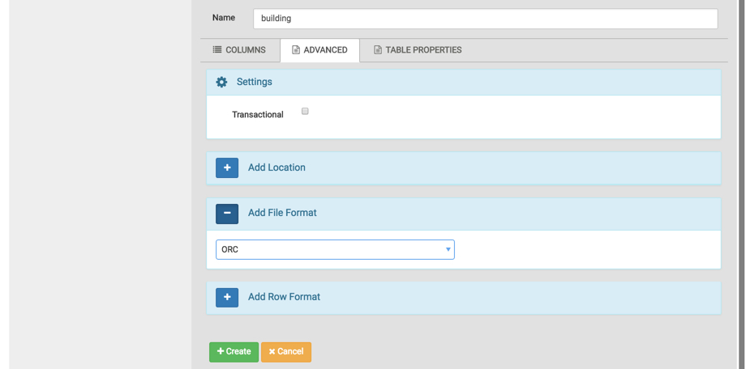
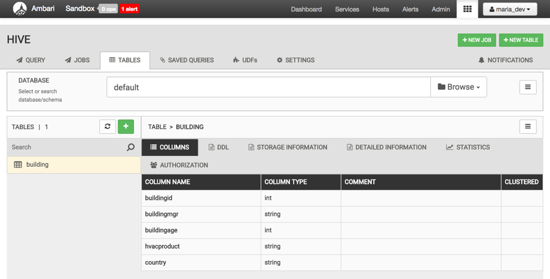
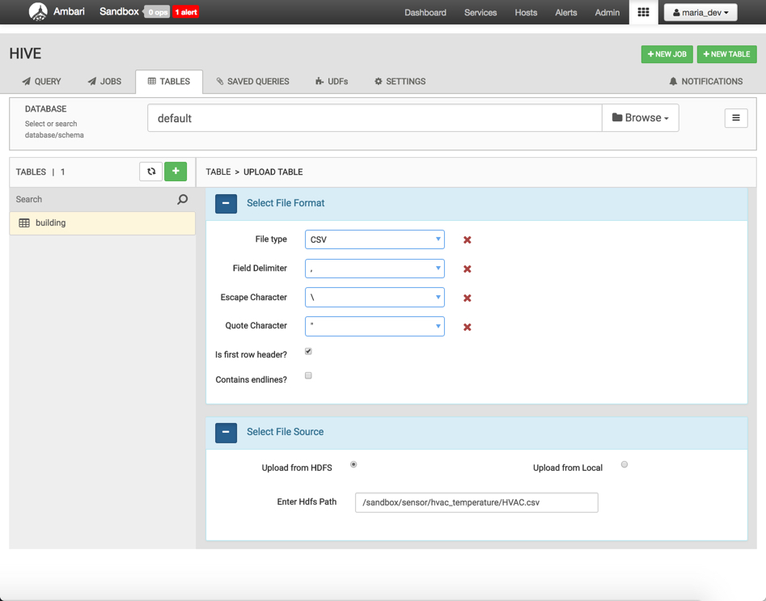
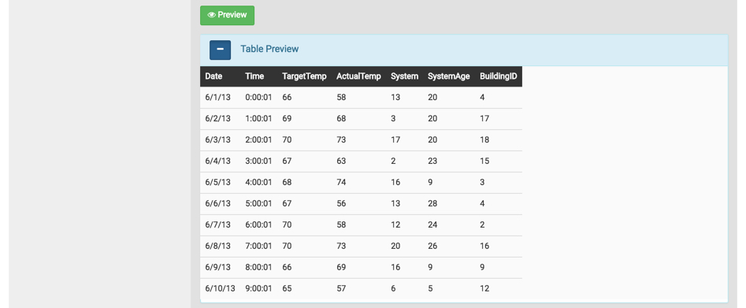
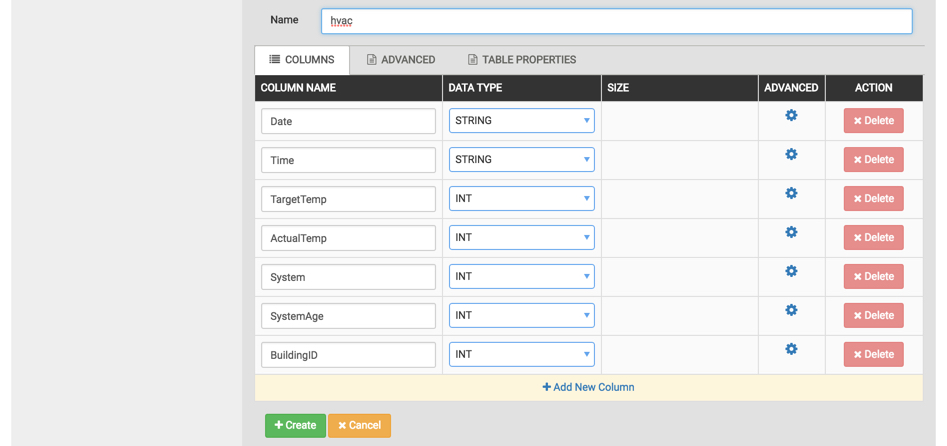
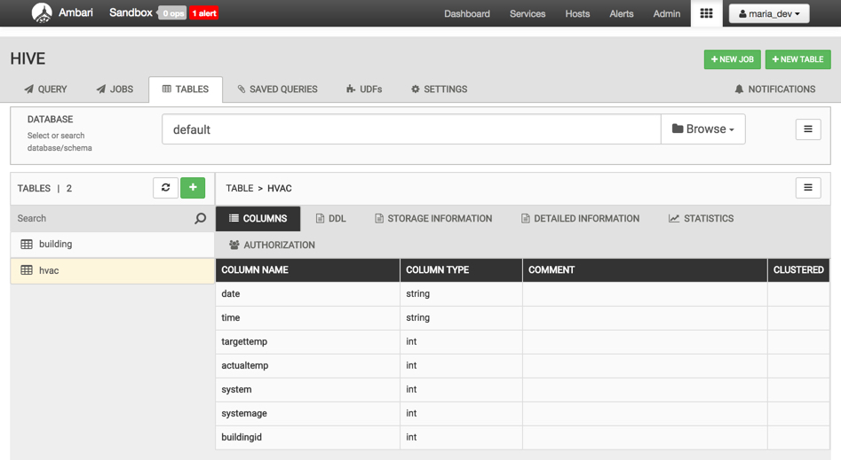

# Cleaning Raw HVAC Data

## Introduction

## Prerequisites

## Outline

- [Upload HVAC Sensor Data into Tables](#upload-hvac-sensor-data-into-tables)
- [Refine the Raw Sensor Data](#refine-the-raw-sensor-data)
- [Summary](#summary)
- [Further Reading](#further-reading)

## Upload HVAC Sensor Data into Tables

Open Ambari UI at `http://sandbox-hdp.hortonworks.com:8080` and login with `maria_dev/maria_dev`.

Use the **views dropdown menu** and choose **Hive View 2**.

There are a few different ways to import CSV data into Hive Tables. We will use Hive's Upload Table tool to transfer our HVAC sensor data into Hive Tables.

### Upload HVAC Building Data into Hive Table

Press **+ NEW TABLE**, select **UPLOAD TABLE**.

Under **Select File Format**, check the box **Is first row header?**.
Under **Select File Source**, choose **Upload from HDFS**.

Enter HDFS Path:

- building.csv path

~~~bash
/sandbox/sensor/hvac_building/building.csv
~~~

Now press **Preview** to see what your table will look like:

Now verify the Hive table prior to being created, look at the table name and under COLUMNS tab verify table columns and column data types are what you want.

Table name should appear as `building`.

Column names should appear as `BuildingID`, `BuildingMgr`, `BuildingAge`, `HVACproduct` and `Country`.

Data type should appear as `INT`, `STRING`, `INT`, `STRING`, `STRING`. If there is a data type that doesn't seem appropriate for the column name to left of it, then feel free to change it to what you feel is appropriate.

Look at the Advanced tab for the Hive table. Verify the Add File Format is **ORC**. We are using ORC cause we can get better performance with Hive especially faster query time with larger datasets.

Press **+ Create** to finish the upload of the building.csv dataset.

Your newly formed Hive **building** ORC table is accessible from Hive TABLES tab.

### Upload HVAC Temperature Data into Hive Table

Select File Format, Select File Source

Enter HDFS Path for HVAC.csv:

~~~bash
/sandbox/sensor/hvac_building/building.csv
~~~

Press Preview to see what the Hive Table will look like:

After previewing the table, scroll down to check the table name, column name and data type fields.

Also check the advanced tab for this table. Verify the Add File Format is **ORC**. Then press **+ Create**. Your newly formed Hive **hvac** ORC table is accessible from Hive TABLES tab.

## Refine the Raw Sensor Data

We will write Hive scripts to clean the raw sensor data in effort to acquire these key insights:

- Reduce heating and cooling expenses
- Keep indoor temperatures in a comfortable range between 65-70 degrees
- Identify which HVAC products are reliable

~~~sql
CREATE TABLE hvac_temperatures as
select *, targettemp - actualtemp as temp_diff,
IF((targettemp - actualtemp) > 5, 'COLD',
IF((targettemp - actualtemp) < -5, 'HOT', 'NORMAL'))
AS temprange,
IF((targettemp - actualtemp) > 5, '1',
IF((targettemp - actualtemp) < -5, '1', 0))
AS extremetemp from hvac;
~~~

works? **YES**

~~~sql
select * from hvac_temperatures limit 10;
~~~

works? **YES**

~~~sql
create table if not exists hvac_building
as select h.*, b.country, b.hvacproduct, b.buildingage, b.buildingmgr
from building b join hvac_temperatures h on b.buildingid = h.buildingid;
~~~

works? **YES**

~~~sql
select * from hvac_building limit 10;
~~~

works? **YES**

## Summary

## Further Reading
