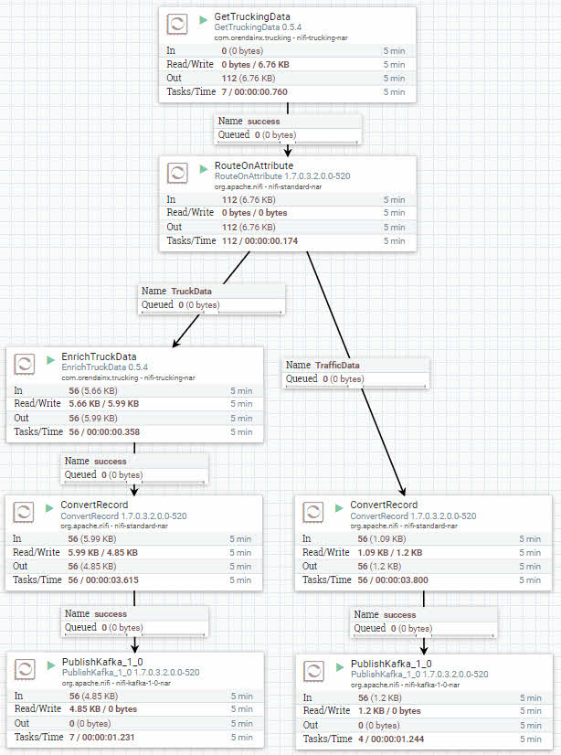
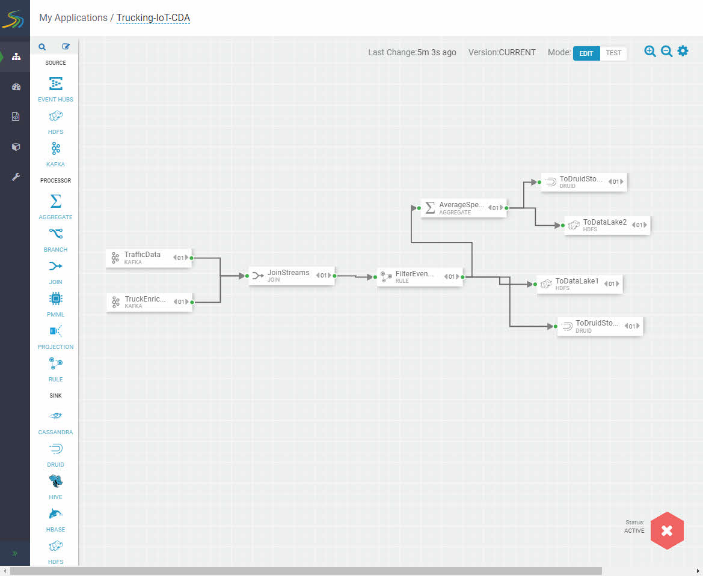

# Setting up the Development Environment

## Introduction

In this tutorial, you will verify your sandbox IP is mapped to your desired hostname, your admin password is setup and the services that need to be on are activated.

## Outline

- [Map sandbox IP to desired hostname in hosts file](#map-sandbox-ip-to-desired-hostname-in-hosts-file)
- [Setup Ambari admin password for HDF and HDP](#setup-ambari-admin-password-for-hdf-and-hdp)
- [Start up all required services](#start-up-all-required-services)
- [Setup Druid for Superset](#setup-druid-for-superset)
- [Summary](#summary)
- [Further Reading](#further-reading)

### Map sandbox IP to desired hostname in hosts file

If you need help mapping Sandbox IP to hostname, reference **Environment
Setup -> Map Sandbox IP To Your Desired Hostname In The Hosts File** in [Learning the Ropes of HDP Sandbox](https://hortonworks.com/tutorial/learning-the-ropes-of-the-hortonworks-sandbox/)

### Setup Ambari admin password for HDF and HDP

If you need help setting the Ambari admin password,

- for HDP, reference **Admin Password Reset** in [Learning the Ropes of HDP Sandbox](https://hortonworks.com/tutorial/learning-the-ropes-of-the-hortonworks-sandbox/)
- for HDF, reference **Admin Password Reset** in [Learning the Ropes of HDF Sandbox](https://hortonworks.com/tutorial/getting-started-with-hdf-sandbox/)

### Started up all required services for HDF and HDP

If unsure, login to Ambari **admin** Dashboard

- for HDF at http://sandbox-hdf.hortonworks.com:8080 and verify **Zookeeper**, **Storm**, **Kafka**,  **NiFi**, **Schema Registry**, **Streaming Analytics Manager** starts up, else start them with Maintenance Mode turned off.
- for HDP at http://sandbox-hdp.hortonworks.com:8080 and verify **HDFS**, **YARN**, **Druid** and **Superset** starts up, else start them with Maintenance Mode turned off.

For example, to start Druid, you would do the following.

After starting Druid and Superset, your Background Operations would look similar:

### Setup Druid for Superset

Before we can visualize data from Druid using Superset, first we need to have
data present in Druid. We will leverage the content from another tutorial to
setup the SAM data pipeline to store data into Druid. Refer to [Appendix A](https://hortonworks.com/tutorial/real-time-event-processing-in-nifi-sam-schema-registry-and-superset/#appendix-a-visualize-trucking-data-with-superset-via-cda) in
Real-Time Event Processing In NiFi, SAM, Schema Registry and SuperSet tutorial.

All you need to do is step 1 and step 2 in Appendix A. We will include reference
images of what will need to be started in the data pipeline to get the data into
Druid.

1\. In the NiFi canvas http://sandbox-hdf.hortonworks.com:9090/nifi, start the
NiFi DataFlow by pressing the green start button in the operate panel.

2\. In the SAM canvas http://sandbox-hdf.hortonworks.com:7777/, start the SAM
topology by pressing the green start button at the bottom right of the canvas.

3\. In the Superset UI http://sandbox-hdp.hortonworks.com:9089, login
with credentials **admin/admin**, wait about **5 – 10 minutes** for Kafka data
to be consumed, then periodically, select the **Sources** dropdown and click on
**Refresh Druid Metadata**. Eventually, the two Druid data sources will appear.

## Summary

Congratulations! Data is now in Druid. We can see the datasources in Superset.
We are ready to start creating visualization representations of the data.

## Further Reading

- [An introduction to Druid](https://www.youtube.com/watch?v=JEhmHsN8jZI)
- [How Superset and Druid Power Real-Time Analytics at Airbnb | DataEngConf SF '17](https://www.youtube.com/watch?v=W_Sp4jo1ACg)
