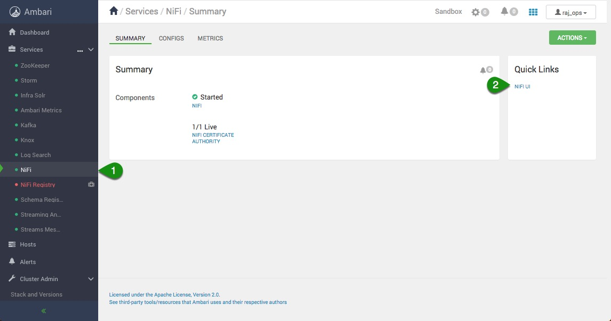
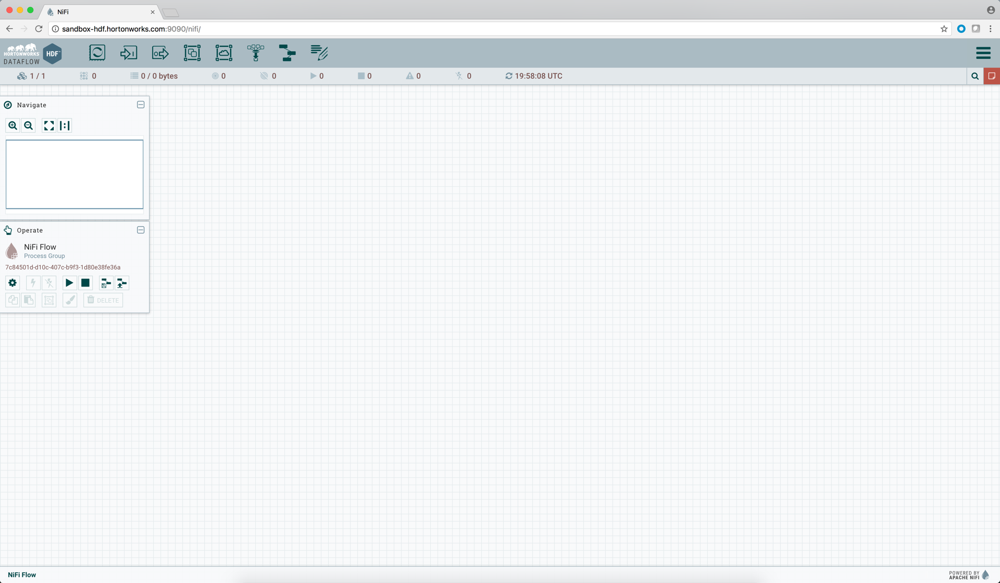

# Launch NiFi HTML UI

## Introduction

With the HDF Sandbox, Apache NiFi comes preinstalled in the Ambari Stack and preconfigured out of the box to utilize many of its features. In the tutorial, it shows you how to access the NiFi HTML UI in one of two ways: use the HDF Splash Screen Page "Advanced Quick Links" or Ambari UI "Quick Links".

## Prerequisites
-   Completed the prior tutorials within this tutorial series
-   Downloaded [HDF Sandbox](https://hortonworks.com/products/sandbox/) for VMWare, VirtualBox or Native Docker
-   [Installed and Deployed HDF 3.0 Sandbox](https://hortonworks.com/tutorial/sandbox-deployment-and-install-guide/) for VMWare, VirtualBox or Native Docker
-   Added HDF Sandbox Hostname to Your Hosts File, refer to [Getting Started with HDF Sandbox](https://hortonworks.com/tutorial/getting-started-with-hdf-sandbox/)

## Outline
-   [Step 1: Open HDF Splash Page](#step-1-open-hdf-splash-page)
-   [Approach 1: Access NiFi HTML UI via Ambari Dashboard](#approach-1-access-nifi-html-ui-via-ambari-dashboard)
-   [Approach 2: Launch NiFi HTML UI from HDF Splash Quick Links](#approach-2-launch-nifi-html-ui-from-hdf-splash-quick-links)
-   [Summary](#summary)

### Step 1: Open HDF Splash Page

1\. Open `sandbox-hdf.hortonworks.com:1080` with your favorite web browser:

Choose either approach to access NiFi UI.

### Approach 1: Access NiFi HTML UI via Ambari Dashboard

1\. Select the **LAUNCH DASHBOARD** button

2\. Type `admin/admin` to login to Ambari.

3\. Verify the NiFi Service is running, it should have a green check mark:

4\. Select the **NiFi Service**, click on **Quick Links** dropdown and press the **NiFi UI**:

### Approach 2: Launch NiFi HTML UI from HDF Splash Quick Links

1\. Select the **QUICK LINKS** button

2\. Hover over the **NiFi 1.2.0** box and select **Go to UI**

## Summary

Congratulations! You explored two approaches for launching NiFi UI. You opened the HDF 3.0 Splash Page: Approach 1 was launching the Ambari Dashboard from the "New To HDF path" while Approach 2 was using the NiFi Quick Link from the "Advanced HDF path". Now you are ready to explore the next tutorial to began building our simple dataflow.
