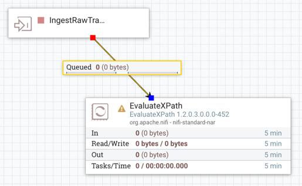
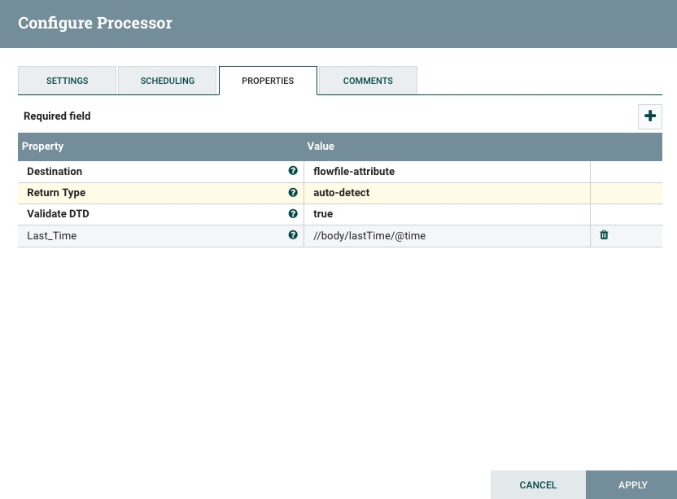
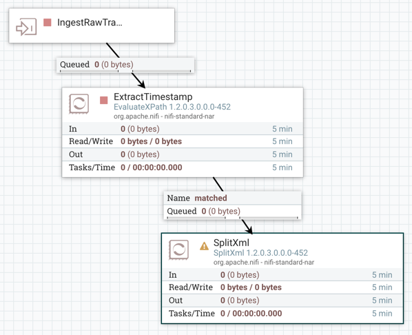
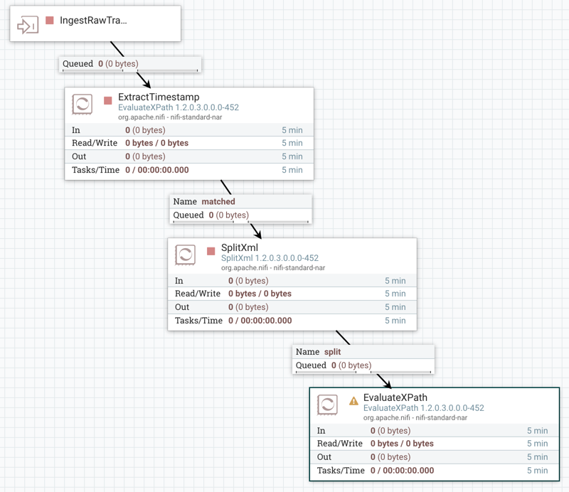
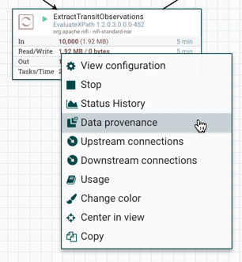

# Build a NiFi Process Group to Parse Transit Events

## Introduction

You will learn to build a portion of the NiFi DataFlow in a process group to parse data using `XPath Expression Language`for **timestamp, vehicle location, speed, vehicle ID** and **other data** from the **San Francisco Muni Transit Simulator**.

## Prerequisites

- Completed the prior tutorials within this tutorial series

## Outline

- [Approach 1: Manually Build ParseTransitEvents Process Group (PG)](#approach-1-manually-build-parsetransitevents-process-group-pg)
- [Step 1: Create a Process Group (PG)](#step-1-create-a-process-group-pg)
- [Step 2: Add an Input Port to Ingest Data Into this PG](#step-2-add-an-input-port-to-ingest-data-into-this-pg)
- [Step 3: Add EvaluateXPath to Extract the Timestamp for Transit Observation](#step-3-add-evaluatexpath-to-extract-the-timestamp-for-transit-observation)
- [Step 4: Add SplitXml to Split A FlowFile into Multiple Separate FlowFiles](#step-4-add-splitxml-to-split-a-flowfile-into-multiple-separate-flowfiles)
- [Step 5: Add EvaluateXPath to Extract Transit Observations](#step-5-add-evaluatexpath-to-extract-transit-observations)
- [Step 6: Add an Output Port to Route Data Outside this PG](#step-6-add-an-output-port-to-route-data-outside-this-pg)
- [Step 7: Connect SimulateXmlTransitEvents to ParseTransitEvents](#step-7-connect-simulatexmltransitevents-to-parsetransitevents)
- [Step 8: Verify ParseTransitEvents Extracts Values From SimulateXmlTransitEvents](#step-8-verify-parsetransitevents-extracts-values-from-simulatexmltransitevents)
- [Approach 2: Import ParseTransitEvents Process Group](#approach-2-import-parsetransitevents-process-group)
- [Summary](#summary)
- [Further Reading](#further-reading)

If you prefer to build the dataflow manually step-by-step, continue on to **Approach 1**. Else if you want to see the NiFi flow in action within minutes, refer to **Approach 2**.

### Approach 1: Manually Build ParseTransitEvents Process Group (PG)

### 1.1 Create Label for Process Group

1\. Add a Label  onto the NiFi canvas for the new process group. Right click, **Change color** to **Blue**.

2\. Right click, select configure and name it `Extract Transit Key Values pairs (Timestamp, Direction, Latitude, Longitude, Vehicle_ID, Vehicle_Speed) From XML FlowFiles using XPath Expression`. Choose Font Size to `18px`.

### Step 1: Create a Process Group (PG)

1\. Add a new Process Group onto the NiFi canvas and name it `ParseTransitEvents`

2\. Double click on the new Process Group to enter it.

### Step 2: Add an Input Port to Ingest Data Into this PG

1\. Add the **Input Port**  component onto the NiFi canvas. Name it `IngestRawTransitEvents`.

### Step 3: Add EvaluateXPath to Extract the Timestamp for Transit Observation

1\. Add the **EvaluateXPath** processor onto the NiFi canvas.

2\. Connect **IngestRawTransitEvents** input port to **EvaluateXPath** processor. When the Create Connection window appears, click **Add**.

**Figure 1:** Connect **IngestRawTransitEvents** to **EvaluateXPath**

3\. Open the processor configuration **properties** tab. Add the properties listed in **Table 1** and if the original properties have values, update them. For the second property in **Table 1**, add a new dynamic property for XPath expression, select the plus **( + )** button. Insert the following property name and value into your properties tab as shown in the table below:

**Table 1:** Update **EvaluateXPath** Properties Tab

| Property  | Value  |
|:---|---:|
| `Destination`  | `flowfile-attribute`  |
| `Last_Time`  | `//body/lastTime/@time`  |

- **Destination** result from XPath evaluation stored into FlowFile attribute

- **Last_Time** is a FlowFile Attribute and XPath expression that retrieves value of time node in the XML file

**Figure 2:** EvaluateXPath Configuration Property Tab Window

4\. Open the processor config **Settings** tab, change the name to **ExtractTimestamp**, then under Auto terminate relationships, check the **failure** and **unmatched** checkboxes. Click **Apply**.

### Step 4: Add SplitXml to Split A FlowFile into Multiple Separate FlowFiles

1\. Add the **SplitXml** processor onto the NiFi canvas.

2\. Connect **ExtractTimestamp** to **SplitXML** processor. When the Create Connection window appears, verify **matched** checkbox is checked, else check it. Click **Add**.

**Figure 3:** Connect **EvaluateXPath** to **SplitXML**

3\. Keep **SplitXML** default configuration **properties**.

4\. Since each property is updated, navigate to the **Scheduling tab** and change the **Run Schedule** from 0 sec to `1 sec`, so the processor executes a task every 1 second.

5\.  Open the processor config **Settings** tab, under Auto terminate relationships, check the **failure** and **original** checkboxes. Click **Apply**.

### Step 5: Add EvaluateXPath to Extract Transit Observations

1\. Add the **EvaluateXPath** processor onto the NiFi canvas.

2\. Connect **SplitXML** to **EvaluateXPath** processor. When the Create Connection window appears, verify **split** checkbox is checked, if not check it. Click Add.

**Figure 4:** Connect **SplitXML** to **EvaluateXPath**

3\. Open the processor configuration **properties** tab. Add the properties listed in **Table 2** and if the original properties have values, update them. For the remaining properties in **Table 2**, add new dynamic properties for XPath expressions, click on the **( + )** button. Insert the following property name and value into your properties tab as shown in the table below:

**Table 2:** Update **EvaluateXPath** Properties Tab

| Property  | Value  |
|:---|---:|
| `Destination`  | `flowfile-attribute`  |
| `Direction_of_Travel`  | `//vehicle/@dirTag`  |
| `Latitude`  | `//vehicle/@lat`  |
| `Longitude`  | `//vehicle/@lon`  |
| `Vehicle_ID`  | `//vehicle/@id`  |
| `Vehicle_Speed`  | `//vehicle/@speedKmHr`  |

- **Destination** set to FlowFile attribute because the result of values from XPath expressions need to be stored in FlowFile attributes.

- **5 user-defined attributes** each represent data related to transit observations associated with the timestamp extracted earlier.

4\. Open the processor config **Settings** tab, change the name to **ExtractTransitObservations**, then under Auto terminate relationships, check the **failure** and **unmatched** checkboxes. Click **Apply**.

### Step 6: Add an Output Port to Route Data Outside this PG

1\. Add the **Output Port**  component onto the NiFi canvas. Name it `ParsedTransitEvents`.

2\. Connect **ExtractTransitObservations** to **ParsedTransitEvents** output port. When the Create Connection window appears, verify **matched** checkbox is checked, if not check it. Click Add.

**Figure 5:** Connect **ExtractTransitObservations** to **ParsedTransitEvents**

### Step 7: Connect SimulateXmlTransitEvents to ParseTransitEvents

1\. Re-enter the `NiFi Flow` breadcrumb.

2\. Connect **SimulateXmlTransitEvents** to **ParseTransitEvents** process group. When the Create Connection window appears, verify **From Output = RawTransitEvents** and connects to **To Input = IngestRawTransitEvents**. Click **Add**.

**Figure 6:** Connection of **SimulateXmlTransitEvents** and **ParseTransitEvents** process group.

### Step 8: Verify ParseTransitEvents Extracts Values From SimulateXmlTransitEvents

1\. Hold **Shift**, press on the mouse and hover over process groups to select them, then hit the **start** button  located in the **Operate** Palette to activate the dataflow.

2\. Double click on **ParseTransitEvents** process group. Right click on the **ExtractTransitObservations** processor, select **Data Provenance**.

3\. View any event by selecting the view provenance event icon 

4\. Pick a row from the list of events, click on the "i" to the left of that row. Then click on the **Attributes** tab. Select **Show modified attributes only** to display only the attributes being parsed with **XPath expression language**. As long as you see values mapped to their attribute name, you have verified the processor is extracting XML data from the flowfile successfully.

**Figure 7:** ExtractTransitObservations parses the XML data for **Direction_of_Travel**, **Latitude**, **Longitude**, **Vehicle_ID**, **Vehicle_Speed**.

### Approach 2: Import ParseTransitEvents Process Group

**Warning: If you Imported the Previous DataFlow, Read these steps first**

1\. In your process group, if there are any **queues** left with data, remove the data. Right click the queue, select **Empty queue**, click **EMPTY**.

2\. Navigate back to the **NiFi Flow** breadcrumb level to delete your flow.

To delete your previous flow, hold **command** or **ctrl** and press **A** to highlight your dataflow, then press **delete** or **backspace**.

**Import the New DataFlow Template**

3\. Download the [tutorial-4-ParseTransitEvents.xml](assets/tutorial-4-build-nifi-process-group-to-parse-transit-events/template/tutorial-4-ParseTransitEvents.xml) template file.

4\. Use the template icon  located in the **Operate** Palette.

5\. **Browse**, find the template file, click **Open** and hit **Upload**.

6\. From the **Components Toolbar**, drag the template icon  onto the graph and select the **tutorial-4-ParseTransitEvents.xml** template file.

7\. Hit the **start** button  to activate the dataflow.

**Figure 8:** **tutorial4-ParseTransitEvents.xml** template includes a NiFi Flow that pulls in San Francisco Muni Transit Events from the XML Simulator, parses through the data to extract key values and stores the transit observations as a JSON file.

Overview of the Process Groups and their Processors:

- **SimulateXmlTransitEvents (Process Group)**
  - **GetFile** fetches the vehicle location simulator data for files in a directory.
  - **UnpackContent** decompresses the contents of FlowFiles from the traffic simulator zip file.
  - **ControlRate** controls the rate at which FlowFiles are transferred to follow-on processors enabling traffic simulation.
  - **UpdateAttribute** renames every FlowFile to give them unique names
  - **PutFile** stores data to local file system
  - **Output Port** makes the connection for the process group to connect to other components (process groups, processors, etc)

- **ParseTransitEvents (Process Group)**
  - **Input Port** ingests data from SimulateXmlTransitEvents Process Group
  - **ExtractTimestamp** extracts the timestamp of the last update for vehicle location data returned from each FlowFile.
  - **SplitXML** splits the parent's child elements into separate FlowFiles. Since vehicle is a child element in our xml file, each new vehicle element is stored separately.
  - **ExtractTransitObservations** extracts attributes: vehicle id, direction, latitude, longitude and speed from vehicle element in each FlowFile.
  - **Output Port** outputs data with the new FlowFile attribute (key/values) to the rest of the flow

Refer to [NiFi's Documentation](https://nifi.apache.org/docs.html) to learn more about each processor described above.

### Summary

Congratulations! You just built a NiFi **ParseTransitEvents** process group to parse the XML content and extract transit observations into FlowFile attributes. The **Input Port** pulls data from the **SimulateXmlTransitEvents** process group, which goes into an **ExtractTimestamp** processor to pull out the **timestamp** for the vehicle observation and add that timestamp as a FlowFile attribute. The FlowFile content rows are then split into multiple FlowFiles via **SplitXml** processor. These single FlowFile records are routed to another **ExtractTransitObservations** processor to extract **transit observations** for multiple transit vehicles of that timestamp from earlier. This data with new FlowFile attributes is routed to the rest of the flow via **Output Port**.

### Further Reading

-   [XPath Expression Tutorial](http://www.w3schools.com/xml/xpath_intro.asp)
