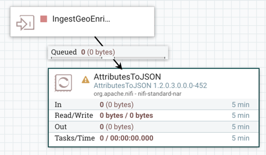
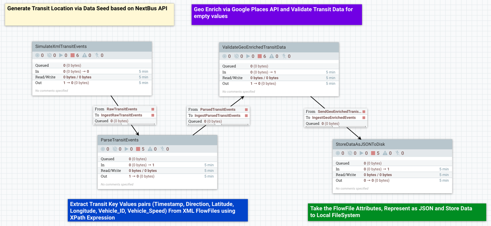

# Build a NiFi Process Group to Store Data As JSON

## Introduction

You will build a new process group called **StoreTransitEventsAsJSONToDisk** to take the FlowFile attributes, write them to a new FlowFile's content as JSON representation. You will then store these FlowFiles to the local filesystem.

## Prerequisites

- Completed the prior tutorials within this tutorial series

## Outline

- [Approach 1: Manually Build StoreTransitEventsAsJSONToDisk Process Group (PG)](#approach-1-manually-build-storetransiteventsasjsontodisk-process-group-pg)
- [Step 1: Create Process Group and Label For It](#step-1-create-process-group-and-label-for-it)
- [Step 2: Add an Input Port to Ingest Data Into this PG](#step-2-add-an-input-port-to-ingest-data-into-this-pg)
- [Step 3: Add AttributesToJSON to Represent FlowFile Attributes As JSON](#step-3-add-attributestojson-to-represent-flowfile-attributes-as-json)
- [Step 4: Add MergeContent to Combine Multiple FlowFiles Together](#step-4-add-mergecontent-to-combine-multiple-flowfiles-together)
- [Step 5: Add UpdateAttribute to Make Each FlowFile Name Unique](#step-5-add-updateattribute-to-make-each-flowfile-name-unique)
- [Step 6: Add PutFile to Store Data to Local File System](#step-6-add-putfile-to-store-data-to-local-file-system)
- [Step 7: Connect ValidateGeoEnrichedTransitData to StoreDataAsJSONToDisk](#step-7-connect-validategeoenrichedtransitdata-to-storedataasjsontodisk)
- [Step 8: Run the NiFi DataFlow](#step-8-run-the-nifi-dataflow)
- [Step 9: Check Data By NiFi's Data Provenance](#step-9-check-data-by-nifis-data-provenance)
- [Approach 2: Import StoreTransitEventsAsJSONToDisk Process Group](#approach-2-import-storetransiteventasjsontodisk-process-group)
- [Summary](#summary)

If you prefer to build the dataflow manually step-by-step, continue on to [Approach 1](#approach-1-manually-build-storetransiteventsasjsontodisk-process-group-pg). Else if you want to see the NiFi flow in action within minutes, refer to [Approach 2](#approach-2-storetransiteventasjsontodisk-process-group).

### Approach 1: Manually Build StoreTransitEventsAsJSONToDisk Process Group (PG)

### Step 1: Create Process Group and Label For It

1\. Add a Label  onto the NiFi canvas for the new process group. Right click, **Change color** to **Green**.

2\. Right click, select configure and name it `Take the FlowFile Attributes, Represent as JSON and Store Data to Local FileSystem`.

3\. Add a new Process Group onto the NiFi canvas and name it `StoreDataAsJSONToDisk`

4\. Double click on the new process group to enter it.

### Step 2: Add an Input Port to Ingest Data Into this PG

1\. Add the **Input Port**  component onto the NiFi canvas. Name it `IngestGeoEnrichedEvents`.

### Step 3: Add AttributesToJSON to Represent FlowFile Attributes As JSON

1\. Add the **AttributesToJSON** processor onto the NiFi canvas.

2\. Connect **IngestGeoEnrichedEvents** input port to **AttributesToJSON** processor.

**Figure 1:** Connect **IngestGeoEnrichedEvents** input port to **AttributesToJSON** processor

3\. Open the processor configuration **properties** tab. Add the properties listed in **Table 1** and if their original properties already have values, update them.

**Table 1:** Update **AttributesToJSON** Properties Tab

| Property  | Value  |
|:---|---:|
| `Attributes List`  | `Vehicle_ID, Direction_of_Travel, Latitude, Longitude, Vehicle_Speed, Last_Time`  |
| `Destination`  | flowfile-content  |

- **Attributes List** takes FlowFile attribute parameters and presents them in JSON format
- **Destination** stores the output as content in the FlowFile

4\. Open the processor config **Settings** tab, under Auto terminate relationships, check the **failure** checkbox. Click **Apply**.

### Step 4: Add MergeContent to Combine Multiple FlowFiles Together

1\. Add the **MergeContent** processor onto the NiFi canvas.

2\. Connect **AttributesToJSON** to **MergeContent** processor. When the Create Connection window appears, verify **success** checkbox is checked, else check it. Click **Add**.

**Figure 2:** Connect **AttributesToJSON** to **MergeContent** processor

3\. Open the processor configuration **properties** tab. Add the properties listed in **Table 2** and if their original properties already have values, update them.

**Table 2:** Update **MergeContent** Properties Tab

| Property  | Value  |
|:---|---:|
| `Minimum Number of Entries`  | `10`  |
| `Maximum Number of Entries`  | `15`  |
| `Delimiter Strategy`  | Text  |
| `Header`  | `[`  |
| `Footer`  | `]`  |
| `Demarcator` | `,` {now-press-shift-enter} |

- **Minimum Number of Entries** takes in at least specified amount of FlowFiles, then merges them into 1 FlowFiles
- **Maximum Number of Entries** takes in no more than specified amount of FlowFiles, then merges them
- **Delimiter Strategy** specifies that Header, Footer and Demarcator set the formatting conditions for text in the file
- **Header** inserts specified value at the beginning of the file
- **Footer** inserts specified value at the end of the file
- **Demarcator** inserts specified value(s) at the end of every line in the file

4\. Open the processor config **Settings** tab, under Auto terminate relationships, check the **failure** and **original** checkboxes. Click **Apply**.

### Step 5: Add UpdateAttribute to Make Each FlowFile Name Unique

1\. Add the **UpdateAttribute** processor onto the NiFi canvas.

2\. Connect **MergeContent** to **UpdateAttribute** processor. When the Create Connection window appears, verify **merged** checkbox is checked, if not check it. Click **Add**.

**Figure 3:** Connect **MergeContent** to **UpdateAttribute** processor

3\. Open the processor configuration properties tab. Add the properties listed in **Table 3** and if their original properties already have values, update them.

**Table 3:** Add **UpdateAttribute** Properties Tab

| Property  | Value  |
|:---|---:|
| `filename`  | `${UUID()}`  |

- **filename** updates each FlowFile with a unique identifier

### Step 6: Add PutFile to Store Data to Local File System

1\. Add the **PutFile** processor onto the NiFi canvas.

2\. Connect **UpdateAttribute** to **PutFile** processor. When the Create Connection window appears, verify **success** checkbox is checked, else check it. Click Add.

**Figure 4:** Connect **UpdateAttribute** to **PutFile** processor

3\. Open the processor configuration **properties** tab. Add the property listed in **Table 4** and if their original property already has a value, update it.

**Table 4:** Update **PutFile** Property Value

| Property  | Value  |
|:---|---:|
| `Directory`  | `/sandbox/tutorial-files/640/nifi/output/observe-transit-data`  |

4\. Open the processor config **Settings** tab, under Auto terminate relationships, check the **failure** and **success** checkboxes. Click **Apply**.

### Step 7: Connect ValidateGeoEnrichedTransitData to StoreDataAsJSONToDisk

1\. Re-enter the `NiFi Flow` breadcrumb to exit **StoreDataAsJSONToDisk** PG.

2\. Connect **ValidateGeoEnrichedTransitData** to **StoreDataAsJSONToDisk** process group. When the Create Connection window appears, verify **From Output = SendGeoEnrichedTranistEvents** and connects to **To Input = IngestGeoEnrichedEvents**. Click **Add**.

**Figure 5:** Connect **ValidateGeoEnrichedTransitData** to **StoreDataAsJSONToDisk** PG

### Step 8: Run the NiFi DataFlow

1\. The processors are valid since the warning symbols disappeared. Notice that the process groups have a highlighted red stop symbol  as shown back in **Figure 5**. To select all process groups, hold down the **shift-key** and drag your mouse across the entire data flow.

2\. Now that all processors are selected, go to the actions toolbar in the left window labeled **Operate** and click the start button . Your process groups should change to a green highlighted start symbol. Your screen should look like the following:

**Figure 6:** Start **StoreDataAsJSONToDisk** PG

3\. To quickly see what the processors are doing and the information on their faces, right click on the canvas, click the **refresh status** button 

### Step 9: Check Data By NiFi's Data Provenance

1\. Before we go see **PutFile**, we must double-click on **StoreDataAsJSONToDisk**. Right click on the PutFile processor. Select `View Data Provenance`.

NiFi searches for provenance events. The window will load with events, select any event. An event is a FlowFile that passes through a processor and the data that is viewable at that particular time.

2\. Select any event by pressing on the view provenance event symbol .

**Figure 7:** NiFi Data Provenance Window

3\. Once you select the event, a Provenance Event Dialog Window will appear. It contains Details, Attributes and Content regarding the particular event. Take a few minutes to view each tab. Let's navigate to the `Content` tab to view the data generated from the FlowFile. NiFi gives the user the option to download or view the content of the event. Click on the **View** button.

**Figure 8:** Provenance Event Window

4\. NiFi gives the user the option view the data in multiple formats. We will view it in original format.

**Figure 9:** View FlowFile JSON Content

Did you receive the data you expected?

### Approach 2: Import StoreDataAsJSONToDisk Process Group

**Warning 1: If you Imported the Previous DataFlow, Read these steps first**

1\. In your process group, if there are any **queues** left with data, remove the data. Right click the queue, select **Empty queue**, click **EMPTY**.

2\. Navigate back to the **NiFi Flow** breadcrumb level to delete your flow.

To delete your previous flow, hold **command** or **ctrl** and press **A** to highlight your dataflow, then press **delete** or **backspace**.

**Import the New DataFlow Template**

3\. Download the [tutorial-6-StoreDataAsJSONToDisk.xml](assets/tutorial-6-build-a-nifi-process-group-to-store-data-as-json/template/tutorial-6-StoreDataAsJSONToDisk.xml) template file.

4\. Use the **upload template** icon  located in the Operate Palette.

5\. **Browse**, find the template file, click **Open** and hit **Upload**.

6\. From the **Components Toolbar**, drag the **add template** icon  onto the graph and select the **tutorial-6-StoreDataAsJSONToDisk.xml** template file.

**Warning 2: If you didn't Obtain Google API Key, then follow the steps**

7\. Refer to [Step 1](#step-1-obtain-api-key-for-nifis-invokehttp-processor) in **Approach 1** from the **Validate the GeoEnriched Data Tutorial** to obtain the Google API key and set up **Google Places API: HTTP URL**.

8\. Once you have your own Google Places API Key, go into the ValidateGeoEnrichedTransitData process group, replace the **InvokeHTTP** processor's **Remote URL** property value with the new **Google Places API: HTTP URL** value.

9\. Hit the **start** button  to activate the dataflow.

**Figure 10:** **tutorial-6-StoreDataAsJSONToDisk.xml** template includes a NiFi Flow that pulls in San Francisco Muni Transit Events from the XML Simulator, parses through the data to extract key values and stores the transit observations as a JSON file.

Overview of the Process Groups and their Processors:

- **SimulateXmlTransitEvents (Process Group)**
  - **GetFile** fetches the vehicle location simulator data for files in a directory.
  - **UnpackContent** decompresses the contents of FlowFiles from the traffic simulator zip file.
  - **ControlRate** controls the rate at which FlowFiles are transferred to follow-on processors enabling traffic simulation.
  - **UpdateAttribute** renames every FlowFile to give them unique names
  - **PutFile** stores data to local file system
  - **Output Port** makes the connection for the process group to connect to other components (process groups, processors, etc)

- **ParseTransitEvents (Process Group)**
  - **Input Port** ingests data from SimulateXmlTransitEvents Process Group
  - **ExtractTimestamp** extracts the timestamp of the last update for vehicle location data returned from each FlowFile.
  - **SplitXML** splits the parent's child elements into separate FlowFiles. Since vehicle is a child element in our xml file, each new vehicle element is stored separately.
  - **ExtractTransitObservations** extracts attributes: vehicle id, direction, latitude, longitude and speed from vehicle element in each FlowFile.
  - **Output Port** outputs data with the new FlowFile attribute (key/values) to the rest of the flow

- **ValidateGooglePlacesData (Process Group)**
  - **Input Port** ingests data from ParseTransitEvents Process Group
  - **ValidateNextBusData** checks the NextBus Simulator data by routing FlowFiles only if their attributes contain transit observation data (Direction_of_Travel, Last_Time, Latitude, Longitude, Vehicle_ID, Vehicle_Speed)
  - **InvokeHTTP** sends a rest call to Google Places API to pull in geo enriched data for transit location
  - **EvaluateJSONPath** parses the flowfile content for city and neighborhoods_nearby
  - **ValidateGooglePlacesData** checks the new Google Places data by routing FlowFiles only if their attributes contain geo enriched data (city, neighborhoods_nearby)
  - **Output Port** outputs data with nonempty FlowFile attributes (key/values) to the rest of the flow

- **StoreTransitEventsAsJSONToDisk (Process Group)**
  - **Input Port** ingests data from ValidateGooglePlacesData Process Group
  - **AttributesToJSON** generates a JSON representation of the attributes extracted from the FlowFiles and converts XML to JSON format this less attributes.
  - **MergeContent** merges a group of JSON FlowFiles together based on a number of FlowFiles and packages them into a single FlowFile.
  - **UpdateAttribute** updates the attribute name for each FlowFile.
  - **PutFile** writes the contents of the FlowFile to a desired directory on the local filesystem.

Refer to [NiFi's Documentation](https://nifi.apache.org/docs.html) to learn more about each processor described above.

## Summary

Congratulations! For the **StoreTransitEventsAsJSONToDisk** Process Group, you learned to take the FlowFile attribute (key/value) pairs and represent them as a JSON format. You then used **MergeContent** to combine multiple FlowFiles together to create a larger FlowFile with multiple records. **UpdateAttribute** was used to ensure no FlowFiles would have duplicate names. **PutFile** was added to the flow to store the JSON data into the local file system.
