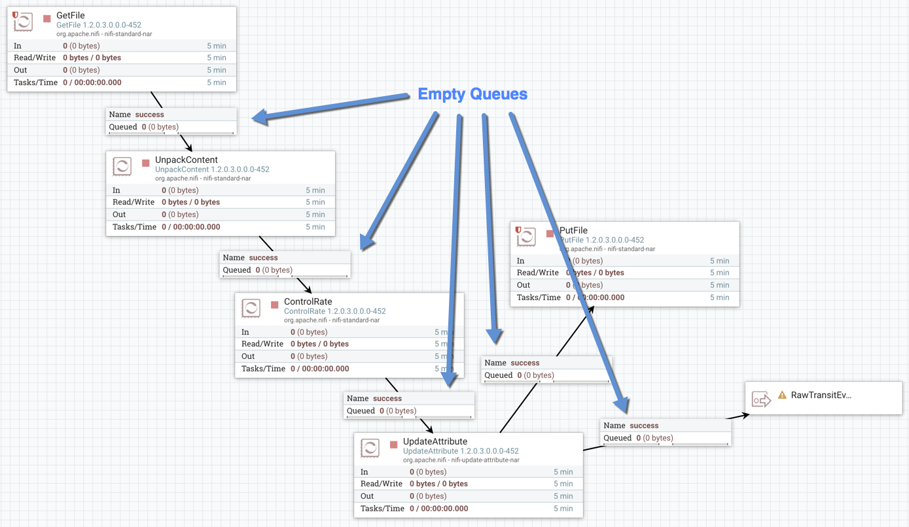
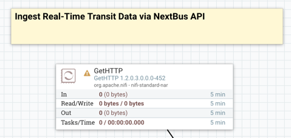
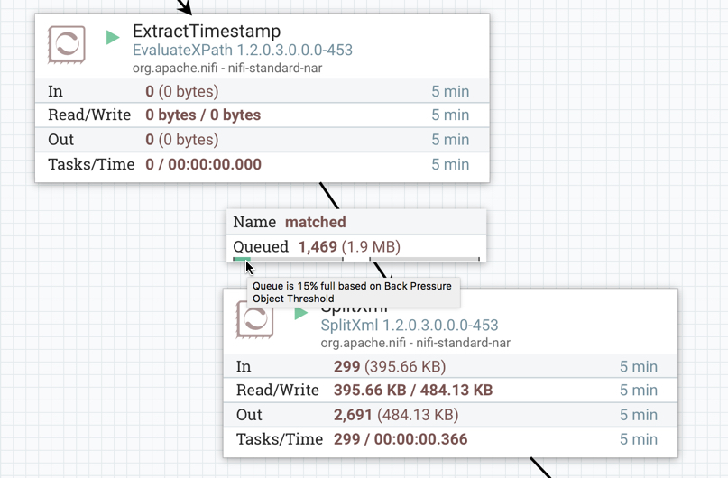

# Integrate NextBus API To Pull In Transit Live Feed

## Introduction

You will learn to perform **rest calls** against the **NextBus API** to retrieve transit data. You will replace the SimulateXmlTransitEvents Process Group data seed with a new processor that pulls in live stream data from **San Francisco Muni Agency** on route **OceanView** into the NiFi DataFlow.

## Prerequisites
-   Completed the prior tutorials within this tutorial series

## Outline

- [Approach 1: Manually Integrate NextBus API into NiFi Flow](#approach-1-manually-build-live-vehicle-routes-nifi-flow)
- [NextBus Live Feed API Basics](#nextbus-live-feed-api-basics)
- [Step 1: Add GetHTTP to Make Rest Calls and Ingest Data via NextBus API](#step-1-add-gethttp-to-make-rest-calls-and-ingest-data-via-nextbus-api)
- [Step 2: Modify PutFile in StoreDataAsJSONToDisk Process Group](#step-2-modify-putfile-in-storedataasjsontodisk-process-groupp)
- [Step 3: Run the NiFi DataFlow](#step-3-run-the-nifi-dataflow)
- [Step 4: Explore Back Pressure for NextBus API Rest Calls](#step-4-explore-back-pressure-for-nextbus-api-rest-calls)
- [Approach 2: Import Live Vehicle Routes NiFi Flow](#approach-2-import-live-vehicle-routes-nifi-flow)
- [Summary](#summary)
- [Further Reading](#further-reading)

If you prefer to build the dataflow manually step-by-step, continue on to **Approach 1**. Else if you want to see the NiFi flow in action within minutes, refer to **Approach 2**.

You will need to understand NextBus API, so that it will be easier to incorporate this API's data into the NiFi flow, which will be built in **Approach 1**.

## Approach 1: Manually Integrate NextBus API into NiFi Flow

## NextBus Live Feed API Basics

NextBus Live Feed provides the public with live information regarding passenger information, such as vehicle location information, prediction times on transit vehicles, routes of vehicles and different agencies (San Francisco Muni, Unitrans City of Davis, etc). We will learn to use NextBus's API to access the XML Live Feed Data and create an URL. In this URL we will specify parameters in a query string. The parameters for the tutorial will include the vehicle location, agency, route and time.

After viewing the Live Feed Documentation, we created the following URL for the GetHTTP processor:

~~~
http://webservices.nextbus.com/service/publicXMLFeed?command=vehicleLocations&a=sf-muni&r=M&t=0
~~~

Let’s break apart the parameters, so we can better understand how to create custom URLs. There are 4 parameters:

- commands: command = vehicleLocations
- agency: a=sf-muni
- route: r=M
- time: t=0

Refer to [NextBus’s Live Feed Documentation](https://www.nextbus.com/xmlFeedDocs/NextBusXMLFeed.pdf) to learn more about each parameter.

### Step 1: Add GetHTTP to Make Rest Calls and Ingest Data via NextBus API

You will replace the **SimulateXmlTransitEvents** Process Group with **GetHTTP** processor.

1\. Check the queue between **SimulateXmlTransitEvents** and **ParseTransitEvents**, if the queue has FlowFiles, then empty the queue. Right click on the queue, click **Empty queue**.

2\. Right click on the queue again. Then press **Delete**.

3\. Enter the **SimulateXmlTransitEvents**, then verify if other queues have FlowFiles and empty those queues. Once all queues are empty, step out of the Process Group.

4\. Right click on **SimulateXmlTransitEvents** Process Group, select **Delete** to remove it. Add **GetHTTP** processor to replace **SimulateXmlTransitEvents**.

5\. Connect **GetHTTP** to **ParseTransitEvents**. Verify **success** is checked under For Relationships. Click **ADD**.

6\. Replace the text in the label above **GetHTTP** with the following: `Ingest Real-Time Transit Data via NextBus API`

2\. Open **GetHTTP** Config Property Tab window. We will need to copy and paste Nextbus XML Live Feed URL into the property value. Add the property listed in **Table 1**.

**Table 1:** Update GetHTTP Properties Tab

| Property  | Value  |
|:---|---:|
| `URL`  | `http://webservices.nextbus.com/service/publicXMLFeed?command=vehicleLocations&a=sf-muni&r=M&t=0` |
| `Filename`  | `live_transit_data_${now():format("HHmmssSSS")}.xml` |

3\. Now that each property is updated. Navigate to the **Scheduling tab** and change the **Run Schedule** from 0 sec to `6 sec`, so that the processor executes a task every 6 seconds.

4\. Open the processor config **Settings** tab, change the processor's Name from GetHTTP to `IngestNextBusXMLData`. Click **Apply** button.

### Step 2: Modify PutFile in StoreDataAsJSONToDisk Process Group

You will change the directory PutFile writes data to since data is coming in from the NextBus API live feed instead of the Simulator.

1\. Open **PutFile** Configure **Properties Tab**. Change the Directory property value from the previous value to the value shown in **Table 2**:

**Table 2:** Update PutFile Properties Tab

| Property  | Value  |
|:---|---:|
| `Directory`  | `/sandbox/tutorial-files/640/nifi/output/live_transit_data` |

**Directory** is changed to a new location for the real-time data coming in from NextBus live stream.

2\. Click **Apply**. Then go back to the **NiFi Flow** breadcrumb.

### Step 3: Run the NiFi DataFlow

Now that we added NextBus San Francisco Muni Live Stream Ingestion to our dataflow , let's run the dataflow and verify if we receive the expected results in our output directory.

1\. Go to the actions toolbar and click the start button . Your screen should look like the following:

2\. Let's verify the data sent to the output directory is correct. Open the Data Provenance for the **PutFile** processor located in **StoreDataAsJSONToDisk** PG. Select **Provenance Event** and **View** its content.

Did you receive neighborhoods similar to the image below?

### Step 4: Explore Back Pressure for NextBus API Rest Calls

Back pressure allows us to specify the amount of data allowed to exist in the queue before the component that is the source of connection is no longer scheduled to run.

For example, let's see what happens when **GetHTTP** processor runs at the fastest possible rate it can execute tasks.

1\. Configure **GetHTTP** under **Scheduling** tab, change **Run Schedule = 0**.

What impact does this place on the remaining dataflow? When you inspect the process groups, you'll notice some of the queues are being filled with a lot of data and the processor connected to it connect keep up with processing that data.

2\. Jump into **ParseTransitEvents** process group, right between **ExtractTimestamp** and **SplitXml**, you will see the queue is becoming very large.

> Note: We are able to see a percentage indicator bar on the left for the **Back Pressure Object Threshold** is **Green**, which means the queue is **0 - 60%** full.

By default the queue can be filled with 10,000 objects or FlowFiles.

3\. Right click on **matched** queue, click **View configuration**.

What happens when the queue reaches that threshold? Back pressure will be applied and the processor sourcing the data to the **matched** queue will deactivate.

- the threshold of flowfiles that can be in the queue is 10,000

There is another configuration element for Back Pressure called **Back Pessure Data Size Threshold**. This configuration specifies the max amount of data (in size) that should be queued before back pressure is triggered. By default the max data size allowed in the queue before back pressure is applied is **1GB**.

> Note: Depending on your application, you may need to modify these values, so that more or less data is filled into a queue.

## Approach 2: Import NextBusAPIIntegration NiFi Flow

**Warning: If you Imported the Previous DataFlow, Read these steps first**

1\. In your process group, if there are any **queues** left with data, remove the data. Right click the queue, select **Empty queue**, click **EMPTY**.

2\. Navigate back to the **NiFi Flow** breadcrumb level to delete your flow.

To delete your previous flow, hold **command** or **ctrl** and press **A** to highlight your dataflow, then press **delete** or **backspace**.

**Import the New DataFlow Template**

3\. Download the [tutorial-7-ingest-live-nextbus-api.xml](assets/tutorial-7-integrate-nextbus-api-to-pull-in-transit-live-feed/template/tutorial-7-ingest-live-nextbus-api.xml) template file. Then import the template file into NiFi.

4\. Use the **upload template** icon  located in the Operate Palette.

5\. **Browse**, find the template file, click **Open** and hit **Upload**.

6\. From the **Components Toolbar**, drag the **add template** icon  onto the graph and select the **tutorial-6-StoreDataAsJSONToDisk.xml** template file.

**Warning 2: If you didn't Obtain Google API Key, then follow the steps**

7\. Refer to **Step 1** in **Approach 1** from the **Validate the GeoEnriched Data Tutorial** to obtain the Google API key and set up **Google Places API: HTTP URL**.

8\. Once you have your own Google Places API Key, go into the ValidateGeoEnrichedTransitData process group, replace the **InvokeHTTP** processor's **Remote URL** property value with the new **Google Places API: HTTP URL** value.

9\. Hit the **start** button  to activate the dataflow.

Overview of the NiFi Flow:

- **GetHTTP** ingests real-time transit observation data from NextBus API

- **ParseTransitEvents (Process Group)**
  - **Input Port** ingests data from SimulateXmlTransitEvents Process Group
  - **ExtractTimestamp** extracts the timestamp of the last update for vehicle location data returned from each FlowFile.
  - **SplitXML** splits the parent's child elements into separate FlowFiles. Since vehicle is a child element in our xml file, each new vehicle element is stored separately.
  - **ExtractTransitObservations** extracts attributes: vehicle id, direction, latitude, longitude and speed from vehicle element in each FlowFile.
  - **Output Port** outputs data with the new FlowFile attribute (key/values) to the rest of the flow

- **ValidateGooglePlacesData (Process Group)**
  - **Input Port** ingests data from ParseTransitEvents Process Group
  - **ValidateNextBusData** checks the NextBus Simulator data by routing FlowFiles only if their attributes contain transit observation data (Direction_of_Travel, Last_Time, Latitude, Longitude, Vehicle_ID, Vehicle_Speed)
  - **InvokeHTTP** sends a rest call to Google Places API to pull in geo enriched data for transit location
  - **EvaluateJSONPath** parses the flowfile content for city and neighborhoods_nearby
  - **ValidateGooglePlacesData** checks the new Google Places data by routing FlowFiles only if their attributes contain geo enriched data (city, neighborhoods_nearby)
  - **Output Port** outputs data with nonempty FlowFile attributes (key/values) to the rest of the flow

- **StoreTransitEventsAsJSONToDisk (Process Group)**
  - **Input Port** ingests data from ValidateGooglePlacesData Process Group
  - **AttributesToJSON** generates a JSON representation of the attributes extracted from the FlowFiles and converts XML to JSON format this less attributes.
  - **MergeContent** merges a group of JSON FlowFiles together based on a number of FlowFiles and packages them into a single FlowFile.
  - **UpdateAttribute** updates the attribute name for each FlowFile.
  - **PutFile** writes the contents of the FlowFile to a desired directory on the local filesystem.

## Summary

Congratulations! You learned how to use NextBus's API to connect to their XML Live Feed for vehicle location data. You also learned how to use the **GetHTTP** processor to ingest a live stream from NextBus San Francisco Muni into NiFi!

## Further Reading

- [NextBus XML Live Feed](https://www.nextbus.com/xmlFeedDocs/NextBusXMLFeed.pdf)
- [Hortonworks NiFi User Guide](https://docs.hortonworks.com/HDPDocuments/HDF2/HDF-2.0.0/bk_user-guide/content/index.html)
- [Hortonworks NiFi Developer Guide](https://docs.hortonworks.com/HDPDocuments/HDF2/HDF-2.0.0/bk_developer-guide/content/index.html)
