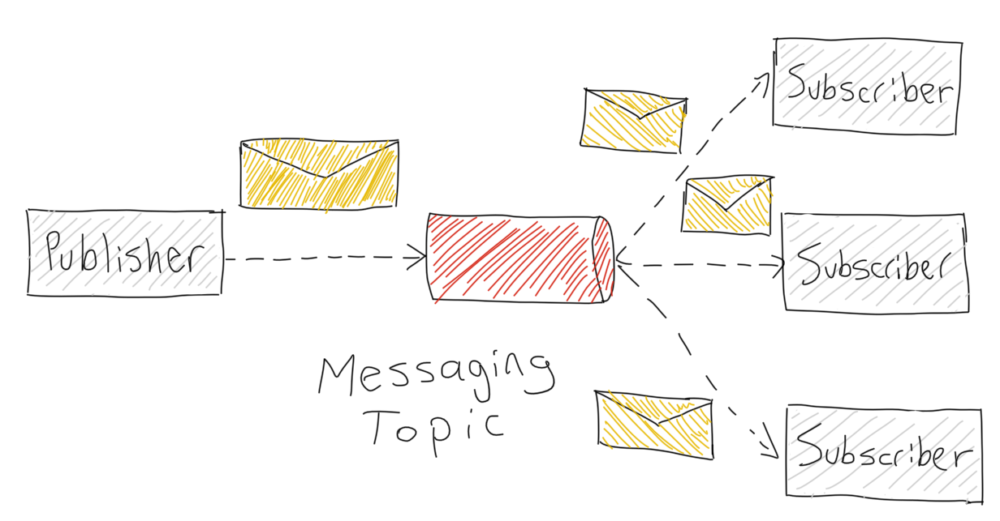

# Kafka in Trucking IoT Use Case

## Outline

-   [The IoT Use Case](#the-iot-use-case)
-   [What is Kafka](#what-is-kafka)
-   [Architectural Overview](#architectural-overview)
-   [Benefits of Kafka](#benefits-of-kafka)
-   [Next: Kafka in Action](#next-kafka-in-action)

## The IoT Use Case

To learn more about the Trucking IoT Use Case, visit [The IoT Use Case Sub Section](https://hortonworks.com/hadoop-tutorial/trucking-iot-hdf/#the-iot-use-case) from the "Trucking IoT on HDF" tutorial.

What is Kafka role in this Stream Processing Application?

- Kafka offers strong durability, so Storm can read data from a topic, process it and write data to databases, another topic, etc.

## What is Kafka

Apache Kafka is an open source publish-subscribe based messaging system responsible for transferring data from one application to another. In messaging systems, there are two types of messaging patterns: point to point and publish-subscribe.

**Point to Point** are messages persisted into a queue

Key Characteristics of generic figure above:

- a message can be read by only one consumer
- 1 or more consumer(s) can consume messages in the queue
- once the message is read, it disappears from the queue

**Publish-Subscribe** are messages persisted into a topic

Key Characteristics of generic figure above:

- consumers can subscribe to 1 or more topics and consume all messages in that topic
- message producers are known as publishers
- message consumers are known as subscribers

Kafka is a publish subscribe messaging pattern.

## Architectural Overview

At a high level, our data pipeline looks as follows:

**NiFi Producer**

Produces a continuous real-time data feed from truck sensors and traffic information that are separately published into two Kafka topics using a NiFi Processor implemented as a Kafka Producer.

To learn more about the Kafka Producer API Sample Code, visit [Developing Kafka Producers](https://docs.hortonworks.com/HDPDocuments/HDP2/HDP-2.6.0/bk_kafka-component-guide/content/ch_kafka-development.html)

**Kafka Cluster**

Has 1 or more topics for supporting 1 or multiple categories of messages that are managed by Kafka brokers, which create replicas of each topic (category queue) for durability.

**Storm Consumer**

Reads messages from Kafka Cluster and emits them into the Apache Storm Topology to be processed.

To learn more about the Kafka Consumer API Sample Code, visit [Developing Kafka Consumers](https://docs.hortonworks.com/HDPDocuments/HDP2/HDP-2.6.0/bk_kafka-component-guide/content/ch_kafka-development.html)

At a mid level for the Kafka Cluster, our data line looks as follows:

## Benefits of Kafka

**Reliability**

- Distributed, partitioned, replicated and fault tolerant

**Scalability**

- Messaging system scales easily without down time

**Durability**

- "Distributed commit log" which allows messages to be persisted on disk asap

**Performance**

- High throughput for publishing and subscribing messages
- Maintains stable performance for many terabytes stored

## Next: Kafka in Action

Now that we've become familiar with how Kafka will be used in our use case, let's move onto seeing Kafka in action when running the demo application.
