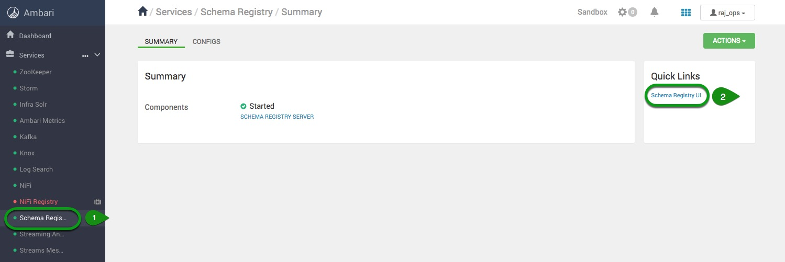
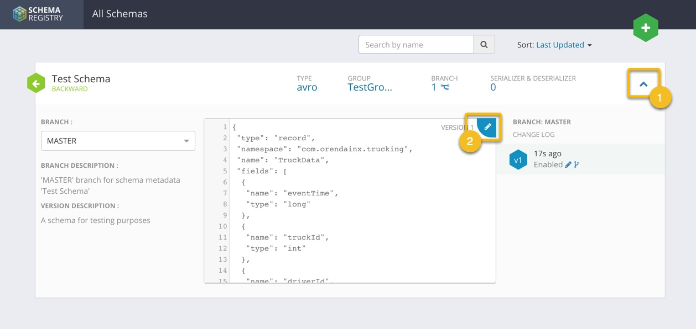
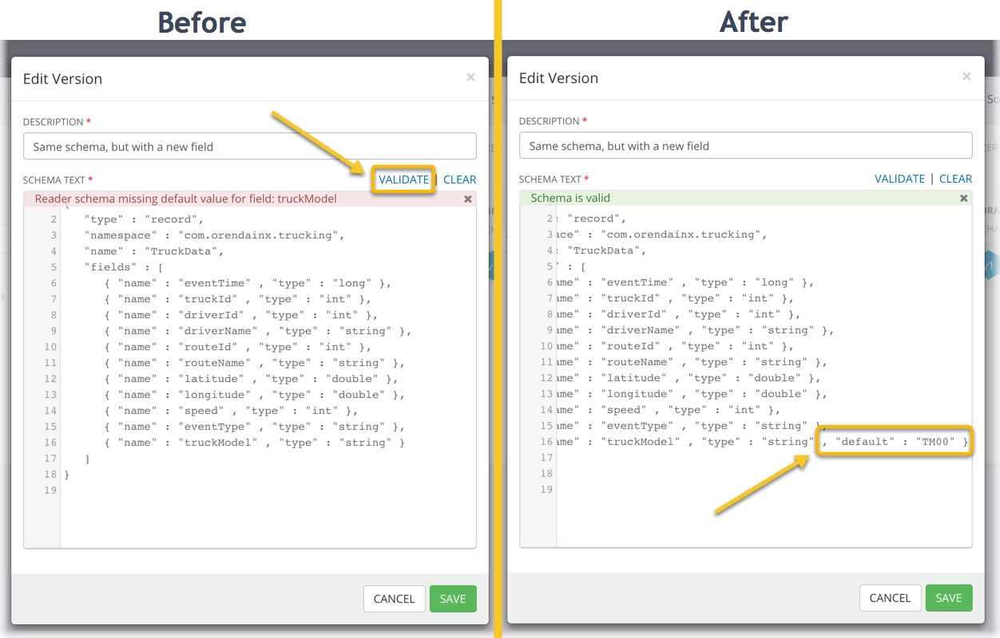

# Schema Registry in Trucking IoT on HDF

## Using the Schema Registry Web Interface

## Introduction

Let's dive in to the Schema Registry UI and play around with what it's got to offer.  We'll cover creating new schemas, registering new versions of existing schemas for backward compatibility, and comparing different versions of schemas.


## Outline

-   [Accessing the Web Interface](#accessing-the-web-interface)
-   [Adding New Schema](#adding-new-schema)
-   [Registering a New Schema Version](#registering-a-new-schema-version)
-   [Comparing Different Schema Versions](#comparing-different-schema-versions)
-   [Next: Using the Schema Registry API](#next-using-the-schema-registry-api)


## Accessing the Web Interface

The URL to the Schema Registry Web UI can be found through the Ambari Quick Links dropdown.



By default, on the HDF sandbox, the Schema Registry web UI can be accessed by navigating to: `http://sandbox-hdf.hortonworks.com:7788`


## Adding New Schema

Now that we have access to the web UI, let's try adding a new schema to the registry.  You may already have a few schemas included with your version of HDF, but follow along and let us add another.

Click on the **+** symbol at the top-right of the interface.


That will open up a window titled "**Add New Schema**" in which we can enter informaiton about our new schema, including the first version of the schema text.  Refer to the following picture and the text below to add a new schema.


Field | Content | Explanation
--- | --- | ---
Name | Test Schema | The name to give this schema
Description | A schema for testing purposes | Any descriptive blurb will do, this is for your own documentation purposes
Type | Avro schema provider | The type of schema to use (Avro, JSON, Protocol Buffers, Thrift, etc.)
Schema Group | TestGroup | Any name you'd like to use for logical grouping of some schemas
Compatibility | Backward | The type of schema compatibility to provide (backward, forward, both, none)
Evolve | Checked | Whether or not to allow schemas to evolve (take on new versions after this initial definition)
Schema Text | (see below) | The schema text, defining fields the expected data will have.

**Schema Text**
```
{
   "type" : "record",
   "namespace" : "com.orendainx.trucking",
   "name" : "TruckData",
   "fields" : [
      { "name" : "eventTime" , "type" : "long" },
      { "name" : "truckId" , "type" : "int" },
      { "name" : "driverId" , "type" : "int" },
      { "name" : "driverName" , "type" : "string" },
      { "name" : "routeId" , "type" : "int" },
      { "name" : "routeName" , "type" : "string" },
      { "name" : "latitude" , "type" : "double" },
      { "name" : "longitude" , "type" : "double" },
      { "name" : "speed" , "type" : "int" },
      { "name" : "eventType" , "type" : "string" }
   ]
}
```

Now **Save** the schema and watch it show up on the web interface.

## Registering a New Schema Version

Now that we have a newly defined schema, let's see about registering a new version of this schema.  Registering new schema versions (i.e. _evolving_ the schema) allows services leveraging Schema Registry work with data of either schema, allowing our overall application to be more resilient and robust.

1.  Find the entry of the schema we just created.  Expand the entry by **clicking on the arrow** on the right side of the box.
2.  Click on the **edit** icon, located at the top-right of the schema text box.



This opens up a window wherein we can add a new version of our schema text.  Add in any description you like in the **Description** textfield, and copy in the following new schema text.

> Note: Notice that this schema text differs from the last one by providing a new "_truckModel_" field.

```
{
   "type" : "record",
   "namespace" : "com.orendainx.trucking",
   "name" : "TruckData",
   "fields" : [
      { "name" : "eventTime" , "type" : "long" },
      { "name" : "truckId" , "type" : "int" },
      { "name" : "driverId" , "type" : "int" },
      { "name" : "driverName" , "type" : "string" },
      { "name" : "routeId" , "type" : "int" },
      { "name" : "routeName" , "type" : "string" },
      { "name" : "latitude" , "type" : "double" },
      { "name" : "longitude" , "type" : "double" },
      { "name" : "speed" , "type" : "int" },
      { "name" : "eventType" , "type" : "string" },
      { "name" : "truckModel" , "type" : "string" }
   ]
}
```

With the new schema text added in, attempt to **Validate** the schema.  You should get an error message as in the image below.



The error message warns us that for a schema to be backward-compatible, any new fields added to a schema should come with a default value.  Let's replace the last field of the schema text with the following, adding a default value.

```
{ "name" : "truckModel" , "type" : "string" , "default" : "TM00" }
```

Attempt to **Validate** again.  Once everything checks out, **Save** the new version.


## Comparing Different Schema Versions


1.  Now that we have added a second, updated, version of our schema, the web interface updates to show us all those that exist.
2.  The Schema Register web interface also allows you to compare any two versions of schemas you have defined.  Click on **Compare Versions** and look around.


## Next: Using the Schema Registry API

Excellent, we just learned how to use Schema Registry's web UI to manage schemas that we can use in our data pipeline.  If you are a developer and are interested in leveraging Schema Registry's API for programmatically registering schemas or marshalling data in code, check out the next section for a sample on using to the Schema Registry's Java API with Scala.
