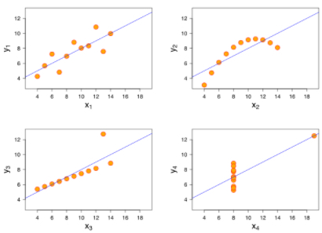
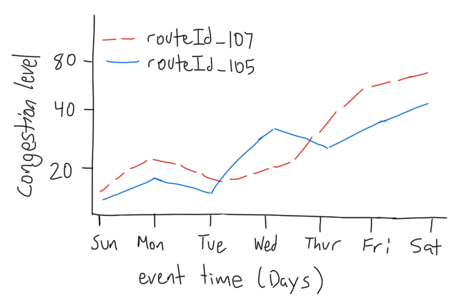
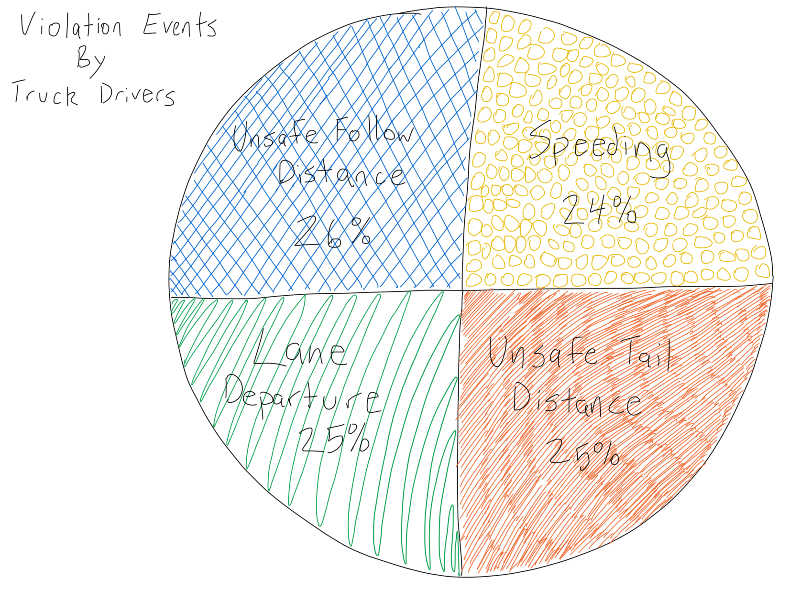

# Lesson: Data Visualization & Superset

## Objective

To understand the importance of Data Visualization, began brainstorming on the some visualizations you can use to communicate messages about the trucking data and become familiar with the Superset.

> **Note**: Most of this information comes from
[Udacity - Data Visualization with Tableau](https://www.udacity.com/course/data-visualization-in-tableau--ud1006), [Udacity - Data Visualization and D3.js](https://www.udacity.com/course/data-visualization-and-d3js--ud507), [Udacity - Intro to Data Science](https://www.udacity.com/course/intro-to-data-science--ud359), [Wikipedia](https://en.wikipedia.org/wiki/Data_visualization) and the [Apache Superset](https://superset.incubator.apache.org/) website.

## Outline

-   [What is Data Visualization?](#what-is-data-visualization?)
-   [Why use Data Visualization?](#why-use-data-visualization?)
-   [Why mention Data Types?](#why-mention-data-types?)
-   [Characteristics of Effective Visualization](#characteristics-of-effective-visualization)
-   [Graphs Used to Communicate Messages about Data](#common-graphs-used-to-communicate-messages-about-data)
-   [Apply Human Perception to Design an Intuitive Graph](#apply-human-perception-to-Design-an-intuitive-graph)
-   [History of Data Visualization](#history-of-data-visualization)
-   [Why use Superset](#why-superset)
-   [Superset Terminology](#superset-terminology)
-   [Next: Superset in Action](#next-superset-in-action)

## Introduction to Data Visualization

## What is Data Visualization?

~~~
"Data visualization is about conveying a story or an idea as
efficiently as possible. Its often said that a picture is worth
a thousand words. Data visualization works the same way. Data
scientists use data visualization to explore patterns in their
data and ultimately convey results."
 - Ryan Orban (Udacity Instructor - Data Visualization and D3.js,
   Lesson 1: Visualization Fundamentals, 1. What is Data
   Visualization?)
~~~

Many people view it as an art and science, which is has various applications:

- [Infographics](https://en.wikipedia.org/wiki/Infographic)
- [Information Visualization](https://en.wikipedia.org/wiki/Information_visualization)
- [Scientific Visualization](https://en.wikipedia.org/wiki/Scientific_visualization)
- [Exploratory Data Analysis](https://en.wikipedia.org/wiki/Exploratory_data_analysis)
- [Statistical Graphics](https://en.wikipedia.org/wiki/Statistical_graphics)

## Why use Data Visualization?

We should use data visualization rather than representing the data as numbers because humans are more adept at interpreting the relationship in the data when they see it directly as a graph.

**Data Visualization & Human Perception**

Data visualization helps our brain perceive data. According to Physicist Tor Norretrander, _eye sight_ takes up majority of space from the _bandwidth of our senses_ and can process information at the speed of computer networks or ethernet cables illustrated by the following diagram (Udacity Course - Data Visualization with Tableau, Lesson 1: Data Visualization Fundamentals).

`Hand drawn diagram based on "Udacity Course - Data Visualization with Tableau, Lesson 1: Data Visualization Fundamentals, 3. Why use data visualization"`

**Anscombe's Descriptive Statistics vs Graphs**

Statistician Francis Anscombe setup the scenario in which he had 4 datasets with eleven points (x,y) that had the same descriptive statistics: mean, variance, correlation coefficient and line of best fit. Without data visualization, it would appear the datasets have no major differences as indicated by the table.

`Credit: Wikipedia - Anscombe's Quartet Page`

**Anscombe's Quartet** suggests to always plot your data rather than depend on descriptive statistics. In the case of the table above with the 4 datasets, the summary statistics did not differ, but the graphs do.

`Credit: Wikipedia - Anscombe's Quartet Page`

What can we see from the graphs that throw off our summary statistics?

The effect of:

- Curvatures
- Outliers

The above example reinforces why we should use data visualization over displaying numbers. Graphics allow us to clearly see deviations or patterns in the data while tables and summary statistics do not.

## Why mention Data Types?

**Data types** concepts are utilized when creating or recreating visualizations. We must understand the different kinds of data types found in data visualizations:

1\. **Quantitative Data** - are any variables with exact numbers, which can be discrete or continuous.
  - _Discrete_ is a variable that is countable
    - Examples of names: units sold, number of languages spoken, number of emails, you received
  - _Continuous_ is a variable that is within a range
    - Examples of names: time, height, weight, money, interest rates, temperature

2\. **Qualitative Data** - are any variables with a label or category
  - _Categorical (Nominal)_ is a variable that labels or categorizes data into groups
    - Examples of names: gender, hair color, country, industry, cat breed
  - _Ordinal (Ordered)_ is a variable that ranks categories
    - Examples of names: rankings, class_difficulty, survey questions like "How do you feel about hedgehogs?"
      - 1\. I love them
      - 2\. negative
      - 3\. neutral
      - 4\. positive

~~~
Credit: Udacity Course - Data Visualization with Tableau, Lesson 1: Data Visualization Fundamentals
~~~

## Characteristics of Effective Visualization

~~~
"Graphical displays should:

1. Show the data
2. Induce the viewer to think about the substance rather than about methodology,
graphic design, the technology of graphic production or something else
3. Avoid distorting what the data has to say
4. Present many numbers in a small space
5. Make large data sets coherent
6. Encourage the eye to compare different pieces of data
7. Reveal the data at several levels of detail, from a broad overview to the
fine structure
8. Serve a reasonably clear purpose: description, exploration, tabulation or
decoration
9. Be closely integrated with the statistical and verbal descriptions of a data
set.

Graphics reveal data." - Wikipedia
~~~

## Common Graphs Used to Communicate Messages about Data

As you experiment with ways to effectively visualize data, graphs you may want to utilize to communicate quantitative **messages** about your use case (Trucking IoT) include:

- 1\. Time Series: Single variable captured over a period of time.
    - _Line Chart_ can show the congestion level on a particular route over the span of weekdays, months, years, etc.

- 2\. Ranking: Categorical subdivisions ranked in ascending or descending order.
    - _Bar Chart_ can rank in ascending order traffic congestion level (the measure) by route (the category) during a single period.

- 3\. Part-to-whole: Categorical subdivisions measured as a ratio to the whole (percentage of 100%).
    - _Pie Chart or Bar Chart_ can show the percentage of violation events by truck drivers: **Lane Departure**, **Unsafe Follow Distance**, **Speeding**, **Unsafe Tail Distance** as a ratio to the whole.

- 4\. Deviation: Categorical subdivisions compared against a reference.
    - _Bar Chart_ can show the actual vs budget expenses for several business departments over a time period.

- 5\. Frequency Distribution: Shows the observations of a variable for a given interval.
    - _Histogram or/and Box Plot_
        - _Histogram_ can show the traffic congestion levels in the data for `Des Moines to Chicago` and `Saint Louis to Chicago` during foggy, windy or rainy day. The following histogram illustrates this information.
        - _Box Plot_ can visualize the statistics about the traffic congestion levels on these routes: median, quartiles, outliers, etc.

- 6\. Correlation: Comparison between two variables (x,y) to determine if they move in the same or opposite directions.
    - _Scatterplot_ can plot unemployment (x) and inflation (y) for a sample of months.

- 7\. Geographical or Geospatial: Comparison of a variable across a map or layout.
    - _Cartogram_ can show the number of persons on various floors of a building.

As you experiment with ways to visualize data to communicate meaningful messages and correlations, you will dabble into **Exploratory Data Analysis**, which is providing insight about the dataset through trial and error.

## Apply Human Perception to Design an Intuitive Graph

Human perception and cognition knowledge is essential for communicating the **message** you want to get across from the graph because all visualizations are created for human consumption. Human perception is the way humans visually process information. Thus, human visual processing involves detecting changes and making comparisons between quantities, sizes, shapes and variations in lightness. As long as **properties of symbolic data** are mapped to **visual properties represented by that data**, humans are able to browse through large volumes of data efficiently. Hence, data visualization allows the user to perform data explorations.

## History of Data Visualization

The first documented trace of data visualization was a **Turin Papyrus Map** and can be tracked back to 1160BC. Maps illustrate information about the location of geological resources and how to extract those resources. Maps also can show a **thematic cartography**, which is a geographical illustration designed to show a theme connected with a specific geographic area. People have also found different forms of data visualization through cave wall drawings and physical artifacts from Mesopotamian, Inca and other indigenous groups.

The invention of paper and parchment was a major breakthrough for allowing further development of visualizations. In the 16th century, techniques and instruments were developed for accurately measuring physical quantities, geographic and celestial positions. With the development of **analytic geometry** and **two-dimensional coordinate system** by Rene Descartes and Pierre de Fermat, they have influenced the methods we use to display and calculate data values.

Fermat teamed up with Blaise Pascal and their work on **statistics and probability theory** laid the foundation for what conceptualize as data. John Tukey and Edward Tufte's work in refining data visualization techniques allowed for this field to be inhabited by more than just the people in the Statistics field. As this technology progressed, hand-drawn visualizations evolve into software visualizations. Software visualization applications have the ability to visualize in 2D, 3D, virtually reality and augmented reality. There are a wide range of programs for visualization that have been developed: Tableau, Zeppelin, AtScale, R, Python, **Superset**.

## Why Superset

Superset has an easy to use interface for exploring and visualizing data with integration for various databases (we'll use Druid). Superset has a rich set of visualizations and gives the user the ability to create dashboards to categorize your data tables. Superset also allows users to create visualization slices, which represent the actual visualization of the data table, and select the appropriate dashboard for your slice. Superset is enterprise-ready, extensible and has a high granularity security/permission model that allows intricate rules on who can access individual features and the dataset.

- Visually predict truck breakdowns and visually analyze driver habits on separate maps all to prevent drivers from getting into accidents

## Superset Terminology

- 1\. Sources: allows users to view databases, tables, druid clusters, druid datasources and

- 2\. Slices: graphical representations of the druid datasources that deliver a particular message about the data in the table to the customer

- 3\. Dashboards: group visualization slices together into particular categories, such as Trucking IoT, Weather IoT, Agriculture IoT, etc.

## Next: Superset in Action

We're now familiar with how Apache Superset ties into our Trucking IoT Application, let's see Superset in action and create some visualization slices of our data.
