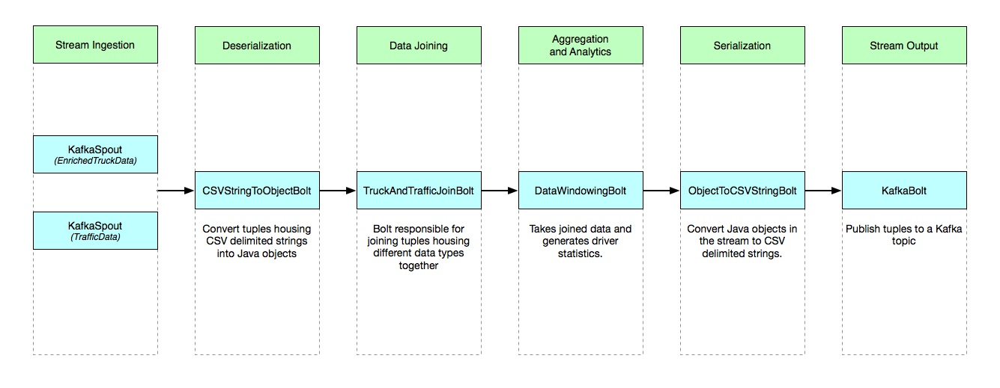

# Trucking IoT on HDF

## Running the Demo

## Introduction

Let's walk through the demo and get an understanding for the data pipeline before we dive deeper into Storm internals.


## Outline

-   [Environment Setup](#environment-setup)
-   [Generate Sensor Data](#generate-sensor-data)
-   [Deploy the Storm Topology](#deploy-the-storm-topology)
-   [Visualize the Processed Data](#visualize-the-processed-data)
-   [Next: Building a Storm Topology](#next:-building-a-storm-topology)


## Environment Setup

SSH into your Hortonworks DataFlow (HDF) environment and download the corresponding demo project.

```
git clone https://github.com/orendain/trucking-iot-demo-2
```

Run the automated setup script to download and prepare necessary dependencies.
```
cd trucking-iot-demo-2
./scripts/setup.sh
```

> Note: The script assumes that Kafka and Storm services are started within Ambari and that the Ambari login credentials are admin/admin.


## Generate Sensor Data

The demo application leverages a very robust data simulator, which generates data of two types and publishes them to Kafka topics as a CSV string.

`EnrichedTruckData`: Data simulated by sensors onboard each truck.  For the purposes of this demo, this data has been pre-enriched with data from a weather service.

```
1488767711734|26|1|Edgar Orendain|107|Springfield to Kansas City Via Columbia|38.95940879245423|-92.21923828125|65|Speeding|1|0|1|60
```


`TrafficData`: Data simulated from an online traffic service, which reports on traffic congestion on any particular trucking route.

```
1488767711734|107|60
```


Start the data generator by executing the appropriate script:
```
./scripts/run-simulator.sh
```


## Deploy the Storm Topology

With simulated data now being pumped into Kafka topics, we power up Storm and process this data.  In a separate terminal window, run the following command:

```
./scripts/deploy-topology.sh
```

> Note: We'll cover what exactly a "topology" is in the next section.

Here is a slightly more in-depth look at the steps Storm is taking in processing and transforming the two types of simulated data from above.




## Visualize the Processed Data

With the data now fully processed by Storm and published back into accessible Kafka topics, it's time to visualize some of our handiwork.  Start up the included reactive web application, which subscribes to a Kafka topic that processed data is stored in and renders these merged and processed truck and traffic data points on a map.

```
./scripts/start-web-application.sh
```

Bring up the web application by accessing it through your broswer at: `sandbox.hortonworks.com:15500`


## Next: Building a Storm Topology

Now that we know how Storm fits into this data pipeline and what type of ETL work it is performing, let's dive into the actual code and see exactly how it is built.
