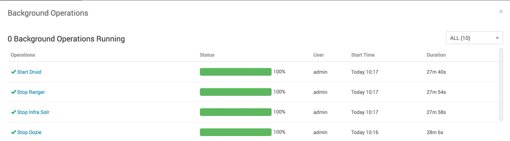
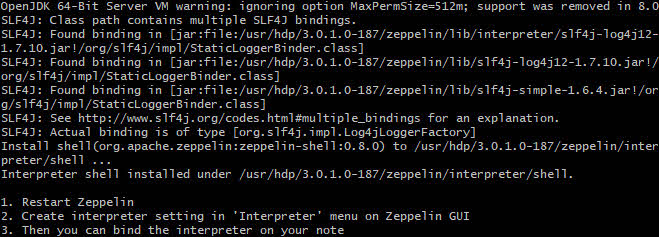
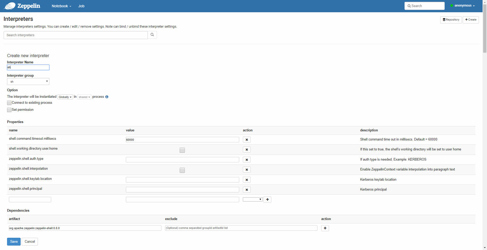

# Setting Up Development Environment

## Introduction

In this tutorial, you will verify your sandbox IP is mapped to your desired hostname, your admin password is setup, all services not needed are turned off and Druid is turned on.

## Prerequisites

- Map Sandbox IP to hostname, if you need help, reference **Environment
Setup -> Map Sandbox IP To Your Desired Hostname In The Hosts File** in [Learning the Ropes of HDP Sandbox](https://hortonworks.com/tutorial/learning-the-ropes-of-the-hortonworks-sandbox/)
- Set the Ambari admin password for HDP, if you need help, reference **Admin Password Reset** in [Learning the Ropes of HDP Sandbox](https://hortonworks.com/tutorial/learning-the-ropes-of-the-hortonworks-sandbox/)

## Outline

- [Start up all required services](#start-up-all-required-services)
- [Summary](#summary)
- [Further Reading](#further-reading)

### Start up all required services

If unsure, login to Ambari **admin** Dashboard for HDP at http://sandbox-hdp.hortonworks.com:8080. Verify **Druid** starts up and is off maintenance mode. Verify **Oozie, Infra Solr and Ranger** are turned off and are on maintenance mode.

> To turn on or off services, for a service, click **ACTIONS** -> **Start** or **Stop**. Similarily to turn on or off maintenance mode, click **Turn On Mainetenance Mode**.

### Install Zeppelin Shell Interpreter

Open Web Shell Client at http://sandbox-hdp.hortonworks.com:4200

~~~bash
/usr/hdp/3.0.1.0-187/zeppelin/bin/install-interpreter.sh --name shell
~~~

Output you should see:

1\. Restart Zeppelin from Ambari UI.

2\. Create interpreter setting in 'Interpreter' menu on Zeppelin GUI.

From Zeppelin UI, click **anyonymous**, then **interpreter**.

From Interpreter, click **+Create**.

Then you can bind the interpreter on your note if needed.

## Summary

Congratulations. You have now have setup the development environment for Druid on the HDP Sandbox. You are ready to do data ingestion with Druid.

## Further Reading

- [Druid Production Cluster Configuration](http://druid.io/docs/latest/configuration/production-cluster.html)
- [Installing and Configuring Druid on HDP](https://docs.hortonworks.com/HDPDocuments/HDP2/HDP-2.6.4/bk_data-access/content/ch_using-druid.html)
