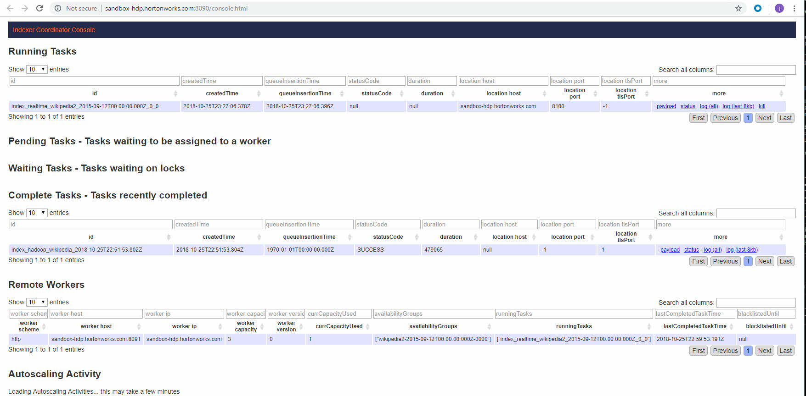

# Loading Streaming Data into Druid via HTTP

## Introduction

You will learn how to load your own streams into Druid using the HTTP **stream push** process. We'll use the **Tranquility Server Client** to push data into **Druid** over the HTTP API. It is important to get familiar with Tranquility because **stream processing** tools, such as **Spark Streaming**, **Apache Storm**, **Apache Kafka**, **Stream Analytics Manager** all use Tranquility API to store data into Druid.

## Prerequisites

- Setup the Development Environment

## Outline

- Step 1: Download Tranquility
- Step 2: Writing an Ingestion Spec
- Step 3: Saving the Ingestion Spec
- Step 4: Running the Task
- Step 5: Running a Query on the Data Source
- Summary
- Further Reading

## Step 1: Download Tranquility

**Tranquilty** is a high level data producer library for Druid. Download it using the following commands:

~~~bash
wget http://static.druid.io/tranquility/releases/tranquility-distribution-0.8.2.tgz -O /usr/hdp/3.0.1.0-187/druid/tranquility-distribution-0.8.2.tgz
cd /usr/hdp/3.0.1.0-187/druid/
tar -xzf tranquility-distribution-0.8.2.tgz
cd tranquility-distribution-0.8.2
~~~

## Step 2: Writing an Ingestion Spec

Open your HDP Web Shell Client at http://sandbox-hdp.hortonworks.com:4200. Create the realtime ingestion spec using the command:

~~~bash
touch /usr/hdp/3.0.1.0-187/druid/conf-quickstart/tranquility/server-wikipedia.json
~~~

Open the ingestion spec in your favorite editor. For instance, if you use vi editor:

~~~bash
vi /usr/hdp/3.0.1.0-187/druid/conf-quickstart/tranquility/server-wikipedia.json
~~~

Press `i` and then copy and paste the following json spec content into vi:

~~~json
{
  "dataSources" : {
    "wikipedia2" : {
      "spec" : {
        "dataSchema" : {
          "dataSource" : "wikipedia2",
          "parser" : {
            "type" : "string",
            "parseSpec" : {
              "format" : "json",
              "dimensionsSpec" : {
                "dimensions" : [
                  "channel",
                  "cityName",
                  "comment",
                  "countryIsoCode",
                  "countryName",
                  "isAnonymous",
                  "isMinor",
                  "isNew",
                  "isRobot",
                  "isUnpatrolled",
                  "metroCode",
                  "namespace",
                  "page",
                  "regionIsoCode",
                  "regionName",
                  "user"
                ]
              },
              "timestampSpec": {
                "column": "time",
                "format": "iso"
              }
            }
          },
          "metricsSpec" : [
            {
              "name" : "added",
              "type" : "longSum",
              "fieldName" : "added"
            },
            {
              "name" : "deleted",
              "type" : "longSum",
              "fieldName" : "deleted"
            },
            {
              "name" : "delta",
              "type" : "longSum",
              "fieldName" : "delta"
            }
          ],
          "granularitySpec" : {
            "type" : "uniform",
            "segmentGranularity" : "day",
            "queryGranularity" : "none",
            "intervals" : ["2015-09-12/2015-09-13"],
            "rollup" : false
          }
        },
        "ioConfig" : {
          "type" : "realtime"
        },
        "tuningConfig" : {
          "type" : "realtime",
          "intermediatePersistPeriod" : "PT10M",
          "windowPeriod" : "P3650D"
        }
      },
      "properties" : {
        "task.partitions" : "1",
        "task.replicants" : "1"
      }
    }
  },
  "properties" : {
    "zookeeper.connect" : "sandbox-hdp.hortonworks.com",
    "druid.discovery.curator.path" : "/druid/discovery",
    "druid.selectors.indexing.serviceName" : "druid/overlord",
    "http.port" : "8200",
    "http.threads" : "9"
  }
}
~~~

### Saving the Ingestion Spec

Now the Druid Ingestion Spec is complete. Save the file.

For example, with the file open in vi editor:

~~~bash
press "esc" to escape, then type ":wq" and press enter to quit and save the file.
~~~

### Analyzing the Ingestion Spec

Let's analyze certain parts of the realtime ingestion spec that differ from the hadoop-based batch ingestion spec.

Notice for

~~~
"ioConfig" : {
  "type" : "realtime"
},
~~~

it specifies we are using **realtime input/output**, we don't use hadoop batch processing. Therefore, there is no need to specify the path to the data file because we have a **data producer** that is **constantly getting realtime data** from **wikipedia API**.

Notice for

~~~
"tuningConfig" : {
  "type" : "realtime",
  "maxRowsInMemory" : "100000",
  "intermediatePersistPeriod" : "PT10M",
  "windowPeriod" : "P3650D"
}
~~~

it specifies we are tuning the realtime data ingestion, which includes how much memory allocated per row and how the amount of time that elapses before storing data into Druid.

Notice properties is JSON Object of the metrics JSON Object. It is new.

~~~
"properties" : {
  "task.partitions" : "1",
  "task.replicants" : "1"
}
~~~

**"properties"** fields specify the task is allocated 1 partitions and there is only 1 replicant. If the replicant number were more than 1, then we would have multiple tasks that can ingest realtime data to `wikipedia` datasource.

Notice there is another properties field outside the `"dataSources"` JSON Object listed as the next JSON Object.

~~~
"properties" : {
  "zookeeper.connect" : "sandbox-hdp.hortonworks.com",
  "druid.discovery.curator.path" : "/druid/discovery",
  "druid.selectors.indexing.serviceName" : "druid/overlord",
  "http.port" : "8200",
  "http.threads" : "9"
}
~~~

This specifies the properties that will be utilized for all datasources. Tranquility server needs to know the hostname of `zookeeper.connect`, the path to Druid discovery, the path to Druid overlord, the port that will be utilized for Tranquility server and the number of threads for the server.

Now we have some information on the differences between realtime and hadoop-based ingestion specs. Let's start the Tranquility server.

## Step 3: Running Tranquility Server

Start Tranquility server with real-time ingestion spec `server-wikipedia.json`, issue the following command:

~~~bash
bash /usr/hdp/3.0.1.0-187/druid/tranquility-distribution-0.8.2/bin/tranquility server -configFile /usr/hdp/3.0.1.0-187/druid/conf-quickstart/tranquility/server-wikipedia.json -Ddruid.extensions.loadList=[]
~~~

You can stop Tranquility by pressing `CTRL-C`.

## Step 4: Sending Data to Tranquility

## Sending Streaming Data to Tranquility via Curl HTTP POST

~~~bash
cd /usr/hdp/3.0.1.0-187/druid/quickstart
gunzip wikiticker-2015-09-12-sampled.json.gz
~~~

~~~bash
curl -XPOST -H'Content-Type: application/json' --data-binary @/usr/hdp/3.0.1.0-187/druid/quickstart/wikiticker-2015-09-12-sampled.json http://sandbox-hdp.hortonworks.com:8200/v1/post/wikipedia2
~~~

If you see a sent count of 0, retry the send command until the sent count also shows 39244:

~~~bash
{"result":{"received":39244,"sent":0}}
~~~

You should receive following output in your terminal indicating HTTP server received X amount of events from you and sent X amount of events to Druid:

~~~bash
{"result":{"received":39244,"sent":39244}}
~~~

Open Druid Overload at http://sandbox-hdp.hortonworks.com:8090/console.html. Task will appear under running tasks:

> Note: It will take around 5 - 15 minutes for the task to complete.

Now that the data is sent, let's verify it with Druid queries.

## Step 5: Running a Query on the Data Source

Copy and paste the following Druid JSON based query in file `wiki2-select.json` using your favorite editor:

~~~json
{
  "queryType": "select",
  "dataSource": "wikipedia2",
  "dimensions": [],
  "metrics": [],
  "intervals": [
    "2015-09-12/2015-09-13"
  ],
  "granularity": "all",
  "pagingSpec": {
    "pagingIdentifiers": {},
    "threshold": 5
  }
}
~~~

Save it.

To verify data is being pushed into Druid, let's run a **select** query on the `wikipedia2` data source.

~~~bash
curl -L -H 'Content-Type: application/json' -XPOST --data-binary @/root/wiki2-select.json http://sandbox-hdp.hortonworks.com:8082/druid/vpretty
~~~

## Summary

In later tutorials, we will apply this Tranquility Library concept utilized in the data producer script, but with other Streaming Systems to push data to Druid.

## Further Reading

- [Loading Streams](http://druid.io/docs/latest/ingestion/stream-ingestion.html)
- [Tranquility](https://github.com/druid-io/tranquility)
- [Web Scraping](https://en.wikipedia.org/wiki/Web_scraping)
- [Wikipedia]
- [wikipedia 1.4.0 API for Python](https://pypi.python.org/pypi/wikipedia)
