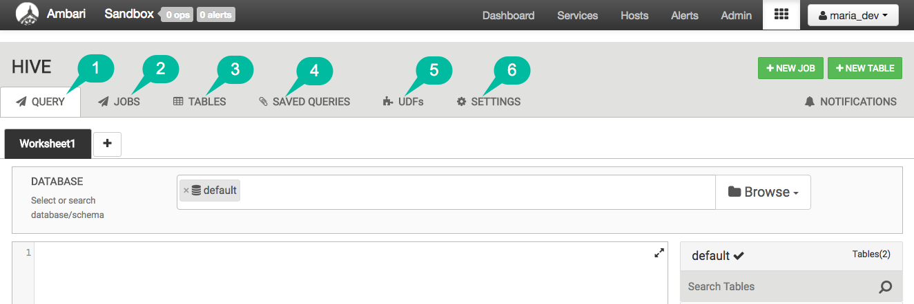
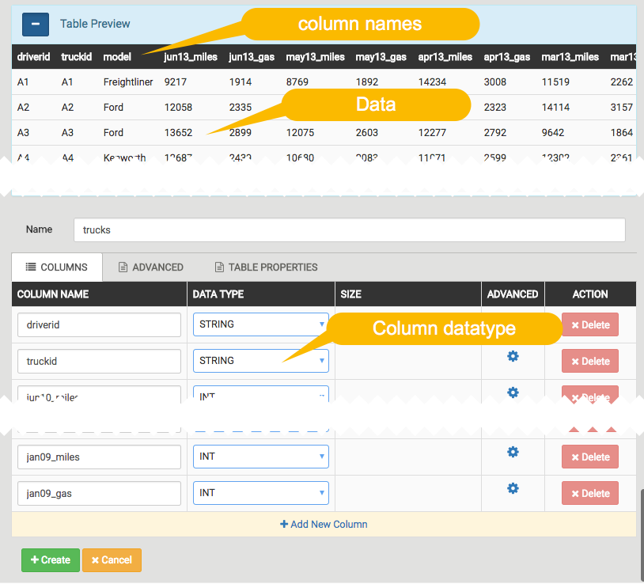
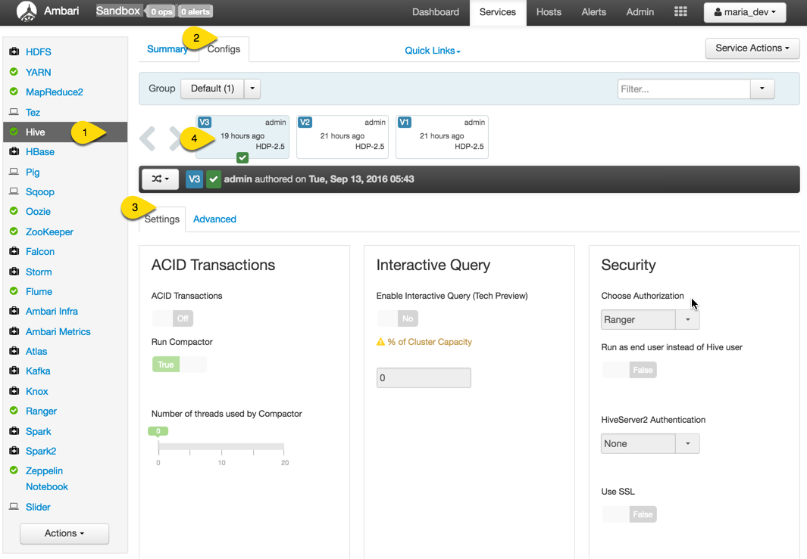
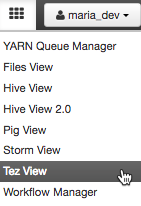

# Hadoop Tutorial – Getting Started with HDP

## Hive - Data ETL

## Introduction

In this tutorial, you will be introduced to Apache Hive. In the earlier section, we covered how to load data into HDFS. So now you have **geolocation** and **trucks** files stored in HDFS as csv files. In order to use this data in Hive, we will guide you on how to create a table and how to move data into a Hive warehouse, from where it can be queried. We will analyze this data using SQL queries in Hive User Views and store it as ORC. We will also walk through Apache Tez and how a DAG is created when you specify Tez as execution engine for Hive. Let's start..!!

## Prerequisites

The tutorial is a part of a series of hands on tutorials to get you started on HDP using the Hortonworks sandbox. Please ensure you complete the prerequisites before proceeding with this tutorial.

-   [Learning the Ropes of the Hortonworks Sandbox](https://hortonworks.com/tutorial/learning-the-ropes-of-the-hortonworks-sandbox/)
-   Hortonworks Sandbox
-   Loading Sensor Data into HDFS

## Outline

-   [Apache Hive Basics](#hive-basics)
-   [Step 2.1: Become Familiar with Ambari Hive View](#use-ambari-hive-user-views)
-   [Step 2.2: Define a Hive Table](#define-a-hive-table)
-   [Step 2.3: Explore Hive Settings on Ambari Dashboard](#explore-hive-settings)
-   [Step 2.4: Analyze the Trucks Data](#analyze-truck-data)
-   [Summary](#summary-lab2)
-   [Further Reading](#further-reading)

## Apache Hive Basics <a id="hive-basics"></a>

Apache Hive provides  SQL interface to query data stored in various databases and files systems that integrate with Hadoop.  Hive enables analysts familiar with SQL to run queries on large volumes of data.  Hive has three main functions: data summarization, query and analysis. Hive provides tools that enable easy data extraction, transformation and loading (ETL).

## Step 2.1: Become Familiar with Ambari Hive View 2.0<a id="use-ambari-hive-user-views"></a>

Apache Hive presents a relational view of data in HDFS. Hive can represent data in a tabular format managed by Hive or just stored in HDFS irrespective in the file  format their data is stored in.  Hive can query data from RCFile format, text files, ORC, JSON, parquet,  sequence files and many of other formats in a tabular view.   Through the use of SQL you can view your data as a table and create queries like you would in an RDBMS.

To make it easy to interact with Hive we use a tool in the Hortonworks Sandbox called the Ambari Hive View.   [Ambari Hive View 2.0](https://docs.hortonworks.com/HDPDocuments/Ambari-2.5.0.3/bk_ambari-views/content/ch_using_hive_view.html) provides an interactive interface to Hive.   We can create, edit, save and run queries, and have Hive evaluate them for us using a series of MapReduce jobs or Tez jobs.

Let’s now open Ambari Hive View 2.0 and get introduced to the environment. Go to the Ambari User View icon and select Hive View 2.0:


The Ambari Hive View looks like the following:



Now let’s take a closer look at the SQL editing capabilities in Hive View:

There are 6 tabs to interact with Hive View 2.0:

1\. **QUERY**: This is the interface shown above and the primary interface to write, edit and execute new SQL statements.

2\. **JOBS**: This allows you to see past and currently running queries. It also allows you to see all SQL queries you have authority to view. For example, if you are an operator and an analyst needs help with a query, then the Hadoop operator can use the History feature to see the query that was sent from the reporting tool.

3\. **TABLES**: Provides one central place to view, create, delete, and manage tables.

4\. **SAVED QUERIES**: Display queries saved by current user. Click the gear icon to the right of the query to open saved query in worksheet to edit or execute. You can also remove saved query from the saved list.

5\. **UDFs**: User-defined functions (UDFs) can be added to queries by pointing to a JAR file on HDFS and indicating the Java classpath, which contains the UDF definition. After the UDF is added here, an Insert UDF button appears in the Query Editor that enables you to add the UDF to your query.

6\. **SETTINGS**: Allows you to modify settings which will affect queries executed in Hive View.

Take a few minutes to explore the various Hive View sub-features.

### 2.1.1 Set hive.execution.engine as Tez

A feature we will configure before we run our hive queries is to set the hive execution engine as Tez. You can try map reduce if you like. We will use Tez in this tutorial.

1.  Click on settings tab, referred to as number 6 in the interface above.
2.  Click on **+Add New**
3.  Click on the KEY dropdown menu and choose ```hive.execution.engine```
4.  Set the value as ```tez```.

Now we are ready to run our queries for this tutorial.

## Step 2.2: Define a Hive Table <a id="define-a-hive-table"></a>

Now that you are familiar with the Hive View, let’s create and load tables for the geolocation and trucks data. In this section we will learn how to use the Ambari Hive View to create two tables: geolocation and trucking using the Hive View Upload Table tab.  The Upload Table tab provides the following key options: choose input file type, storage options (i.e. Apache ORC) and set first row as header.   Here is a visual representation of the table and load creation process accomplished in the next few steps.:


### 2.2.1 Create and load Trucks table For Staging Initial Load

Starting from Hive View 2.0:
1. Select **NEW TABLE**
2. Select **UPLOAD TABLE**


Complete form as follows using `/user/maria_dev/data/trucks.csv` as the HDFS Path, `trucks` as the table name, then click `Preview`.


You should see a similar screen:
> Note: that the first row contains the names of the columns.



Click `Create` button to complete table creation.

Before reviewing what is happening behind the covers in the Upload Progress let’s learn learn more about Hive File Formats.

### 2.2.2: Define an ORC Table in Hive Create table using Apache ORC file format

[Apache ORC](https://orc.apache.org/) is a fast columnar storage file format for Hadoop workloads.

The Optimized Row Columnar ([new Apache ORC project](https://hortonworks.com/blog/apache-orc-launches-as-a-top-level-project/)) file format provides a highly efficient way to store Hive data. It was designed to overcome limitations of the other Hive file formats. Using ORC files improves performance when Hive is reading, writing, and processing data.

To use the ORC format, specify ORC as the file format when creating the table. Here is an example::

~~~
CREATE TABLE ... STORED AS ORC ...
CREATE TABLE trucks STORED AS ORC AS SELECT * FROM trucks_temp_table;
~~~

Similar style create statements are used with the temporary tables used in the `UPLOAD TABLE` process.

### 2.2.3: Review Upload Table Progress Steps

Initially the `trucks` table is created and loaded `trucks.csv` into a temporary table.  The temporary table is used to create and load data in ORC format using syntax explained in previous step.  Once the data is loaded into final table the temporary table is deleted.


> NOTE: The temporary table names are random set of characters and not the names in the illustration above.

You can review the SQL statements issued by selecting the `JOBS` tab and clicking on the **4 Internal Job** that were executed as a result of using the `Upload Table`.


### 2.2.4 Create and Load Geolocation Table

Repeat the steps above with the `geolocation.csv` file to create and load the geolocation table using the ORC file format.

### 2.2.5 Hive Create Table Statement

Let’s review some aspects of the **CREATE TABLE** statements generated and issued above.  If you have an SQL background this statement should seem very familiar except for the last 3 lines after the columns definition:

-   The **ROW FORMAT** clause specifies each row is terminated by the new line character.
-   The **FIELDS TERMINATED** BY clause specifies that the fields associated with the table (in our case, the two csv files) are to be delimited by a comma.
-   The **STORED AS** clause specifies that the table will be stored in the TEXTFILE format.

> NOTE: For details on these clauses consult the [Apache Hive Language Manual](https://cwiki.apache.org/confluence/display/Hive/LanguageManual+DDL).

### 2.2.6 Verify New Tables Exist

To verify the tables were defined successfully:
1. Click on the `TABLES` tab.
2. Click on the **refresh** icon in the `TABLES` explorer.
3. Select table you want to verify. Definition of columns will be displayed.


### 2.2.7 Sample Data from the trucks table

Click on the `QUERY` tab, type the following query into the query editor and click on `Execute`:

~~~sql
select * from trucks limit 10;
~~~

The results should look similar to:


**A few additional commands to explore tables:**

-   `show tables;` - List the tables created in the database by looking up the list of tables from the metadata stored in HCatalogdescribe

-   `describe {table_name};` - Provides a list of columns for a particular table

~~~
   describe geolocation;
~~~

-   `show create table {table_name};` - Provides the DDL to recreate a table

~~~
   show create table geolocation;
~~~

-   `describe formatted {table_name};` - Explore additional metadata about the table.  For example you can verify geolocation is an ORC Table, execute the following query:

~~~
   describe formatted geolocation;
~~~

By default, when you create a table in Hive, a directory with the same name gets created in the `/apps/hive/warehouse` folder in HDFS.  Using the Ambari Files View, navigate to the /apps/hive/warehouse folder. You should see both a `geolocation` and `trucks` directory:

> NOTE: The definition of a Hive table and its associated metadata (i.e., the directory the data is stored in, the file format, what Hive properties are set, etc.) are stored in the Hive metastore, which on the Sandbox is a MySQL database.

### 2.2.8 Rename Query Editor Worksheet

Double-click on the worksheet tab to rename the label to "sample truck data".  Now save this worksheet by clicking the `Save` button.


### 2.2.9 Beeline - Command Shell

If you want to try running some of these commands from the the command line you can use the Beeline Shell.  Beeline uses a JDBC connection to connect to HiveServer2. Follow the following steps from your shell in the box (or putty if using Windows):

1\.  Connect to Sandbox VM

~~~
    ssh maria_dev@127.0.0.1 -p 2222
~~~

-   When prompted, use password "maria_dev"

2\. Connect to Beeline

~~~
beeline -u jdbc:hive2://localhost:10000 -n maria_dev
~~~

3\. Enter Beeline commands like:

~~~
!help
!tables
!describe trucks
select count(*) from trucks;
~~~

4\. Exit the Beeline shell:

~~~
!quit
~~~

What did you notice about performance after running hive queries from shell?

-   Queries using the shell run faster because hive runs the query directory in hadoop whereas in Ambari Hive View, the query must be accepted by a rest server before it can submitted to hadoop.
-   You can get more information on the [Beeline from the Hive Wiki](https://cwiki.apache.org/confluence/display/Hive/HiveServer2+Clients#HiveServer2Clients-Beeline–CommandLineShell).
-   Beeline is based on [SQLLine](http://sqlline.sourceforge.net/).

## Step 2.3: Explore Hive Settings on Ambari Dashboard <a id="explore-hive-settings"></a>

### 2.3.1 Open Ambari Dashboard in New Tab

Click on the Dashboard tab to start exploring the Ambari Dashboard.


### 2.3.2 Become Familiar with Hive Settings

Go to the **Hive page** then select the **Configs tab** then click on **Settings tab**:



Once you click on the Hive page you should see a page similar to above:

1.  **Hive** Page
2.  Hive **Configs** Tab
3.  Hive **Settings** Tab
4.  Version **History** of Configuration

Scroll down to the **Optimization Settings**:


In the above screenshot we can see:

1.  **Tez** is set as the optimization engine
2.  **Cost Based Optimizer** (CBO) is turned on

This shows the **HDP Ambari Smart Configurations**, which simplifies setting configurations

-   Hadoop is configured by a **collection of XML files**.
-   In early versions of Hadoop, operators would need to do **XML editing** to **change settings**.  There was no default versioning.
-   Early Ambari interfaces made it **easier to change values** by showing the settings page with **dialog boxes** for the various settings and allowing you to edit them.  However, you needed to know what needed to go into the field and understand the range of values.
-   Now with Smart Configurations you can **toggle binary features** and use the slider bars with settings that have ranges.

By default the key configurations are displayed on the first page.  If the setting you are looking for is not on this page you can find additional settings in the **Advanced** tab:


For example, if we wanted to **improve SQL performance**, we can use the new **Hive vectorization features**. These settings can be found and enabled by following these steps:

1.  Click on the **Advanced** tab and scroll to find the **property**
2.  Or, start typing in the property into the property search field and then this would filter the setting you scroll for.

As you can see from the green circle above, the `Enable Vectorization and Map Vectorization` is turned on already.

Some **key resources** to **learn more about vectorization** and some of the **key settings in Hive tuning:**

-   Apache Hive docs on [Vectorized Query Execution](https://cwiki.apache.org/confluence/display/Hive/Vectorized+Query+Execution)
-   [HDP Docs Vectorization docs](https://docs.hortonworks.com/HDPDocuments/HDP2/HDP-2.0.9.0/bk_dataintegration/content/ch_using-hive-1a.html)
-   [Hive Blogs](https://hortonworks.com/blog/category/hive/)
-   [5 Ways to Make Your Hive Queries Run Faster](https://hortonworks.com/blog/5-ways-make-hive-queries-run-faster/)
-   [Interactive Query for Hadoop with Apache Hive on Apache Tez](https://hortonworks.com/tutorial/interactive-query-for-hadoop-with-apache-hive-on-apache-tez/)
-   [Evaluating Hive with Tez as a Fast Query Engine](https://hortonworks.com/blog/evaluating-hive-with-tez-as-a-fast-query-engine/)

## Step 2.4: Analyze the Trucks Data <a id="analyze-truck-data"></a>

Next we will be using Hive, Pig and Zeppelin to analyze derived data from the geolocation and trucks tables.  The business objective is to better understand the risk the company is under from fatigue of drivers, over-used trucks, and the impact of various trucking events on risk.   In order to accomplish this, we will apply a series of transformations to the source data, mostly though SQL, and use Pig or Spark to calculate risk.   In the last lab on Data Visualization, we will be using _Zeppelin_ to **generate a series of charts to better understand risk**.


Let’s get started with the first transformation.   We want to **calculate the miles per gallon for each truck**. We will start with our _truck data table_.  We need to _sum up all the miles and gas columns on a per truck basis_. Hive has a series of functions that can be used to reformat a table. The keyword [LATERAL VIEW](https://cwiki.apache.org/confluence/display/Hive/LanguageManual+LateralView) is how we invoke things. The **stack function** allows us to _restructure the data into 3 columns_ labeled rdate, gas and mile (ex: 'june13', june13_miles, june13_gas) that make up a maximum of 54 rows. We pick truckid, driverid, rdate, miles, gas from our original table and add a calculated column for mpg (miles/gas).  And then we will **calculate average mileage**.

### 2.4.1 Create Table truck_mileage From Existing Trucking Data

Using the Ambari Hive View 2.0, execute the following query:

~~~sql
CREATE TABLE truck_mileage STORED AS ORC AS SELECT truckid, driverid, rdate, miles, gas, miles / gas mpg FROM trucks LATERAL VIEW stack(54, 'jun13',jun13_miles,jun13_gas,'may13',may13_miles,may13_gas,'apr13',apr13_miles,apr13_gas,'mar13',mar13_miles,mar13_gas,'feb13',feb13_miles,feb13_gas,'jan13',jan13_miles,jan13_gas,'dec12',dec12_miles,dec12_gas,'nov12',nov12_miles,nov12_gas,'oct12',oct12_miles,oct12_gas,'sep12',sep12_miles,sep12_gas,'aug12',aug12_miles,aug12_gas,'jul12',jul12_miles,jul12_gas,'jun12',jun12_miles,jun12_gas,'may12',may12_miles,may12_gas,'apr12',apr12_miles,apr12_gas,'mar12',mar12_miles,mar12_gas,'feb12',feb12_miles,feb12_gas,'jan12',jan12_miles,jan12_gas,'dec11',dec11_miles,dec11_gas,'nov11',nov11_miles,nov11_gas,'oct11',oct11_miles,oct11_gas,'sep11',sep11_miles,sep11_gas,'aug11',aug11_miles,aug11_gas,'jul11',jul11_miles,jul11_gas,'jun11',jun11_miles,jun11_gas,'may11',may11_miles,may11_gas,'apr11',apr11_miles,apr11_gas,'mar11',mar11_miles,mar11_gas,'feb11',feb11_miles,feb11_gas,'jan11',jan11_miles,jan11_gas,'dec10',dec10_miles,dec10_gas,'nov10',nov10_miles,nov10_gas,'oct10',oct10_miles,oct10_gas,'sep10',sep10_miles,sep10_gas,'aug10',aug10_miles,aug10_gas,'jul10',jul10_miles,jul10_gas,'jun10',jun10_miles,jun10_gas,'may10',may10_miles,may10_gas,'apr10',apr10_miles,apr10_gas,'mar10',mar10_miles,mar10_gas,'feb10',feb10_miles,feb10_gas,'jan10',jan10_miles,jan10_gas,'dec09',dec09_miles,dec09_gas,'nov09',nov09_miles,nov09_gas,'oct09',oct09_miles,oct09_gas,'sep09',sep09_miles,sep09_gas,'aug09',aug09_miles,aug09_gas,'jul09',jul09_miles,jul09_gas,'jun09',jun09_miles,jun09_gas,'may09',may09_miles,may09_gas,'apr09',apr09_miles,apr09_gas,'mar09',mar09_miles,mar09_gas,'feb09',feb09_miles,feb09_gas,'jan09',jan09_miles,jan09_gas ) dummyalias AS rdate, miles, gas;
~~~


### 2.4.2 Explore a sampling of the data in the truck_mileage table

To view the data generated by the script, execute the following query in the query editor:

~~~sql
select * from truck_mileage limit 100;
~~~

You should see a table that _lists each trip made by a truck and driver_:


### 2.4.3 Use the Content Assist to build a query

1\.  Create a new **SQL Worksheet**.

2\.  Start typing in the **SELECT SQL command**, but only enter the first two letters:

~~~
SE
~~~

3\.  Press **Ctrl+space** to view the following content assist pop-up dialog window:


> NOTE: Notice content assist shows you some options that start with an “SE”. These shortcuts will be great for when you write a lot of custom query code.

4\. Type in the following query, using **Ctrl+space** throughout your typing so that you can get an idea of what content assist can do and how it works:

~~~sql
SELECT truckid, avg(mpg) avgmpg FROM truck_mileage GROUP BY truckid;
~~~


5\.  Click the “**Save As**” button to save the query as “**average mpg**”:


6\.  Notice your query now shows up in the list of “**Saved Queries**”, which is one of the tabs at the top of the Hive User View.

7\.  Execute the “**average mpg**” query and view its results.

### 2.4.4 Explore Explain Features of the Hive Query Editor

Let's explore the various explain features to better _understand the execution of a query_: Visual Explain, Text Explain, and Tez Explain. Click on the **Visual Explain** button:


This visual explain provides a visual summary of the query execution plan. You can see more detailed information by clicking on each plan phase.


If you want to see the explain result in text, select `RESULTS`. You should see something like:


### 2.4.5 Explore TEZ

Click on **TEZ View** from Ambari Views. You can see _DAG details_ associated with the previous hive and pig jobs.



Select the first `DAG ID` as it represents the last job that was executed.


There are seven tabs at the top, please take a few minutes to explore the various tabs. When you are done exploring, click on the **Graphical View** tab and hover over one of the nodes with your cursor to get more details on the processing in that node.


Click on the **Vertex Swimlane**. This feature helps with troubleshooting of TEZ jobs. As you will see in the image there is a graph for Map 1 and Reducer 2. These graphs are timelines for when events happened. Hover over red or blue line to view a event tooltip.

Basic Terminology:

-   **Bubble** represents an event
-   **Vertex** represents the solid line, timeline of events

For map1, the tooltip shows that the events vertex started and vertex initialize occur simultaneously:


For Reducer 2, the tooltip shows that the events vertex started and initialize share milliseconds difference on execution time.

Vertex Initialize


Vertex started


When you look at the tasks started for and finished (red thick line) for `Map 1` compared to `Reducer 2` (blue thick line) in the graph, what do you notice?

-   `Map 1` starts and completes before `Reducer 2`.

### 2.4.6 Create Table avg_mileage From Existing trucks_mileage Data

It is common to save results of query into a table so the result set becomes persistent. This is known as [Create Table As Select](https://cwiki.apache.org/confluence/display/Hive/LanguageManual+DDL#LanguageManualDDL-CreateTableAsSelect) (CTAS). Copy the following DDL into the query editor, then click **Execute**:

~~~sql
CREATE TABLE avg_mileage
STORED AS ORC
AS
SELECT truckid, avg(mpg) avgmpg
FROM truck_mileage
GROUP BY truckid;
~~~


### 2.4.7 View Sample Data of avg_mileage

To view the data generated by CTAS above, execute the following query:

~~~sql
SELECT * FROM avg_mileage LIMIT 100;
~~~

Table `avg_mileage` provides a list of average miles per gallon for each truck.


### 2.4.8 Create Table DriverMileage from Existing truck_mileage data

The following CTAS groups the records by driverid and sums of miles. Copy the following DDL into the query editor, then click **Execute**:

~~~sql
CREATE TABLE DriverMileage
STORED AS ORC
AS
SELECT driverid, sum(miles) totmiles
FROM truck_mileage
GROUP BY driverid;
~~~


### 2.4.9 View Data of DriverMileage

To view the data generated by CTAS above, execute the following query:

~~~sql
SELECT * FROM drivermileage LIMIT 100;
~~~


## Summary <a id="summary-lab2"></a>

Congratulations! Let’s summarize some Hive commands we learned to process, filter and manipulate the geolocation and trucks data.
We now can create Hive tables with `CREATE TABLE` and `UPLOAD TABLE`. We learned how to change the file format of the tables to ORC, so hive is more efficient at reading, writing and processing this data. We learned to retrieve data using `SELECT` statement and create a new filtered table (`CTAS`).

## Further Reading

Augment your hive foundation with the following resources:

-   [Apache Hive](https://hortonworks.com/hadoop/hive/)
-   [Hive LLAP enables sub second SQL on Hadoop](https://hortonworks.com/blog/llap-enables-sub-second-sql-hadoop/)
-   [Programming Hive](http://www.amazon.com/Programming-Hive-Edward-Capriolo/dp/1449319335/ref=sr_1_3?ie=UTF8&qid=1456009871&sr=8-3&keywords=apache+hive)
-   [Hive Language Manual](https://cwiki.apache.org/confluence/display/Hive/LanguageManual+DDL)
-   [HDP DEVELOPER: APACHE PIG AND HIVE](https://hortonworks.com/training/class/hadoop-2-data-analysis-pig-hive/)
