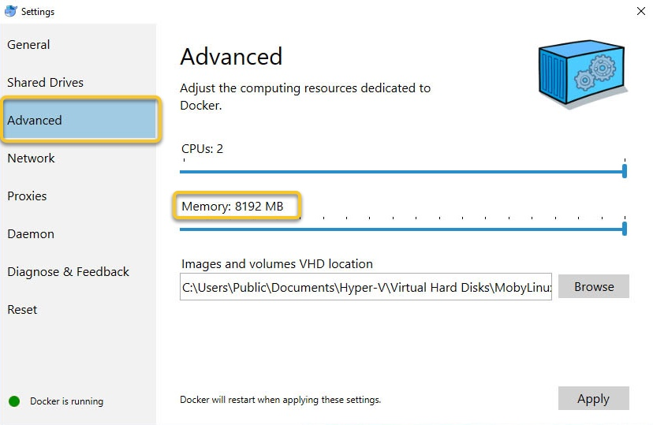
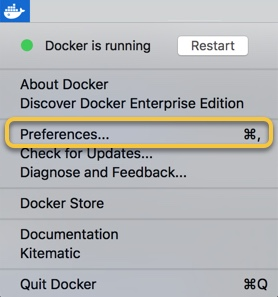
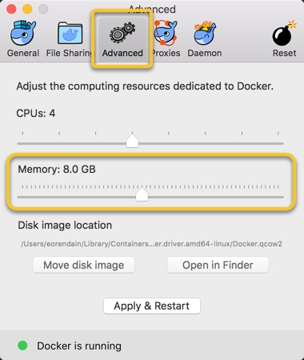
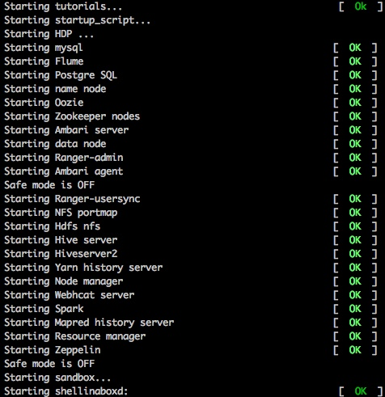

# Deploying Hortonworks Sandbox on Docker

## Introduction

This tutorial walks through installing the Hortonworks Sandbox onto Docker on your computer.


## Prerequisites

-   [Download the Hortonworks Sandbox](https://hortonworks.com/downloads/#sandbox)
-   Docker Installed
    -   [Docker For Linux](https://docs.docker.com/engine/installation/linux/)
    -   [Docker For Windows](https://docs.docker.com/docker-for-windows/install/)
    -   [Docker For Mac](https://docs.docker.com/docker-for-mac/install/)
-   A computer with at least **8 GB of RAM to spare**.


## Outline

-   [Configure Docker Memory](#configure-docker-memory)
    -   [For Linux](#for-linux)
    -   [For Windows](#for-windows)
    -   [For Mac](#for-mac)
-   [Load Sandbox Into Docker](#load-sandbox-into-docker)
-   [Start Sandbox](#start-sandbox)
    -   [For HDP 2.6 Sandbox](#for-hdp-2.6-sandbox)
    -   [For HDF 2.1 Sandbox](#for-hdf-2.1-sandbox)
-   [Further Reading](#further-reading)


## Configure Docker Memory


### For Linux

No special configuration needed for Linux.


### For Windows

After [installing Docker For Windows](https://docs.docker.com/docker-for-windows/install/), open the application and click on the Docker icon in the menu bar.  Select **Settings**.


Select the **Advanced** tab and adjust the dedicated memory to **at least 8GB of RAM**.




### For Mac

After [installing Docker For Mac](https://docs.docker.com/docker-for-mac/install/), open the application and click on the Docker icon in the menu bar.  Select **Preferences**.



Select the **Advanced** tab and adjust the dedicated memory to **at least 8GB of RAM**.




## Load Sandbox Into Docker

Open up a console and use the following command to load in the sandbox image you downloaded from <https://hortonworks.com/downloads/#sandbox>.

```
docker load -i /path/to/image/sandbox_docker_image.tar.gz
```

To check that the image was imported successfully, run the following command.  You should see the sandbox docker image on the list.

```
docker images
```


## Start Sandbox

Download one of the following scripts and save it somewhere on your computer.


### For HDP 2.6 Sandbox

-   For Linux/Mac: Use this [start_sandbox-hdp.sh](assets/start_sandbox-hdp.sh)
-   For Windows: Use this [start-start_sandbox-hdp.ps1](assets/start_sandbox-hdp.ps1)


### For HDF 2.1 Sandbox

-   For Linux/Mac: Use this [start_sandbox-hdf.sh](assets/start_sandbox-hdf.sh)
-   For Windows: Use this [start_sandbox-hdf.ps1](assets/start_sandbox-hdf.ps1)


Run the script you just downloaded.  It will start the sandbox for you, creating the sandbox docker container in the process if neceesary.

You should see something like the following:



The sandbox is now created and ready for use.

Welcome to the Hortonworks Sandbox!


## Further Reading

-   Follow-up with the tutorial: [Learning the Ropes of the Hortonworks Sandbox](https://hortonworks.com/hadoop-tutorial/learning-the-ropes-of-the-hortonworks-sandbox)
-   [Browse all tutorials available on the Hortonworks site](https://hortonworks.com/tutorials/)
