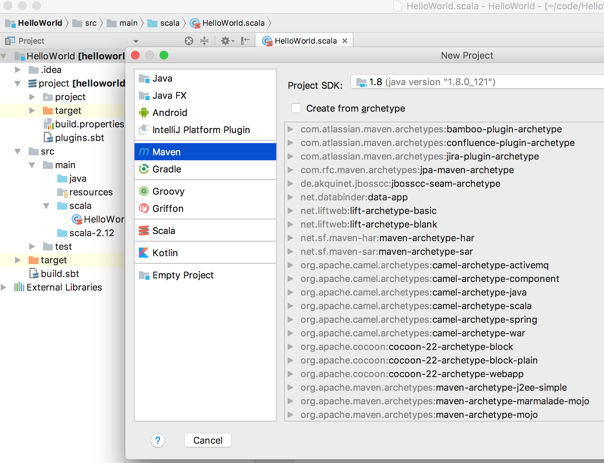
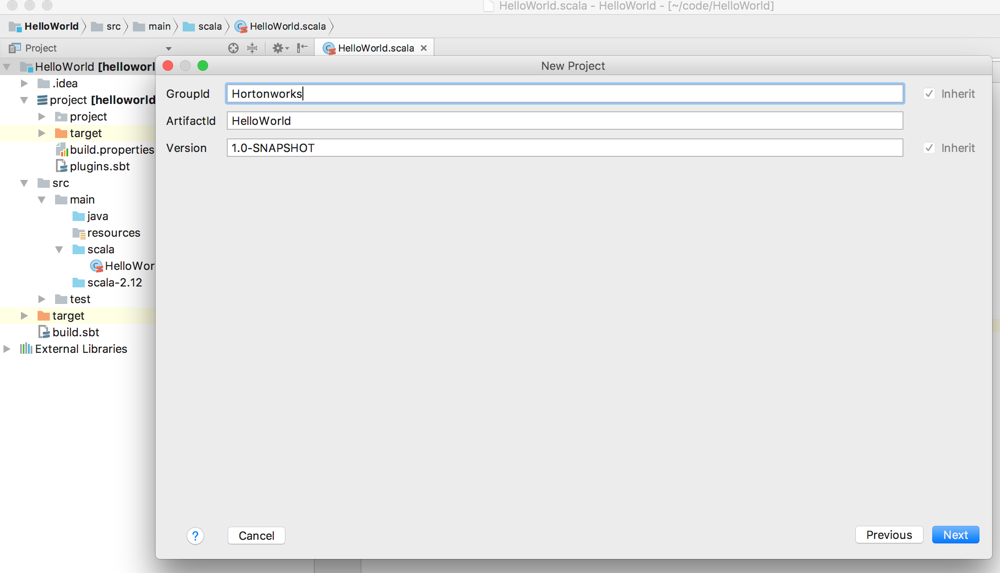
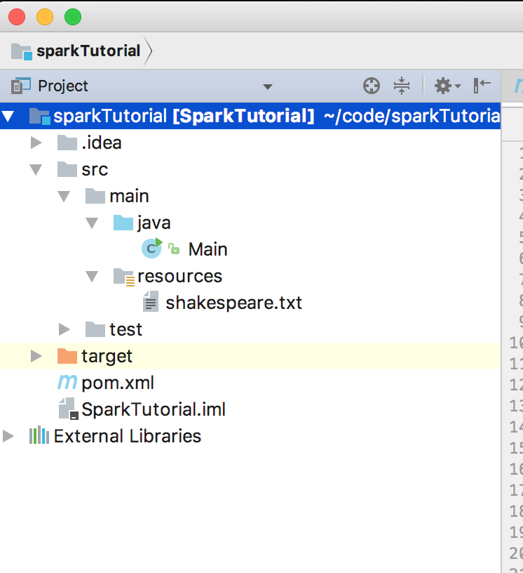
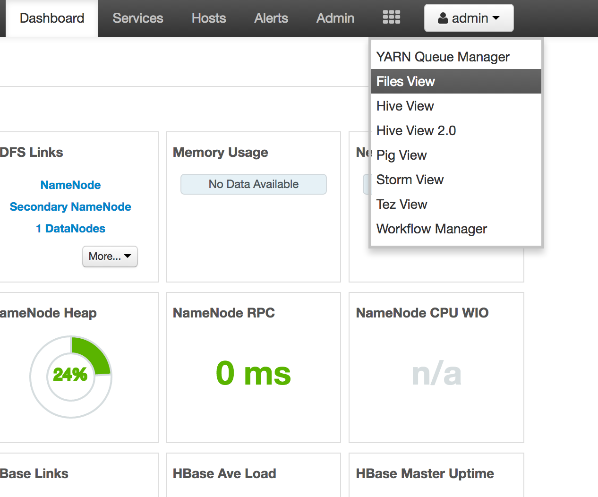
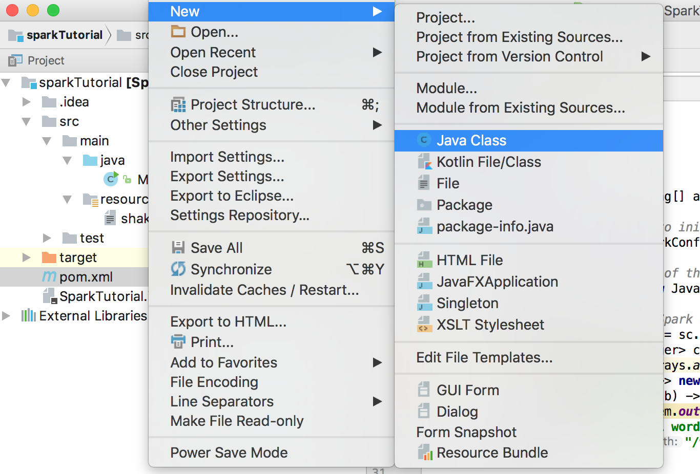
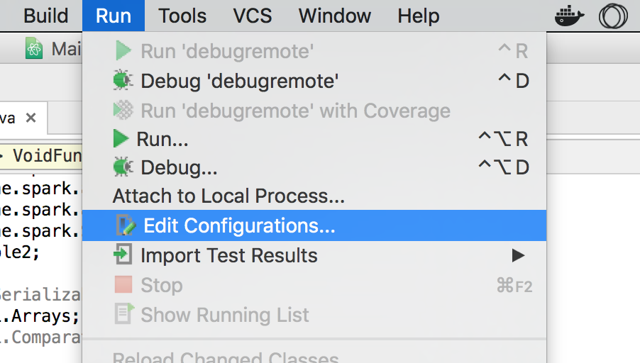
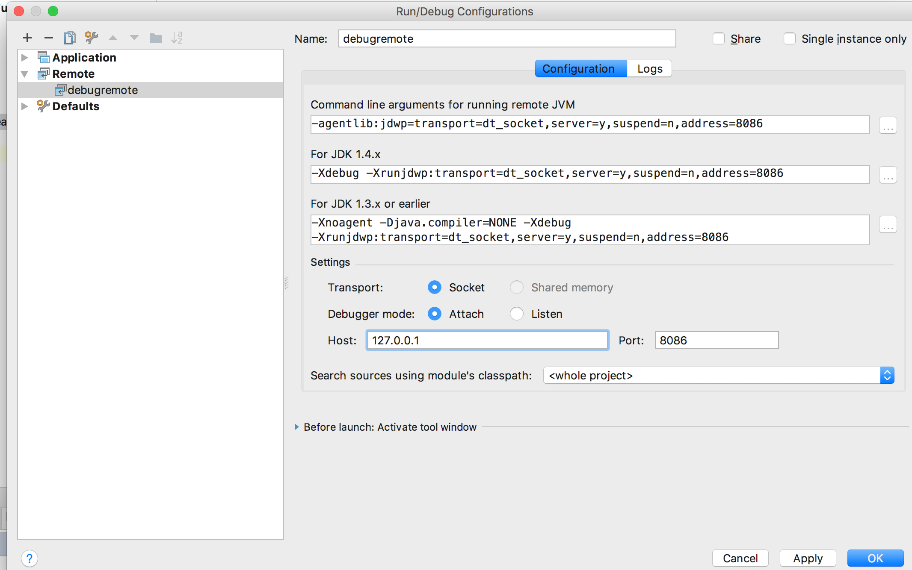

# Setting up a Spark Development Environment with Java

## Introduction

This tutorial will teach you how to set up a full development environment for developing and debugging Spark applications. For this tutorial we'll be using Java, but Spark also supports development with Java, Python, and R. The Scala version of this tutorial can be found [here](https://hortonworks.com/hadoop-tutorial/setting-up-a-spark-development-environment-with-scala/), and the Python version [here](https://hortonworks.com/hadoop-tutorial/setting-up-a-spark-development-environment-with-python/). We'll be using IntelliJ as our IDE, and since we're using Java we'll use Maven as our build manager. By the end of the tutorial, you'll know how to set up IntelliJ, how to use Maven to manage dependencies, how to package and deploy your Spark application to a cluster, and how to connect your live program to a debugger.

## Prerequisites

-   Download the [Hortonworks Sandbox](https://hortonworks.com/downloads/)

## Outline

-   [Installing Prerequisites](#installing-prerequisites)
-   [Creating a new IntelliJ Project](#creating-a-new-intellij-project)
-   [Maven](#maven)
-   [Create a Spark Application](#create-a-spark-application)
-   [Deploying to the Sandbox](#deploying-to-the-sandbox)
-   [Deploying to the Cloud](#deploying-to-the-cloud)
-   [Live Debugging](#live-debugging)

## Installing Prerequisites

Before starting this tutorial make sure you've installed the IntelliJ IDE, the Java programming language and the dependency manager Maven.

## Creating a new IntelliJ Project

To create a new project select File > New > Project. Then select Maven.



Make a new project called HelloWorld.



IntelliJ should make a new project with a default directory structure. It may take a minute or two to generate all the folders.



Let's break down the project structure.
-   .idea: These are IntelliJ configuration files.
-   src: Source Code. Most of your code should go into the main directory. The test folder should be reserved for test scripts.
-   target: When you compile your project it will go here.
-   pom.xml: The Maven configuration file. We'll show you how to use this file to import third party libraries and documentation.

## Maven

Before we start writing a Spark Application, we'll want to import the Spark libraries and documentation into IntelliJ. To perform this we're going to use Maven. This is necessary if we want IntelliJ to recognize Spark code. To import the Spark libraries we're going to use the dependency manager Maven. Add the following lines to the file pom.xml:

```
<?xml version="1.0" encoding="UTF-8"?>
<project xmlns="http://maven.apache.org/POM/4.0.0"
         xmlns:xsi="http://www.w3.org/2001/XMLSchema-instance"
         xsi:schemaLocation="http://maven.apache.org/POM/4.0.0 http://maven.apache.org/xsd/maven-4.0.0.xsd">
    <modelVersion>4.0.0</modelVersion>

    <groupId>hortonworks</groupId>
    <artifactId>SparkTutorial</artifactId>
    <version>1.0-SNAPSHOT</version>

    <build>
        <plugins>
            <plugin>
                <groupId>org.apache.maven.plugins</groupId>
                <artifactId>maven-compiler-plugin</artifactId>
                <configuration>
                    <source>1.8</source>
                    <target>1.8</target>
                </configuration>
            </plugin>
        </plugins>
    </build>

    <dependencies>
        <dependency>
            <groupId>org.apache.spark</groupId>
            <artifactId>spark-core_2.10</artifactId>
            <version>2.1.0</version>
        </dependency>
    </dependencies>

</project>
```

After you save the file, IntelliJ will automatically import the libraries and documentation needed to run Spark.

## Create a Spark Application

For our first "Hello World" application we're going to build a simple program that performs a word count on the collected works of Shakespeare. Download the text file [here](https://github.com/hortonworks/data-tutorials/tree/master/tutorials/hdp/hdp-2.6/configuring-and-debugging-spark/assets/shakespeare.txt). Later we'll want to Spark to retrieve this file from HDFS (Hadoop Distributed File System), so let's place it there now.

To upload to HDFS, first make sure the sandbox is on, then navigate to localhost:8080 and login (default username/password is maria_dev/maria_dev). Once you've logged into Ambari Manager, mouse over the drop-down menu on the upper-right hand corner and click on Files View. Then open the tmp folder and click the upload button in the upper-right corner to upload the file. Make sure it's named shakespeare.txt.



Now we're ready to start making our application. In your IDE open the folder src/main/resources, which should have been generated automatically for you. Place shakespeare.txt there.

Next, create a new Scala file called Main at src/main/scala. When the IDE asks whether to create a class, object or trait, choose object. Name the file Main.scala.



Copy this into your new file:

```
public class Main {

    public static void main(String[] args) {
        System.out.println("Hello World");
    }
}
```
Now go to the "Run" drop down menu at the top of your IDE and select run. Then select Main. If everything is set up correctly, the IDE should print "Hello World".

Now that we know the environment is set up correctly, replace the file with this code:

```
import org.apache.spark.api.java.JavaPairRDD;
import org.apache.spark.api.java.JavaSparkContext;
import org.apache.spark.api.java.JavaRDD;
import org.apache.spark.SparkConf;
import scala.Tuple2;

import java.util.Arrays;

public class Main {

    public static void main(String[] args){

        //Create a SparkContext to initialize
        SparkConf conf = new SparkConf().setMaster("local").setAppName("Word Count");

        // Create a Java version of the Spark Context
        JavaSparkContext sc = new JavaSparkContext(conf);

        // Load the text into a Spark RDD, which is a distributed representation of each line of text
        JavaRDD<String> textFile = sc.textFile("src/main/resources/shakespeare.txt");
        JavaPairRDD<String, Integer> counts = textFile
                .flatMap(s -> Arrays.asList(s.split("[ ,]")).iterator())
                .mapToPair(word -> new Tuple2<>(word, 1))
                .reduceByKey((a, b) -> a + b);
        counts.foreach(p -> System.out.println(p));
        System.out.println("Total words: " + counts.count());
        counts.saveAsTextFile("/tmp/shakespeareWordCount");
    }

}
```

As before, click Run -> Run to run the file. This should run the Spark job and print the frequency of each word that appears in Shakespeare.

Notice we've set this line:
``
conf.setMaster("local")
``
This tells Spark to run locally using this computer, rather than in distributed mode. To run Spark against multiple machines, we would need to change this value to YARN. We'll see how to do this later.

We've now seen how to deploy an application directly in an IDE. This is a good way to quickly build and test an application, but it is somewhat unrealistic since Spark is only running on a single machine. In production use Spark will usually process data stored on a distributed file system like HDFS (or perhaps S3 or Azure Blog Storage if running in the cloud). Spark is also usually run in clustered mode (ie, distributed across many machines).

In the next two sections we'll learn how to deploy distributed Spark applications. First we'll learn how to deploy Spark against the Hortonworks sandbox, which is a single-node Hadoop environment, and then we'll learn how to deploy Spark in the cloud.

## Deploying to the Sandbox

In this section we'll be deploying against the Hortonworks sandbox. Although we're still running Spark on a single machine, we'll be using HDFS and YARN (a cluster resource manager), so this will be a closer approximation of running a full distributed cluster than what we've done previously.

The first thing we want to do is change this line:
```
JavaRDD<String> textFile = sc.textFile("src/main/resources/shakespeare.txt");
```
to this:
```
JavaRDD<String> textFile = sc.textFile("hdfs:///tmp/shakespeare.txt");
```
and this:
```
counts.saveAsTextFile("/tmp/shakespeareWordCount");
```
to this:
```
counts.saveAsTextFile("hdfs:///tmp/shakespeareWordCount");
```

This tells Spark to read and write to HDFS instead of locally. Make sure to save the file.

Next, we're going to package this code into a compiled jar file that can be deployed on the sandbox. To make our lives easier, we're going to create an assembly jar: a single jar file that contains both our code and all jars our code depends on. By packaging our code as an assembly we guarantee that all dependency jars (as defined in pom.xml) will be present when our code runs.

Open up a terminal and cd to the directory that contains pom.xml. Run ``mvn package``. This will create a compiled jar called "SparkTutorial-1.0-SNAPSHOT.jar" in the folder target.

Copy the assembly over to the sandbox:

```
scp -P 2222 ./target/SparkTutorial-1.0-SNAPSHOT.jar root@sandbox.hortonworks.com:/root
```

Then open a second terminal window and ssh into the sandbox:
```
ssh -p 2222 root@sandbox.hortonworks.com
```

Use spark-submit to run our code. We need to specify the main class, the jar to run, and the run mode (local or cluster):
```
/usr/hdp/current/spark2-client/bin/spark-submit --class "Main" --master local ./SparkTutorial-1.0-SNAPSHOT.jar
```

Your console should print the frequency of each word that appears in Shakespeare, like this:
```
...
(comutual,1)
(ban-dogs,1)
(rut-time,1)
(ORLANDO],4)
(Deceitful,1)
(commits,3)
(GENTLEWOMAN,4)
(honors,10)
(returnest,1)
(topp'd?,1)
(compass?,1)
(toothache?,1)
(miserably,1)
(hen?,1)
(luck?,2)
(call'd,162)
(lecherous,2)
...
```
Additionally, if you open the File View in Ambari you should see results under /tmp/shakespeareWordCount. This shows the results have also been stored in HDFS.

## Deploying to the Cloud

In this section we'll learn how to deploy our code to a real cluster. If you don't have a cluster available you can quickly set one up on [AWS](https://hortonworks.com/products/cloud/aws/) using Hortonworks Data Cloud or on Azure using [HDInsight](https://azure.microsoft.com/en-us/services/hdinsight/) (which is powered by Hortonworks). These services are designed to let you quickly spin up a cluster for a few hours (perhaps on cheaper spot instances), run a series of jobs, then spin the cluster back down to save money. If you want a permanent installation of Hadoop that will run for months without being shutdown, you should download Hortonworks Data Platform from [here](https://hortonworks.com/downloads/) and install it on your servers.

After setting up a cluster the process of deploying our code is similar to deploying to the sandbox. We need to scp the jar to the cluster:
```
scp -P 2222 -i "key.pem" ./target/SparkTutorial-1.0-SNAPSHOT.jar root@[ip address of a master node]:root
```

Then open a second terminal window and ssh into the master node:
```
ssh -p 2222 -i "key.pem" root@[ip address of a master node]
```

Then use spark-submit to run our code:
```
/usr/hdp/current/spark2-client/bin/spark-submit --class "Main"  --master yarn --deploy-mode client ./SparkTutorial-1.0-SNAPSHOT.jar
```

Notice that we specified the parameters ``--master yarn`` instead of ``--master local``. ``--master yarn`` means we want Spark to run in a distributed mode rather than on a single machine, and we want to rely on YARN (a cluster resource manager) to fetch available machines to run the job. If you aren't familiar with YARN, it is especially important if you want to run several jobs simultaneously on the same cluster. When configured properly, a YARN queue will provide different users or process a quota of cluster resources they're allowed to use. It also provides mechanisms for allowing a job to take full use of the cluster when resources are available and scaling existing jobs down when additional users or jobs begin to submit jobs.

The parameter ``--deploy-mode client`` indicates we want to use the current machine as the driver machine for Spark. The driver machine is a single machine that initiates a Spark job, and is also where summary results are collected when the job is finished. Alternatively, we could have specified ``--deploy-mode cluster``, which would have allowed YARN to choose the driver machine.

It's important to note that a poorly written Spark program can accidentally try to bring back many Terabytes of data to the driver machine, causing it to crash. For this reason you shouldn't use the master node of your cluster as your driver machine. Many organizations submit Spark jobs from what's called an edge node, which is a separate machine that isn't used to store data or perform computation. Since the edge node is separate from the cluster, it can go down without affecting the rest of the cluster. Edge nodes are also used for data science work on aggregate data that has been retrieved from the cluster. For example, a data scientist might submit a Spark job from an edge node to transform a 10 TB dataset into a 1 GB aggregated dataset, and then do analytics on the edge node using tools like R and Python. If you plan on setting up an edge node, make sure that machine doesn't have the DataNode or HostManager components installed, since these are the data storage and compute components of the cluster. You can check this on the host tab in Ambari.

## Live Debugging

In this section we'll learn how to connect a running Spark program to a debugger, which will allow us to set breakpoints and step through the code line by line. Debugging Spark is done like any other program when running directly from an IDE, but debugging a remote cluster requires some configuration.

On the machine where you plan on submitting your Spark job, run this line from the terminal:

```
export SPARK_JAVA_OPTS=-agentlib:jdwp=transport=dt_socket,server=y,suspend=n,address=8086
```

This will let you attach a debugger at port 8086. You'll need to make sure port 8086 is able to receive inbound connections. Then in IntelliJ go to Run -> Edit Configurations:



Then click the + button at the upper-left and add a new remote configuration. Fill the host and port fields with your host ip address and 8086.



If you run this debug configuration from your IDE immediately after submitting your Spark job, the debugger will attach and Spark will stop at breakpoints. You can also inspect the values of live variables within your program. This is invaluable when trying to pin down bugs in your code.

Tutorial By Greg Womack (Twitter: @gregw134)
