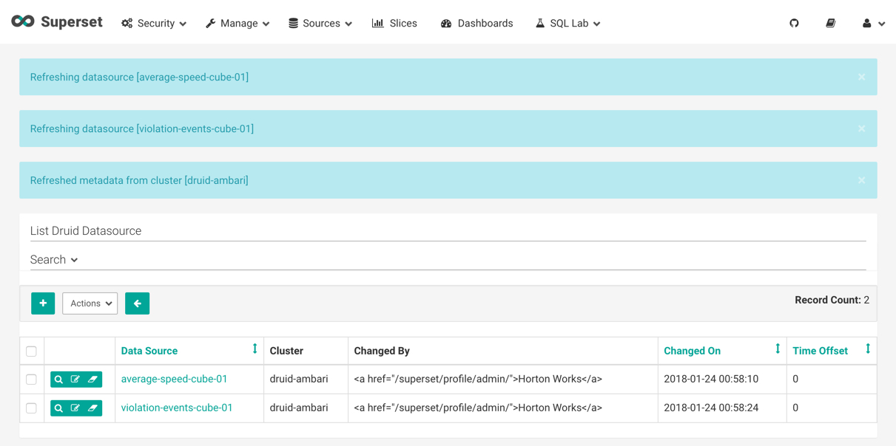

# Setting up the Development Environment

## Introduction

In this tutorial, you will verify your sandbox IP is mapped to your desired hostname, your admin password is setup and the services that need to be on are activated.

## Outline

- [Map sandbox IP to desired hostname in hosts file](#map-sandbox-ip-to-desired-hostname-in-hosts-file)
- [Setup Ambari admin password](#setup-ambari-admin-password)
- [Start up all required services](#start-up-all-required-services)
- [Setup Druid for Superset](#setup-druid-for-superset)
- [Summary](#summary)
- [Further Reading](#further-reading)

### Map sandbox IP to desired hostname in hosts file

If you need help mapping Sandbox IP to hostname, reference **Environment
Setup -> Map Sandbox IP To Your Desired Hostname In The Hosts File** in [Learning the Ropes of HDP Sandbox](https://hortonworks.com/tutorial/learning-the-ropes-of-the-hortonworks-sandbox/)

### Setup Ambari admin password

If you need help setting the Ambari admin password, for HDP, reference **Admin Password Reset** in [Learning the Ropes of HDP Sandbox](https://hortonworks.com/tutorial/learning-the-ropes-of-the-hortonworks-sandbox/)

### Start up all required services

If unsure, login to Ambari **admin** Dashboard for HDP at http://sandbox-hdp.hortonworks.com:8080. Verify **Druid** and **Superset** are turned on and are off maintenance mode.

### Setup Druid for Superset

To query data against a Druid datasource and visualize it, first we will need
to load data into Druid. We will use Spark Structured Streaming with Tranquility
API to load data into Druid using realtime ingestion.

4\. Open Superset at http://sandbox-hdf.hortonworks.com:9089/

5\. Wait about **5 – 10 minutes** for Kafka data to be consumed, then periodically, select the **Sources** dropdown and click on **Refresh Druid Metadata**. Eventually, the two Druid data sources will appear.

## Create Visualization Slices

Superset is being used to visualize the Druid data sources. From the characteristics of an effective visual display from the concepts section, we will apply them now to effectively visualize the **average-speed-cube-01** and **violation-events-cube-01** datasets.

## Summary

## Further Reading
