# Tour of Cloudera Data Science Workbench

## Introduction

Cloudera Data Science Workbench [CDSW](https://www.cloudera.com/products/data-science-and-engineering/data-science-workbench.html) is a secure enterprise data science platform which enables Data Scientists to accelerate their workflow from exploration to production by providing them with their very own analytics pipelines. CDSW allows data scientist to utilize already existing skills and tools, such as Python, R, and Scala to run computations in Hadoop clusters.

At a high level the Cloudera Data Science Workbench runs on one or more [gateway nodes](https://www.cloudera.com/documentation/enterprise/5-8-x/topics/cm_ig_host_allocations.html) of a CDH cluster. The gateway nodes leverage Docker and Kubernetes to allocate resources for isolated environments where you can run your very own data science projects.

## Prerequisites

- Deployed the [Cloudera Data Platform Sandbox](www.google.com) with CDSW

## Outline

- [Concepts](#concepts)
- [Guided Tour of CDSW](#guided-tour-of-cdsw)
- [Adding Envorinment Variables](#adding-environment-variables)
- [Scheduling Jobs](#scheduling-jobs)
- [CDSW Lab](#cdsw-lab)
- [Sharing Results](#sharing-results)
- [Further Reading](#further-reading)

## Concepts

This tutorial will guide you through the basics of using CDSW and understanding it's basic functionalities. You'll fist learn about the lay out of the user interface, followed by creating your first data science project on CDSW and finally you will learn how to share your results.

## Guided tour of CDSW

This is the CDSW main dashboard where you will find

1. How many sessions, jobs, or models are running
2. What resources are allocated to you, such as virtual CPUs, storage, and GPUs

an important feature of CDSW are contexts, by switching contexts you will be able to change from team projects to your own personal projects. Creating a new context is very easy, let's create a new context for this tutorial and future CDSW tutorials we may work with

click on the  sign next to your username and select **Create Team**

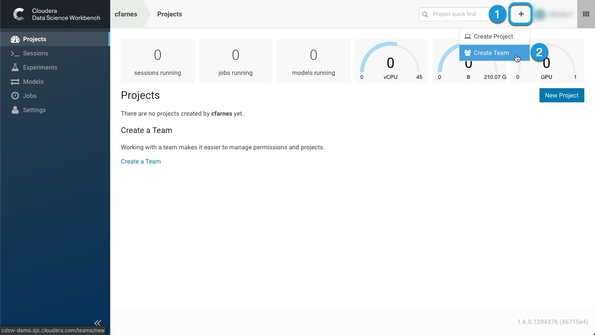

Next name your team tutorials and select create team

Ensure that you are in the `Tutorials` team account

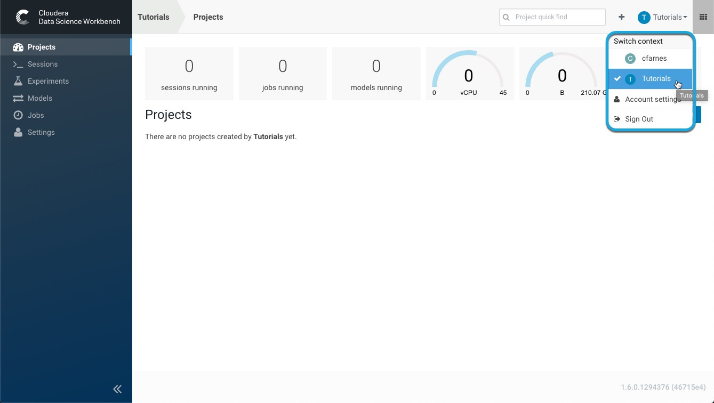

## Adding Environment Variables

[Environment variables in CDSW](https://www.cloudera.com/documentation/data-science-workbench/latest/topics/cdsw_environment_variables.html) can give you more control over how your session behaves; for example, you can set the maximum number of characters at the output of the workbench console, you can even change the project timezone and timeout per session.

You may set environment variables in the following scopes:

- **Global Scope**: The site administrator for CDSW may set global variable which will be applied to every project on a particular deployment

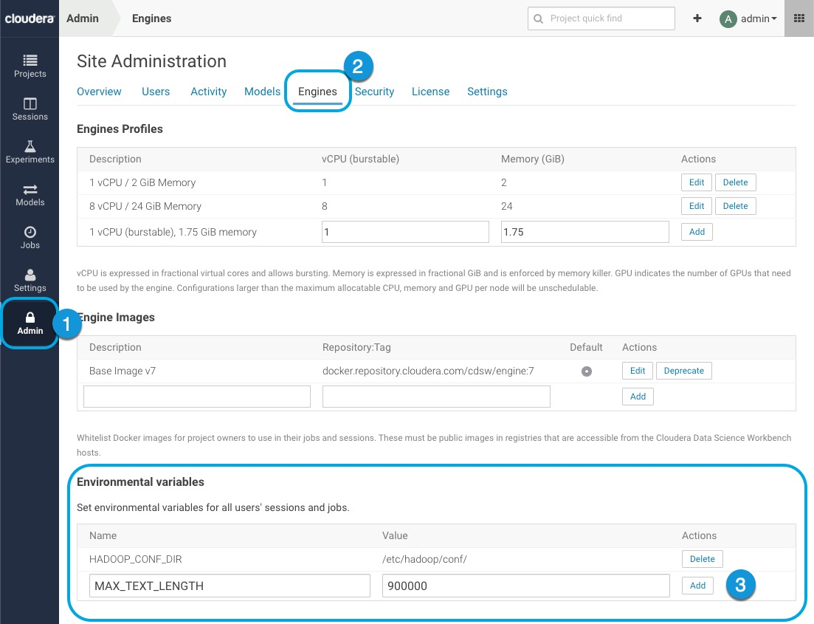

- **Project Scope**: If you created a project and you are it's administrator you may set environmental variables for the entire project, these settings will take precedence over global variables

First choose the project for which you want to set the environemnt variables for:

Then enter your variables in the appropriate section

- **Job Scope**: Environment variables can also be set for models that are scheduled to be built if there are existing jobs. Job environment variables take precedence over project variables

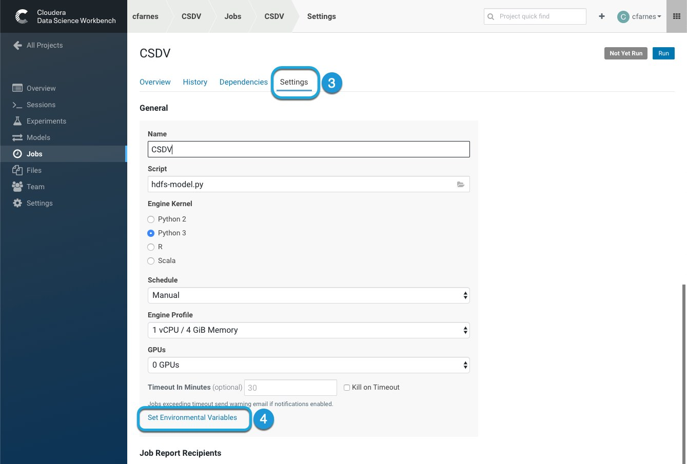

- **Experiments**: Experiment level variables are isolated from the project and will inherit values from environmental variables set at the project-level and/or global level.

- **Models**: Model variables are isolated from the project and are set at build time, these settings will over ride all other environemnt variables. Variables will be inherited project level and global level if they are not set.

## Scheduling Jobs

CDSW allows you to automate the process of launching an engine, running a training script, and tracking the results of the training via automated email alerts. [Further documentation on creating a job can be found here.](https://www.cloudera.com/documentation/data-science-workbench/latest/topics/cdsw_jobs_pipelines.html#create_job)

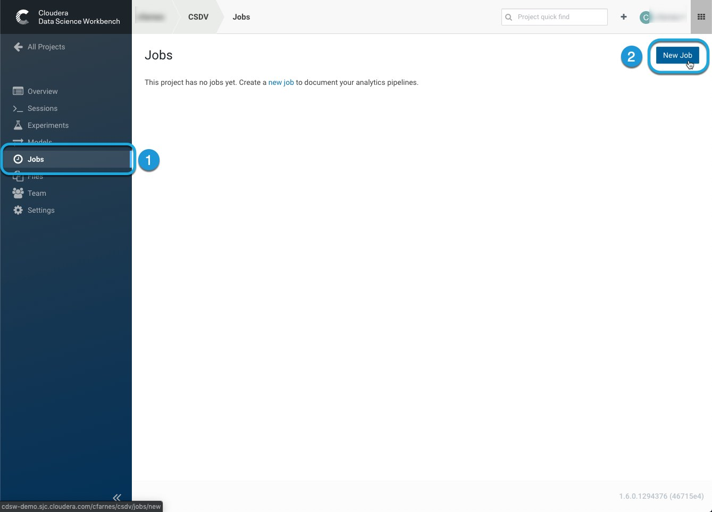

next name your new job and select a script to run

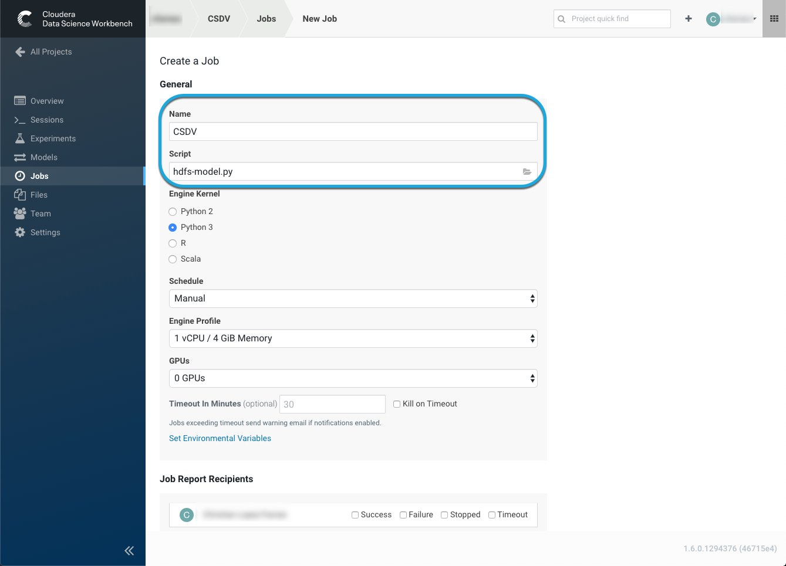

jobs can be run manually or be automated by running them as a recurring build

or as a dependency of a different job

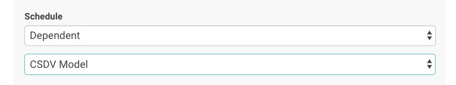

## CDSW Lab

The following exercise will show you how to create your first CDSW project and run a python engine to generate insight. To begin download the python script and data used in this tutorial

[click here](www.google.com)

Now we are ready to create a new project on our CDSW instance. Click on the  sign at the upper right hand side of your screen and select **New Project** you will find a screen like the one shown below

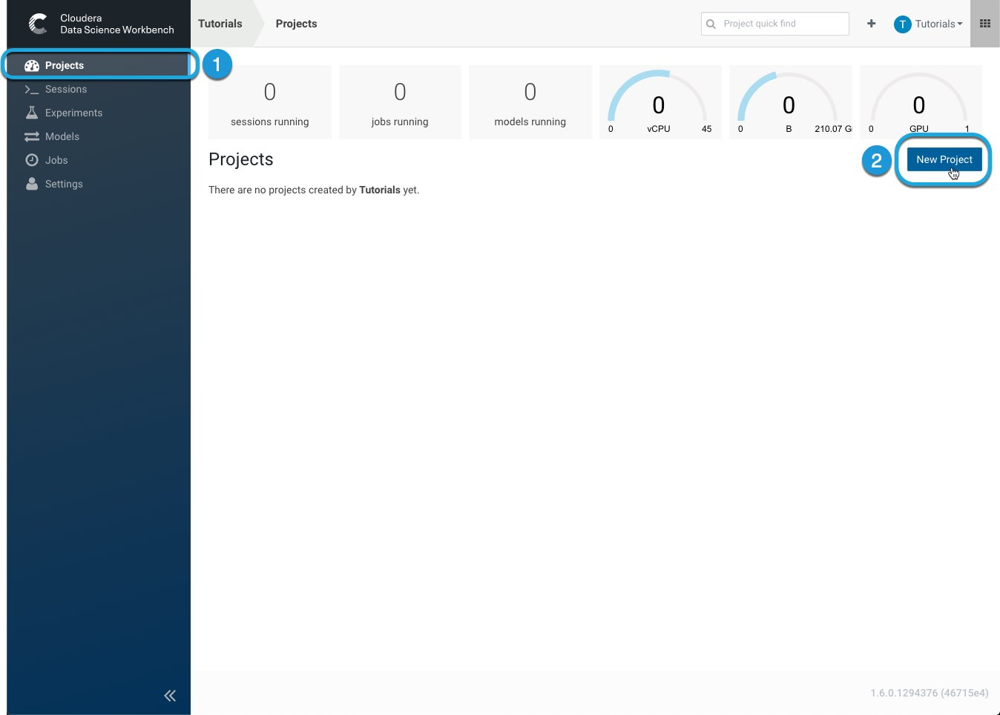

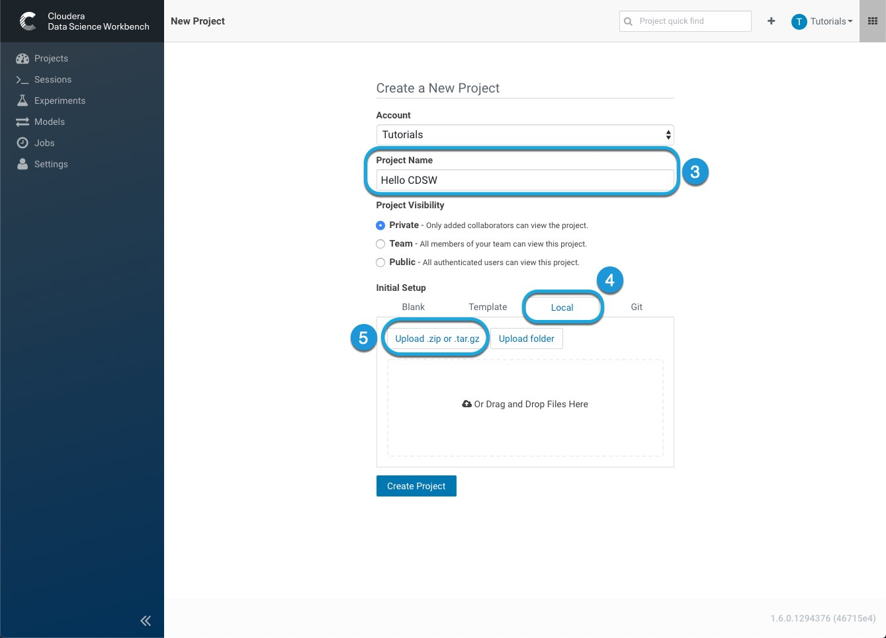

The Account name section should be automatically be filled with the **Tutorials** team we created earlier, name your project `Hello CDSW`

Next, select the **Local** window and select the file we downloaded earlier it should be named **tour-of-cdsw.zip**

Once your file is done uploading you will find the project's management interface, if you have created models in this project or are running any jobs associated with this project this is where you can manage them.

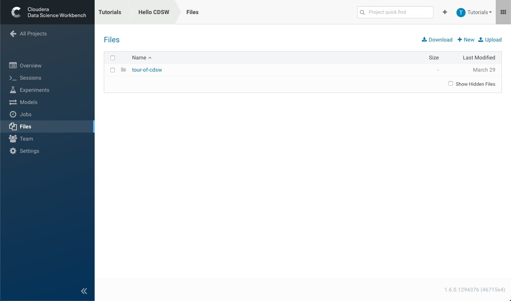

To begin working click on the **Open Workbench** button on the upper right hand side. The next step is to choose an *Engine Kernel*, by default CDSW supports Engines using Scala, Python, and R

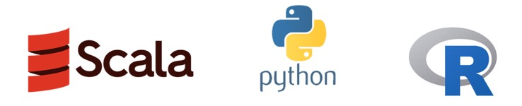

In the context of CDSW, an **Engine** is responsible for running data science workloads and acting as intermediary to the supporting CDH cluster. The **Base Engine Images** of CDSW are Docker images which contain all of the building blocks needed to launch a CDSW session and run workloads, they are built into and shipped with CDSW. When you run a session to start a project, an engine is spun-up—and managed by Kubernetes—as a container based on the base engine image you selected and contain the following components:

CDSW allows you to run your code as a *session* or a *job*. A session is a way to interpret your code interactively, whereas a job allows you to execute your code as a batch process and can be scheduled to run recursively

In order for us to use the python script needed for this tutorial select a **Python 3** engine with this resource allocation configuration

- 1 vCPU
- 2 GiB Memory
- 0 GPU (It's okay if you don't have any, but it's great to know you can have them)

We can use either a Jupyter Notebook as our editor or a Workbench, feel free to choose your favorite

to finalize set-up select the **Launch Session** option.

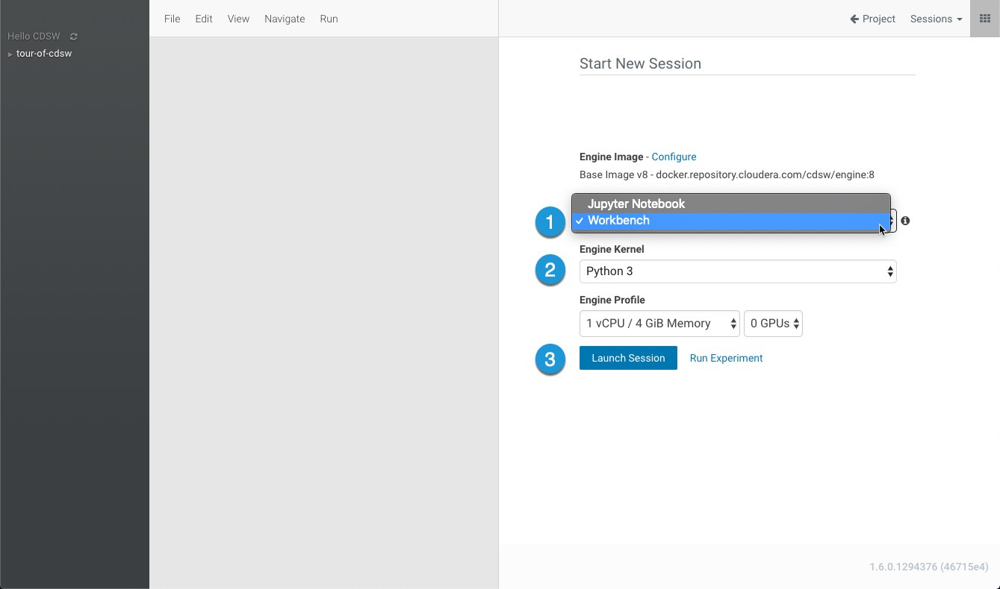

Welcome to the Workbench, the user interface should look like the image below:

Along the top of the workbench you will find:

1\. Terminal Access

The terminal access window grants you access to the running engine from a web console. It allows you to move files around, run git commands, and understand the resources on your environment

2\. Clear

Cleans up the output from running code

3\. Interrupt and Stop

The interrupt section allows you to stop the command currently being executed while the stop button allows you to stop your session

4\. View

The view option allows you to open additional resources available to you, such as Spark History, and YARN history

To begin using our python script we must first install some libraries, this is very easy in CDSW:

1. Expand the home directory **tour-of-cdsw**
2. Select the **README** file
3. Highlight the pip install command and right click. Finally, select **Run Line(s)**

Note that while your libraries are installing the command line on the right side of the workbench will glow red indicating that it is currently busy

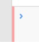

and once it is done executing your commands and is ready for the next input it will glow green

## Sharing Results

Once the libraries finish installing follow these instructions

1. Select the **1_python.py** script
2. Select the **Run** option from the menu
3. Click on **Run All**

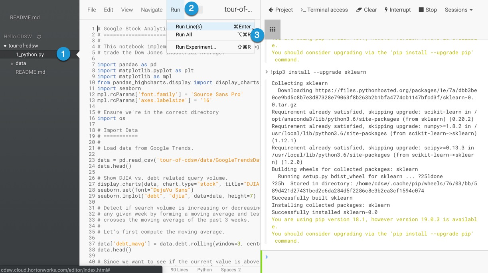

Runnign the Google Stock Analytics python script will generate an output visible on the right side of the workbench along with these visualizations:

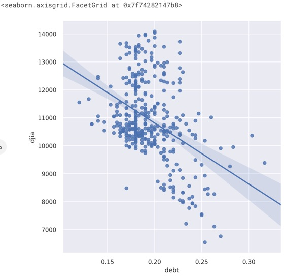

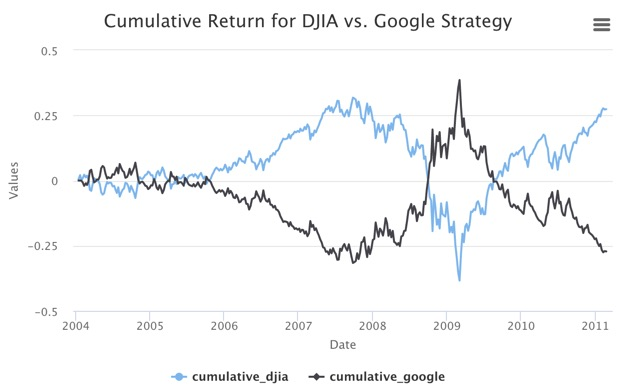

On the left side of the charts you will find a link symbol , you can click it to share your individual link with the world

or you may choose to share your notebook results with specific stake holders. At the top right side of the workbench there is an option to share the results of your notebook, select it.

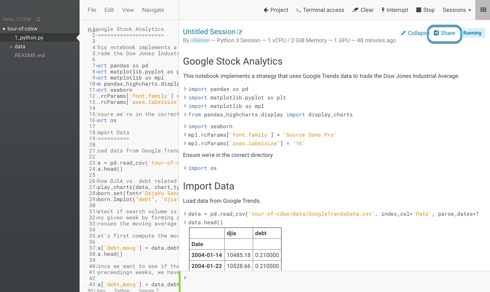

You may choose to share your results to anyone anonymous user with the link, any logged on user, or more granularly with a specific person or team

You may also choose to protect your intellectual property by hiding code and output text from your experiment.

This is what an anonymous person with the link will see:

## Summary

Congratulations, now you know the basics functionalities of CDSW, how it works, and how to run code and share your results, as you can see CDSW is an extremely powerful tool to manage and use your resources more efficiently and help you share your ideas and results in a fast, and convinient manner.

## Further Reading

- [CDSW Documentation](https://www.cloudera.com/documentation/data-science-workbench/latest/topics/cdsw_overview.html)
- [Configuring Cloudera Data Science Workbench Engines](https://www.cloudera.com/documentation/data-science-workbench/latest/topics/cdsw_engine_configuration.html)
- [CDSW Requirements](https://www.cloudera.com/documentation/data-science-workbench/latest/topics/cdsw_requirements_supported_versions.html)
