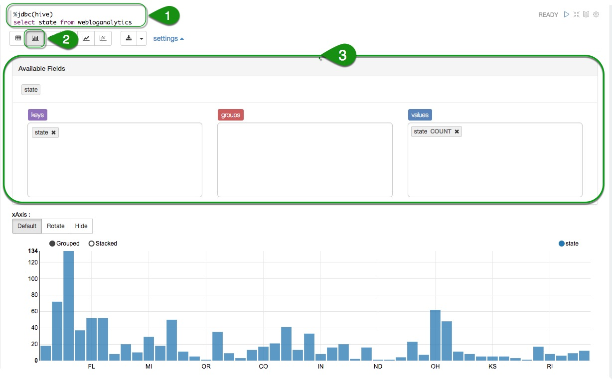
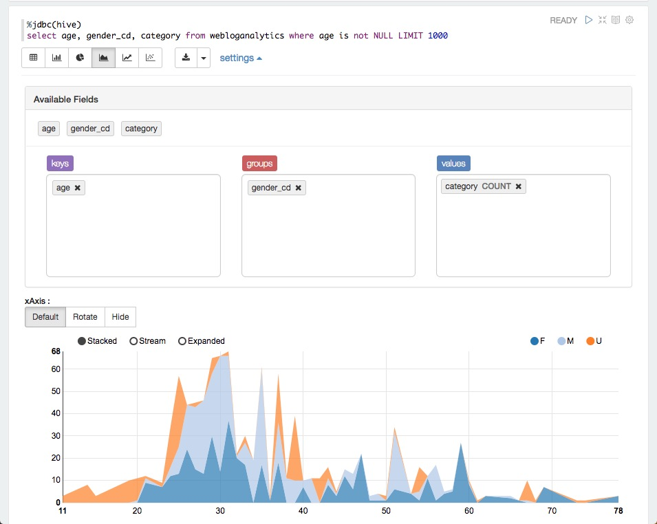
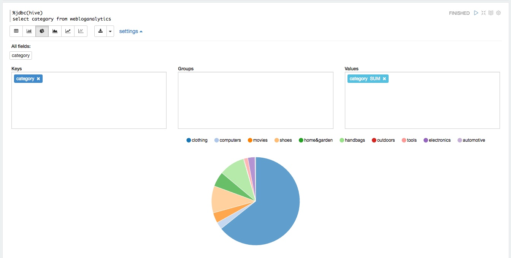

# Visualize Log Data with Apache Zeppelin

## Introduction

In this section, we will use Apache Zeppelin to access refined clickstream data.

## Prerequisites

- Have sample retail data already loaded [by completing this tutorial](https://hortonworks.com/tutorial/loading-data-into-the-hortonworks-sandbox)

## Outline

- [Import a Notebook into Apache Zeppelin](#import-a-notebook-into-apache-zeppelin)
- [Identify the State with the Most Customers](#identify-the-state-with-the-most-customers)
- [Understand Customer Demographics](#understand-customer-demographics)
- [Analyze Interest Category Distribution](#analyze-interest-category-distribution)
- [Summary](#summary)
- [Further Reading](#further-reading)

If you don't have access to Microsoft Excel Professional Plus, you can also utilize Apache Zeppelin to do you data visualization.

## Import the Zeppelin Notebook

 Great! you have met the requirements and are ready to begin (If at any point you have any issues, make sure to checkout the [Getting Started with Apache Zeppelin](https://hortonworks.com/tutorial/getting-started-with-apache-zeppelin/) tutorial).

To import the notebook, go to the Zeppelin home screen.

1\. Click **Import note**

2\. Select **Add from URL**

3\. Copy and paste the following URL into the **Note URL**

~~~text
https://raw.githubusercontent.com/hortonworks/data-tutorials/master/tutorials/templates/tutorial-template-spark/assets/Learning%20Spark%20Tutorials.json
~~~

4\. Click on **Import Note**

Once your notebook is imported, you can open it from the Zeppelin home screen by:

5\. Clicking **ClickstreamAnalytics**

Once the **ClickstreamAnalytics** notebook is up, follow all the directions within the notebook to complete the tutorial.

## Identify the State with the Most Customers

Let's take a look at the first graph in the notebook.  Take note of the following:

1. The code in the paragraph that is run
2. The fields that are visualized (click "**settings**" to open this panel)
3. The type of graph rendered

## Understand Customer Demographics

Scroll down and check out the next section with a graph.  Let's dive a bit deeper and see how we achieve the visualizion.

1\. Write the query to filter demographics (age, gender, category)

~~~sql
%jdbc(hive)
select age, gender_cd, category from webloganalytics where age is not NULL LIMIT 1000
~~~

2\. Open **settings**, make sure

- **_age_** is dragged into the **Keys** area,
- **_gender\_cd_** is dragged into **Groups** area,
- **_category COUNT_** is dragged into **Values** area

3\. Select **area chart** as the visualization.

Those steps produce the following:

The majority of users who visit the website are within age range of 20-30. Additionally, there seems to be an even split between both genders.

## Analyze Interest Category Distribution

Finally, let's check out the last graph in this notebook.  It looks like clothing is clearly the most popular reason customers visit the website.

## Summary

You have successfully analyzed and visualized log data with Apache Zeppelin.  This, and other tools can be used with the Hortonworks Data Platform to derive insights about customers from various data sources.

The data stored in the Hortonworks Data Platform can be refreshed frequently and used for basket analysis, A/B testing, personalized product recommendations, and other sales optimization activities.

## Further Reading

- [Zeppelin Notebook for Analysing Web Server Logs](https://community.hortonworks.com/content/repo/56765/zeppelin-notebook-for-analysing-web-server-logs.html)
- [Zeppelin in Hortonworks Blog](https://hortonworks.com/apache/zeppelin/#blog)
